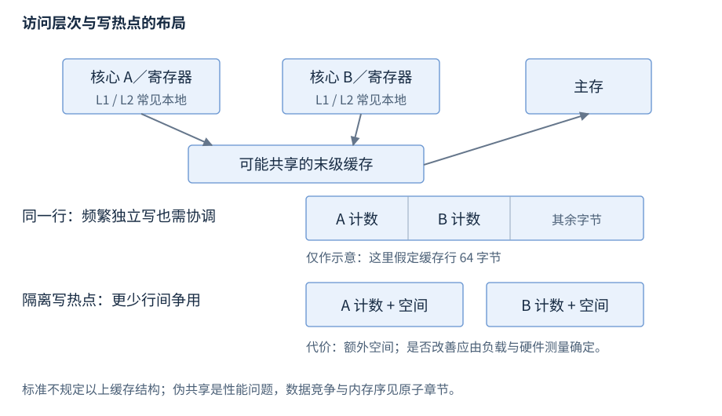

# CPU、缓存与程序执行

CPU 执行指令，寄存器保存正在使用的值，缓存与主存提供指令和数据。本章先建立执行与访问路径，再介绍局部性、分支、布局和字节序；性能判断由测量资料支撑。

**范围与先修**：硬件是常见多核处理器模型，不规定具体型号结构；C++ 规则按 C++17，标准位工具标 C++20/23。先修为类型、对象与数组，原子正确性见 R22。Intel 架构可进一步查 [基本架构与指令手册](https://www.intel.com/content/www/us/en/developer/articles/technical/intel-sdm.html)，不能外推为所有 CPU 的要求。

## CPU 与指令执行

**基础概念**。中央处理器（central processing unit，CPU）按指令集规定执行运算、访存和控制转移；核心是可执行指令流的处理单元，逻辑处理器是 OS 可调度执行上下文。核心数量、逻辑线程数量与实际执行资源不能混为一个数。

一条程序执行路径包含取指 → 译码 → 取得操作数 → 执行 → 保存结果。这个逻辑顺序帮助理解操作，不表示现代处理器必须每阶段串行完成；流水线、超标量和乱序实现可以让多条指令重叠推进。

| 指令类别 | 操作数与结果 | 常见用途 |
| --- | --- | --- |
| 算术/逻辑 | 寄存器值或架构允许的其他操作数 | 加减、比较、位运算 |
| 加载/存储 | 地址、存储中的值、寄存器 | 从内存取得值，或保存值 |
| 分支/调用/返回 | 条件、目标地址与返回信息 | 改变执行路径 |

C++ 表达式先经编译器转换为目标指令。源码 `x + y` 不固定对应一条加法：编译器可折叠、内联、向量化或消除不影响可观察行为的工作。[C++ 抽象机器](https://timsong-cpp.github.io/cppwp/n4659/intro.execution)

## 寄存器与指令依赖

**基础概念**。寄存器是处理器直接操作的状态存储，常见分类为通用整数、浮点/向量、程序计数器与控制状态；名称、数量和宽度由指令集决定。编译器选择哪些值暂存寄存器，变量没有固定“寄存器住所”。

调用约定规定参数、返回值和哪些寄存器由调用者/被调用者保存；详见 [链接与 ABI](R27-linking-loading-libraries.zh-CN.md)。寄存器不足时可能将暂存值放入内存；调试时变量被优化掉，可能只是没有对应可恢复存储位置。

若后一条指令需要前一条结果，形成数据依赖链；独立指令可更容易重叠执行。下面两种累计方式只有在数值语义相同条件下才能比较，尤其不能忽略整数溢出或浮点结合差异：

```cpp
sum += values[i]; // 后一轮依赖本轮 sum
```

这是已有循环的局部摘录；减少依赖可增加吞吐，但不是随意改变 C++ 运算语义的许可。

## 缓存、主存与访问路径

**基础概念**。缓存（cache）保留近期使用的数据副本以缩短部分访问；主存（main memory）为进程的驻留页提供容量。常见 L1/L2/L3 是缓存层级名，容量、包含关系及核心共享范围依处理器设计。

访问一个地址时，可依次由近端缓存、较远缓存或主存满足；虚拟地址还需地址转换，页表和缺页归 [虚拟内存](R25-process-virtual-memory.zh-CN.md)。缓存命中（hit）表示所需数据已在对应层，未命中（miss）需要取得数据；写入还涉及缓存一致性与写回。



图24-1：上半为常见层次，不规定所有机器的 L1/L2/L3 共享与大小；下半假定缓存行 64 字节，仅说明独立计数位于同一行的写协调。不能据该图推导 C++ memory_order。

缓存行（cache line）是缓存管理和一致性处理的常见单位；程序读取一个字节，硬件可能取得包含它的一整行。访问成本同时受命中层、依赖、并发请求和带宽影响，不能给“访问一次变量”指定固定时间。

## 时间局部性与空间局部性

**机制解释**。时间局部性是近期访问的数据被重复使用；空间局部性是随后访问附近地址。工作集（working set，此处性能意义）是某阶段使用的数据集合，容量与访问模式决定它能否有效利用缓存。

下面顺序扫描现有 vector<int>，需 `<vector>`；sum 用于后续结果且总和可由 long long 表示：

```cpp
long long sum = 0;
for (int value : values) sum += value;
```

vector 连续存储通常利于按行取得和预取；链表节点可能分散，下一节点地址又依赖当前指针。比较两者应包含查位置、分配、有效元素大小和访问次数，不能仅由 O(n) 推出相同缓存成本。

分块把一个子工作集反复用完再移到下一块，可提高复用；结构数组与数组结构改变一起扫描的字段数量。选择布局先看实际访问字段，不能为未测的硬件模型扩大所有对象。

## 分支预测与推测执行

**机制解释**。分支预测提前选择可能路径，使流水线继续取得指令；推测执行先执行尚未确认需要的工作，确认后提交或放弃相应结果。预测失败可损失已推进的工作，成本受具体处理器和路径分布影响。

将 if 改成无分支表达式可能增加两侧计算、引入额外内存访问，未必更快。大量独立运算可能受吞吐限制，长依赖链可能受延迟限制；CPU 利用率高也可能在等待访存或忙等。

硬件推测不能代替 C++ 并发规则。volatile 的可观察访问规则不等于“每次从主存读取”，也不提供互斥和发布；跨线程顺序由 [语言内存模型](R22-atomics-memory-order.zh-CN.md) 判断。

## 缓存一致性与伪共享

**机制解释**。一致性机制协调多个核心缓存中同一位置的可见值。伪共享（false sharing）指逻辑独立、不同核心频繁写入的对象落在同一缓存行，造成额外协调；它不等于修改同一 C++ 对象，也不必构成数据竞争。

优先让每线程局部累计后合并；有证据时隔离热字段。隔离会增加内存与扫描成本，不能统一盲目填充 64 字节。[Linux 内核伪共享分析](https://www.kernel.org/doc/html/latest/kernel-hacking/false-sharing.html)

`<new>` 的 C++17 `hardware_destructive_interference_size` 与 constructive 版本是实现给出的布局建议，不是运行时缓存探测；公共结构若使用它会影响 ABI，需统一编译契约。工具条目和版本详见标准位/数值工具入口。[C++17 干扰尺寸](https://timsong-cpp.github.io/cppwp/n4659/support.types.layout)

## 对齐、填充与访问成本

**机制解释**。对齐（alignment）是类型允许起始地址满足的要求，填充（padding）是布局中的额外表示空间。语言的 alignof/alignas、对象表示与合法访问维护于 R02；这里解释它们与硬件读取的关系。

数组按 sizeof(T) 的跨度排列元素，结构尺寸不能由字段大小直接相加。跨缓存行或硬件不支持的未对齐访问可能拆成更多操作；硬件支持某次访问也不使不满足对象寿命/类型访问要求的 C++ 指针合法。[Linux 未对齐访问说明](https://www.kernel.org/doc/html/latest/core-api/unaligned-memory-access.html)

外部数据应按协议字段解码，不能直接把本机 struct 当成磁盘/网络格式。填充、宽度、字节序与字段合法表示是独立条件；memcpy 能复制对象表示，不表示任意外部字节都对应有效值。

## 字节序与字段编码

**基础概念**。字节序（endianness）是多字节数值按地址递增的字节排列：小端把低有效字节放低地址，大端把高有效字节放低地址。它不改变数值本身，也不决定网络协议字段采用哪一种排列。

| 数值 0x01020304 | 低地址到高地址的四字节 | 含义 |
| --- | --- | --- |
| 大端 | 01 02 03 04 | 高有效字节在前 |
| 小端 | 04 03 02 01 | 低有效字节在前 |

以显式移位编码 32 位大端字段，需 `<array>`、`<cstdint>`、`<climits>`；实现提供 uint32_t 且协议用 8 位字节：

```cpp
static_assert(CHAR_BIT == 8, "8-bit protocol bytes");
std::uint32_t value = 0x01020304u;
std::array<unsigned char, 4> bytes{{
    static_cast<unsigned char>(value >> 24),
    static_cast<unsigned char>(value >> 16),
    static_cast<unsigned char>(value >> 8),
    static_cast<unsigned char>(value)}};
```

结果为 1、2、3、4，与主机字节布局无关。[r24-byte-order.cpp](../examples/r24-byte-order.cpp) 保留完整编码/解码组合示例。解码先提升到足够宽无符号类型再移位；位宽、长度、单位与目标范围均需验证。C++20 `std::endian` 和 C++23 `std::byteswap` 的标准接口归数值/位工具章；混合字节序实现也可能存在。[endian](https://timsong-cpp.github.io/cppwp/n4861/bit.endian)

## 延迟、吞吐与调查入口

**机制解释**。延迟是完成某次操作所需时间；吞吐是单位时间完成的工作量；带宽是单位时间传送的数据量。扩大并发可能改善吞吐却增加单任务等待，复杂度只描述规模增长趋势。

| 现象 | 收集证据 | 调查方向 |
| --- | --- | --- |
| 增加线程反而慢 | 工作量、争用、带宽、伪共享 | 找实际限制资源 |
| 连续扫描变慢 | 工作集、跨度、字节量 | 缓存和带宽条件 |
| 链表局部操作快而整体慢 | 查找、分配、指针依赖 | 纳入完整任务成本 |
| Debug 与 Release 差异大 | 优化与输入是否相同 | 生产结论用相应构建 |
| 加 padding 后改善 | 重复测量及目标架构计数 | 证明热点与一致性成本 |
| 数值异常 | 溢出、窄化、并发读写 | 先核对语言规则 |

测量保留结果的可观察用途、构建与负载条件；微基准不能直接代表端到端收益。性能测量过程见 R32，数值范围与溢出规则见 R02/R04。
