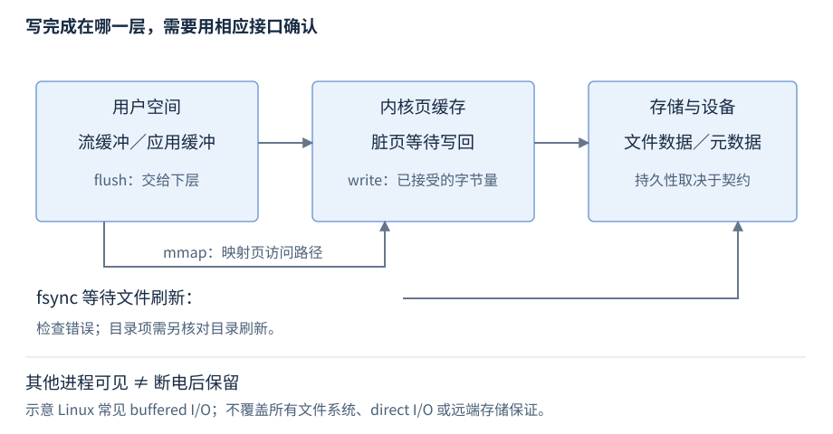

# 第25章 系统调用与文件 I/O

一次“写成功”可能只表示字节进入缓冲或内核缓存。接口返回、其他读取者可见和断电后仍存在，是三个需要分别确认的边界。

**版本与平台**：C++17/20 标准库只提供部分文件能力；fd、mmap、epoll 为 Linux，HANDLE、OVERLAPPED、IOCP 为 Windows。**先修**：RAII、错误处理、文件流、虚拟内存。首次读第1至3节；异步服务查第4、5节。

## 1 系统调用、fd 与 HANDLE 的所有权

系统调用请求内核管理的能力；一次库函数调用可能执行零次、多次系统调用。不要把 C++ 函数、C 库包装与内核入口视为一一对应，也不要由“进入内核”断言一定做了磁盘 I/O。

Linux 文件描述符是进程表中的整数索引，0也可有效；open 失败返回 -1。dup 等可以让不同 fd 指向同一 open file description，从而共享文件偏移和某些状态。fd 关闭后数值可复用，旧 fd 不是稳定业务身份。

Windows HANDLE 是不透明句柄，各 API 的失败哨兵不同，例如 CreateFile 返回 INVALID_HANDLE_VALUE。一般内核句柄用 CloseHandle，Winsock SOCKET 用 closesocket；不能用 C++ delete。RAII 封装应只允许移动、明确无效值、避免重复关闭，并为需检查的结束操作提供显式方法。析构不能抛，重要 close／flush 错误也不能悄悄当成功。[Linux close](https://man7.org/linux/man-pages/man2/close.2.html)、[Windows CreateFile](https://learn.microsoft.com/en-us/windows/win32/api/fileapi/nf-fileapi-createfilew)、[CloseHandle](https://learn.microsoft.com/en-us/windows/win32/api/handleapi/nf-handleapi-closehandle)。

Linux close 错误后不能盲目重试同一数值，它可能已被其他线程重用；EINTR 处理还存在平台差异。跨线程关闭一个正在 I/O 的 fd 也不是可靠的通用取消协议，要管理活动操作与句柄寿命。

管理 fd 或 HANDLE 要区分所有者和借用者。回调保存数值但不保活资源，关闭后再使用可能操作另一已复用资源；异步任务需把连接与操作状态的寿命纳入完成协议。异常安全封装也不能默默拥有调用方仍负责关闭的句柄，否则发生重复释放。

文件偏移也是共享状态。Linux pread/pwrite 指定偏移而不依赖共享当前位置，适合并行处理互不重叠区间；它们仍有短读写与错误规则，不使重叠区间的业务更新变成事务。[pread/pwrite](https://man7.org/linux/man-pages/man2/pread.2.html)。

## 2 短读写：实际完成量才是进度

Linux read/write 返回 ssize_t：正数为本次字节数，-1 后才读 errno。read 的正数少于请求值合法；对普通文件或 TCP 流，正长度读取返回0分别表示文件结束或对端有序关闭。零长度请求不应用作断连探测。write 也可能只写前缀，剩余部分需要继续；没有正进展时必须避免无限空转。[read](https://man7.org/linux/man-pages/man2/read.2.html)、[write](https://man7.org/linux/man-pages/man2/write.2.html)。

| 返回／错误 | 处理原则 | 条件 |
| --- | --- | --- |
| n > 0 | 推进偏移 n，不重复已完成前缀 | 不假定等于请求量 |
| read == 0 | 按该对象语义处理 EOF | 请求量需大于0；UDP零长度报文另论 |
| EINTR | 检查取消与截止时间，再按接口规则重试 | 不把所有中断视为业务失败 |
| EAGAIN/EWOULDBLOCK | 等待就绪或返回调用方 | 非阻塞操作暂不可进展 |
| ENOSPC/EIO 等 | 保存错误及已完成量 | 部分写入可能已经发生 |
| 关闭／刷新失败 | 向显式结束路径报告 | 析构不能提供成功确认 |

Windows ReadFile/WriteFile 的同步与 OVERLAPPED 形式另有返回方式，ERROR_IO_PENDING 是操作正在进行，不能照搬 errno 逻辑。提交异步操作后，缓冲和 OVERLAPPED 必须存活到完成；函数返回不意味着可释放它们。[Windows 同步与异步 I/O](https://learn.microsoft.com/en-us/windows/win32/fileio/synchronous-and-asynchronous-i-o)。

## 3 用户缓冲、页缓存、映射与持久性

iostream 或 C stdio 可先保存在用户缓冲；flush 将其交给下层，不承诺持久化。Linux 常见 buffered write 写入页缓存的脏页，再由写回机制提交存储。mmap 让进程访问映射页，减少某些复制但带来缺页、生命周期与同步成本，不是“内存访问永不阻塞”。

图25-1：箭头是常见 buffered I/O 路径，不覆盖 direct I/O 或所有文件系统。每一层成功只承诺其接口边界；底层设备、文件系统和远端存储仍影响持久性。

Linux fsync 等待文件数据及所需元数据刷新；fdatasync 可减少不影响后续读取的元数据工作。新建／重命名文件要使目录项持久，通常还需要对包含目录 fsync，并检查各返回值。具体文件系统及存储故障模型仍需验证；close 成功不是这个流程的替代。[Linux fsync/fdatasync](https://man7.org/linux/man-pages/man2/fsync.2.html)。

MAP_SHARED 映射的写回按 msync 等平台接口处理；可见性不等于稳定存储。Windows 有 FlushFileBuffers 与映射的 FlushViewOfFile，各自范围不同，应按文档组合与验证。若业务要求“事务式替换”，设计临时文件、完整写入、刷新、替换与目录持久性，而不是只覆盖原文件。本章不运行会修改用户文件的演示。[Linux msync](https://man7.org/linux/man-pages/man2/msync.2.html)、[Windows FlushFileBuffers](https://learn.microsoft.com/en-us/windows/win32/api/fileapi/nf-fileapi-flushfilebuffers)、[FlushViewOfFile](https://learn.microsoft.com/en-us/windows/win32/api/memoryapi/nf-memoryapi-flushviewoffile)。

## 4 阻塞、非阻塞、就绪与完成

阻塞调用可能等到能取得进展才返回；非阻塞调用不能立即进展时报告相应错误。就绪通知说“现在可能可以读／写”，实际操作仍须检查；完成通知说“先前提交的操作已有结果”。这是两种不同组织方式。

Linux epoll 维护关注集合并报告就绪。水平触发在状态仍就绪时可持续报告；边沿触发常用非阻塞 fd，必须处理到 EAGAIN，不能读一小块就假定还会有下一通知。EPOLLOUT 通常只在有待发数据时关注，否则可能持续唤醒。普通磁盘文件不是 epoll 的通用异步完成来源。[epoll](https://man7.org/linux/man-pages/man7/epoll.7.html)。

Windows IOCP 将关联句柄的异步 I/O 完成包交给工作线程。完成状态、实际字节数和操作对象决定后续动作；完成队列还有并发调度契约，不保证多个操作结果按提交顺序交付。不能把 epoll 的“读到 EAGAIN”循环直接套到 IOCP 缓冲管理。[IOCP](https://learn.microsoft.com/en-us/windows/win32/fileio/i-o-completion-ports)。

每条异步操作应保留提交、处理中、完成或取消完成的状态。请求取消不立即证明内核不再接触缓冲；Windows CancelIoEx 后仍需处理完成结果，再释放关联存储。完成可能正常成功，也可能取消或报其他错误，不能把收到完成包直接当成功。Linux 就绪循环则围绕连接状态与当前可进展操作组织；关闭时需防止旧事件访问已销毁对象。[Windows CancelIoEx](https://learn.microsoft.com/en-us/windows/win32/api/ioapiset/nf-ioapiset-cancelioex)。

## 5 从症状检查 I/O 边界

| 现象 | 首查 | 工作处理 |
| --- | --- | --- |
| 文件尾部偶发缺失 | 短写偏移、刷新错误 | 记录每次完成量，明确持久性要求 |
| 进程退出后内容缺失 | 用户缓冲是否检查；退出方式 | 用显式完成流程报告失败 |
| 有事件但 read 仍 EAGAIN | 竞争读取、非阻塞状态 | 把通知当提示，依据实际返回推进 |
| 边沿触发后不再收到数据 | 是否读到 EAGAIN | 恢复正确排空与重挂逻辑 |
| IOCP 下缓冲偶发损坏 | 是否在完成前复用／销毁 | 操作对象保活至完成 |
| 写延迟突然上升 | 脏页、写回、设备／文件系统状态 | flush成本与缓存命中分开测量 |

本章平台条目经官方文档核验，未在当前 Windows 环境实跑 Linux API 或 IOCP／持久性实验。标准文件流见 R19，映射与地址空间见 R24，网络收发见 R27。
