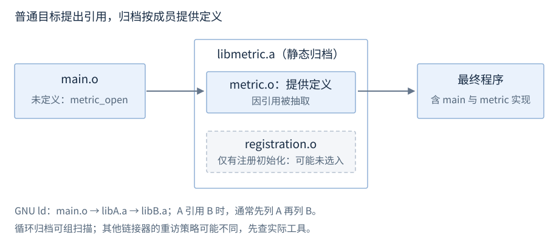
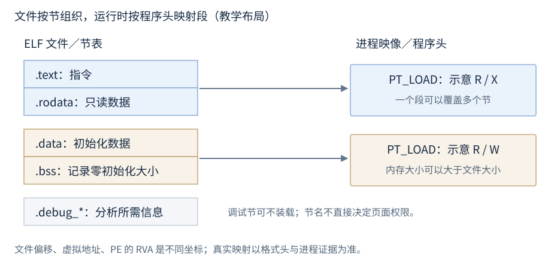
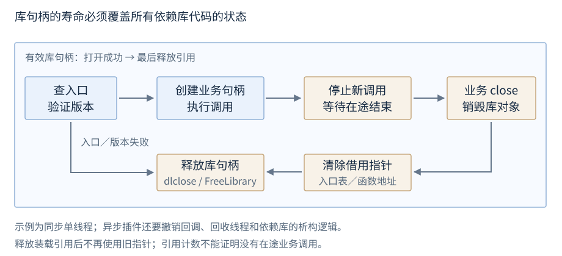

# 链接、装载与库

目标文件保存实现与引用；链接器组织产物并解析符号；装载器把产物建立为进程映像。本章先介绍这些实体与静态/共享库正常使用，再介绍搜索、显式加载和 ABI。

**范围与先修**：示例 C++17；格式与 API 分别限定 Linux ELF/glibc 与 Windows PE/COFF。先修为声明、定义、翻译单元与所有权。配套工程提供完整源码；CMake target 的组织归 R30，本章不依赖某一本机工具链。

## 目标文件与链接产物

**基础概念**。目标文件（object file）是编译后的组合输入，通常不能独立运行。可执行文件（executable）是能由装载器启动的映像；静态库（static library）是目标文件归档；共享库（shared library）是可在运行时映射并绑定的实现。

| 目标文件内容 | 保存的信息 | 用途 |
| --- | --- | --- |
| 代码与只读/可写数据 | 指令、常量、初始化字节 | 形成运行映像 |
| 符号表 | 定义、未定义引用、绑定属性 | 解析引用与定义 |
| 重定位项 | 修改位置、类型、符号、附加值 | 按布局补地址相关字段 |
| 格式与架构信息 | ELF/COFF、位数、机器类型等 | 让工具正确解释内容 |

GNU/Linux 编译驱动可将 `metric.cpp` 编成目标文件：

```text
g++ -std=c++17 -c metric.cpp -o metric.o
```

输入为源文件，`-c` 只编译不完成最终链接；产物 metric.o 保留后续链接所需信息。Windows MSVC 以 `cl /std:c++17 /DMETRIC_STATIC /c metric.cpp` 编译配套静态版本，通常输出 metric.obj；METRIC_STATIC 是配套接口头选择静态声明的工程宏，作用见“导出可见性与接口标注”。换后缀不改变格式，64 位输入不能直接成为 32 位目标的一部分。LTO 工具链还可能保留中间表示，使代码生成延续到链接阶段。[ELF 符号表](https://gabi.xinuos.com/elf/05-symtab.html)、[PE/COFF 格式](https://learn.microsoft.com/en-us/windows/win32/debug/pe-format)

## 符号与名称修饰

**基础概念**。符号（symbol）是目标文件用来标识定义或引用的条目，包含名称及相关属性。C++ 名称修饰（name mangling）通常把命名空间、重载和参数类型编码到机器符号；反修饰便于阅读，原始名字用于比较实际身份。

链接器把 main.o 的未定义引用关联到 metric.o 的定义，并组织输出布局。`f(int)` 与 `f(long)` 是不同类型，当前平台宽度相同也不会使符号等价。MSVC 和 GNU 不保证采用同一种编码。[Microsoft 修饰名](https://learn.microsoft.com/en-us/cpp/build/reference/decorated-names?view=msvc-170)

| 现象 | 常见原因 | 有效证据 |
| --- | --- | --- |
| undefined reference / unresolved external | 未链接实现，或签名/语言链接不同 | 比较引用与定义的原始符号 |
| multiple definition / already defined | 普通定义进入多个单元/重复输入 | 找每个定义来自哪个输入 |
| 库中可见但动态查不到 | 未动态导出或名称不匹配 | 动态符号表/导出表 |
| 查到地址却调用异常 | 布局、调用约定、寿命不同 | ABI 与所有权契约 |

`extern "C"` 规定语言链接，常用于确定动态入口名，不统一数据布局、位数、调用约定或分配器。inline/模板多单元定义仍有 ODR 一致性条件，弱符号/COMDAT 合并也不证明语言正确性。[语言链接](https://timsong-cpp.github.io/cppwp/n4659/dcl.link)、[ODR](https://timsong-cpp.github.io/cppwp/n4659/basic.def.odr)

## 静态库：创建与链接

**基础操作**。静态归档保留实际目标代码；最终链接把被选入的成员组合到输出。GNU ar 的正常命令形状：

```text
ar rcs libmetric.a metric.o
g++ main.o libmetric.a -o app
```

`r` 加入/替换成员，`c` 创建归档，`s` 建符号索引；main.o 引用库中的函数，最终 app 包含被选入实现。MSVC 使用 `lib /OUT:metric.lib metric.obj` 创建库，以 `cl main.obj metric.lib /Fe:app.exe` 完成普通链接；配套调用方 main.obj 也须在编译时定义 METRIC_STATIC，使声明对应静态实现。头文件仍需提供编译时声明，归档不能替代声明。[GNU ar](https://sourceware.org/binutils/docs/binutils/ar.html)

### 归档成员抽取与顺序



图27-1：GNU ld 常见归档扫描位置示意，其他链接器可能重访归档。抽取单位通常是目标文件，后续节回收是另一机制。

GNU ld 通常在库出现位置扫描；后面的目标新增引用不自动使先前归档重扫。main 引用 A、A 引用 B 时常用 `main.o libA.a libB.a`。循环引用可重列或用组扫描：

```text
g++ main.o -Wl,--start-group libA.a libB.a -Wl,--end-group -o app
```

仅靠全局构造函数注册、无可引用入口的成员可能未被抽取；可提供显式注册入口，确需整库保留再限定 whole-archive 范围。归档成功不证明依赖满足，链接静态库也不代表整个程序完全静态。[GNU ld 归档与组](https://sourceware.org/binutils/docs/ld/Options.html)

## 共享库、DLL 与导入库

**基础操作**。程序可在链接时记录共享依赖，由启动装载路径找到实现，也可运行中显式加载插件。链接成功仍需部署实际共享库及其传递依赖。

| 产物 | 链接时角色 | 运行时角色 |
| --- | --- | --- |
| Linux `.so` | 提供动态符号，可记录 SONAME | 动态链接器找到并绑定实现 |
| Windows `.dll` | 通常经导入库进行普通链接 | 装载器处理导出/导入地址 |
| Windows 导入 `.lib` / MinGW `.dll.a` | 提供 DLL 导入所需信息 | 不能替代 DLL 实现 |
| 静态 `.lib` / `.a` | 归档实际目标代码 | 被选入实现随产物部署 |

GNU/Linux 的简单创建和普通链接：

```text
g++ -std=c++17 -fPIC -shared metric.cpp -o libmetric.so
g++ main.o -L. -lmetric -o app
```

`-fPIC` 生成位置无关代码，`-shared` 输出共享库，`-L` 指链接搜索目录，`-lmetric` 请求相应库；运行搜索另行配置，不能从 -L 推出部署成功。Windows MSVC 以 `cl /std:c++17 /DMETRIC_BUILD /LD metric.cpp` 生成配套 DLL，METRIC_BUILD 让接口头声明导出；普通调用方采用默认导入声明并链接导入库。只发布 exe 与导入库仍会缺实现。[GCC 代码生成](https://gcc.gnu.org/onlinedocs/gcc/Code-Gen-Options.html)、[PE 导入与导出](https://learn.microsoft.com/en-us/windows/win32/debug/pe-format)

## 导出可见性与接口标注

**基础操作**。动态导出表是公开入口集合，普通符号表出现名字不等于动态查找可见。ELF 工具链可用 visibility 控制，Windows 可用 `__declspec(dllexport/dllimport)` 或 .def 导出协议名。

导出宏把平台声明差异集中在头文件。配套 METRIC_API 标注导出/导入，METRIC_CALL 表示调用约定，METRIC_NOEXCEPT 在 C++ 中标不传播异常；它们是工程定义，不是 C++ 关键字。

| 配套配置 | 含义 | 接口头结果 |
| --- | --- | --- |
| `METRIC_STATIC` | 静态库/调用方 | 不标 DLL 导入导出 |
| `METRIC_BUILD` | 正在构建动态库 | 标导出 |
| `METRIC_EXPLICIT` | 显式加载主程序 | 用协议声明/函数指针，不普通导入 |

Linux 示例默认隐藏内部符号再显式开放 API；Windows 普通调用者使用导入声明。固定导出名与 ABI 是不同问题，32 位调用约定可能改变名称装饰，必须核对实际导出。[接口宏源码](../examples/r27-libraries/metric_api.h)、[GCC visibility](https://gcc.gnu.org/onlinedocs/gcc/Code-Gen-Options.html)

## 节、段与进程映像

**基础概念**。装载器根据映像建立地址空间、权限与初始状态，动态链接器处理依赖及地址绑定；入口通常经过运行时启动代码再到 main，全局/库初始化可能发生在 main 前。

ELF 节（section）按链接/分析用途组织，例如 .text、.data、.bss；段（segment）按程序头描述运行映射，一个 PT_LOAD 可覆盖多个节。调试节可在文件中而不装入内存；零初始化空间可以不在文件保存等量零字节。



图27-2：节与段不是一一对应。PE 使用自己的节表及映像目录；RVA 是相对映像基址的虚拟地址，不是文件偏移。[ELF 程序装载](https://gabi.xinuos.com/elf/07-pheader.html)

## 重定位、PIC、PIE 与绑定

**机制解释**。重定位（relocation）按符号和布局修正地址相关字段；相对形式可示意为 S + A - P，S 是目标地址、A 为附加值、P 为修改位置。实际公式、位宽与溢出由目标 ABI 指定；静态与运行时可各完成一部分。[ELF 重定位](https://gabi.xinuos.com/elf/06-reloc.html)

PIC 为适应加载位置变化的代码生成方式，PIE 是相应可执行形式，ASLR 为 OS 地址随机化策略。位置无关不等于零重定位；指针和间接表项仍可能需修正。PE 基址重定位与导入地址填充也不是同一工作。

ELF 常见 GOT 保存间接地址，PLT 支持部分外部函数绑定；延迟绑定可推迟解析到首次调用，立即绑定更早暴露缺符号。路径受架构/选项/优化影响，不能认定每次调用必经 PLT。共享库链接报不适用的重定位时，核对输入对象的 PIC 要求和最终产物类型。[ELF 动态链接](https://gabi.xinuos.com/elf/08-dynamic.html)

## Linux ELF/glibc：运行搜索

**基础操作**。先查依赖名 → 再查搜索规则 → 确认实际加载路径。含斜杠的依赖字符串按路径处理，不含时通常考虑以下顺序；特殊链接配置、硬件能力目录与安全执行模式改变部分行为。

| 顺序 | 来源 | 关键条件 |
| --- | --- | --- |
| 1 | DT_RPATH | 无 DT_RUNPATH 时使用，可影响后代 |
| 2 | LD_LIBRARY_PATH | 安全执行模式忽略 |
| 3 | DT_RUNPATH | 仅该对象的直接 DT_NEEDED，子依赖需自己的规则 |
| 4 | /etc/ld.so.cache | 系统缓存候选 |
| 5 | 系统默认目录 | 按架构/链接选项确定 |

`$ORIGIN` 指含相关动态标签的程序/库目录，设置时避免 shell 提前展开；GNU 风格 `-Wl,-rpath,'$ORIGIN/../lib'` 的引用有实际意义。最终为 RPATH 还是 RUNPATH 以产物动态标签为准；app 的 RUNPATH 不自动传播为所有子库策略。[ld.so](https://man7.org/linux/man-pages/man8/ld.so.8.html)

## Windows：DLL 搜索

**基础操作**。加载方法、打包模型、搜索标志与系统配置决定候选范围。非打包程序的默认安全搜索包含重定向/API sets/SxS、已加载模块、Known DLLs 等前置规则，再按该模型的目录规则查找；新系统还可能考虑包依赖图。当前目录不总是第一站。[Windows DLL 搜索顺序](https://learn.microsoft.com/en-us/windows/win32/dlls/dynamic-link-library-search-order)

顶层 DLL 的完整路径不自动固定其所有依赖。显式加载可使用完整 UTF-16 路径及 `LOAD_LIBRARY_SEARCH_DLL_LOAD_DIR | LOAD_LIBRARY_SEARCH_SYSTEM32` 限定相应依赖目录；这些标志的系统版本支持和其他加载器规则仍需核对。编译 -I、链接 -L 与运行搜索是三个阶段。

## Linux/POSIX：dlopen、dlsym 与 dlclose

**基础操作**。`<dlfcn.h>` 的加载接口摘要：

```cpp
void* dlopen(const char* path, int flags);
void* dlsym(void* library, const char* name);
char* dlerror();
int dlclose(void* library);
```

dlopen 成功返回句柄、失败为空；RTLD_NOW 尽早解析、RTLD_LAZY 允许相关延迟，RTLD_LOCAL 限制符号传播。dlsym 查精确名称；先清旧 dlerror，再读取新错误，不能仅把地址为空解释为查找错误。dlclose 成功为 0，失败非零并可由 dlerror 说明。

下面约定库导出可调用的 `int version()`，report 与 consume 为调用方不抛的处理函数；这是平台操作摘录：

```cpp
void* library = dlopen(path, RTLD_NOW | RTLD_LOCAL);
if (!library) report(dlerror());
else {
    dlerror();
    void* address = dlsym(library, "version");
    const char* error = dlerror();
    if (error) report(error);
    else if (address) consume(reinterpret_cast<int (*)()>(address)());
    if (dlclose(library) != 0) report(dlerror());
}
```

path 是库路径；函数地址转换依 POSIX 契约，不是 ISO C++ 任意数据/函数指针转换保证。错误文本在下一次相关调用前复制或处理；卸载后不再使用函数地址。[dlopen/dlclose](https://man7.org/linux/man-pages/man3/dlopen.3.html)、[dlsym](https://man7.org/linux/man-pages/man3/dlsym.3.html)

## Windows：LoadLibraryExW、GetProcAddress 与 FreeLibrary

**基础操作**。`<windows.h>` 的接口摘要：

```cpp
HMODULE LoadLibraryExW(LPCWSTR path, HANDLE reserved, DWORD flags);
FARPROC GetProcAddress(HMODULE library, LPCSTR name);
BOOL FreeLibrary(HMODULE library);
```

LoadLibraryExW 成功返回模块句柄、失败为空；reserved 为 nullptr。GetProcAddress 返回导出入口地址，失败为空，名称大小写和调用类型须一致；FreeLibrary 释放装载引用，成功非零。失败立即取得 GetLastError。

下面约定绝对 UTF-16 path，库精确导出 C 风格名称 version 且约定 `int (__cdecl*)()`；report/consume 不抛：

```cpp
HMODULE library = LoadLibraryExW(path, nullptr,
    LOAD_LIBRARY_SEARCH_DLL_LOAD_DIR | LOAD_LIBRARY_SEARCH_SYSTEM32);
if (!library) report(GetLastError());
else {
    auto address = GetProcAddress(library, "version");
    if (!address) report(GetLastError());
    else consume(reinterpret_cast<int (__cdecl*)()>(address)());
    if (!FreeLibrary(library)) report(GetLastError());
}
```

这不是通用未知 DLL 的类型探测；签名与 ABI 必须事前约定。释放成功不保证立刻解除映射，也不允许继续调用旧地址。[LoadLibraryExW](https://learn.microsoft.com/en-us/windows/win32/api/libloaderapi/nf-libloaderapi-loadlibraryexw)、[GetProcAddress](https://learn.microsoft.com/en-us/windows/win32/api/libloaderapi/nf-libloaderapi-getprocaddress)、[FreeLibrary](https://learn.microsoft.com/en-us/windows/win32/api/libloaderapi/nf-libloaderapi-freelibrary)

## 插件协议与卸载

**组合应用**。配套库用 C 风格接口、不透明业务句柄和版本表缩小兼容面；业务句柄由库自身 close 销毁。版本不支持时入口返回空；失败不修改输出。四个声明是源码逐字摘录，宏用途已在导出条目定义：

<!-- source: examples/r27-libraries/metric_api.h -->
```cpp
METRIC_API metric_context* METRIC_CALL metric_open(void) METRIC_NOEXCEPT;
METRIC_API int32_t METRIC_CALL metric_clamp_percent(
    metric_context*, int32_t value, int32_t* output) METRIC_NOEXCEPT;
METRIC_API void METRIC_CALL metric_close(metric_context*) METRIC_NOEXCEPT;
METRIC_API const metric_api* METRIC_CALL metric_get_api(uint32_t version) METRIC_NOEXCEPT;
```

正常调用为取得 v1 接口表 → 校验版本/字段 → open 业务对象 → 调用 clamp_percent → close 业务对象 → 释放装载引用。普通 static/shared 调用者在构建时链接；显式插件只查 metric_get_api 后通过函数表调用。



图27-3：库寿命覆盖接口表、业务对象和在途调用。真实异步插件还需停止新调用、等待线程、撤销回调、销毁依赖库代码的对象；库引用计数不追踪应用自己的裸函数指针。

完整 [工程入口](../examples/r27-libraries/README.md)、[CMake target](../examples/r27-libraries/CMakeLists.txt)、[接口](../examples/r27-libraries/metric_api.h)、[实现](../examples/r27-libraries/metric.cpp)、[普通调用者](../examples/r27-libraries/linked_main.cpp)、[共同业务示例](../examples/r27-libraries/metric_check.h)、[插件调用者](../examples/r27-libraries/plugin_main.cpp) 保留原实现，不在正文展开测试包装。

## ABI 与所有权边界

**进阶后查**。应用二进制接口（application binary interface，ABI）规定机器调用、数据布局、符号和运行库关系；地址查找成功不证明调用契约一致。

| 边界 | 应约定 | 典型故障 |
| --- | --- | --- |
| 调用约定 | 参数/返回位置、栈、寄存器 | 第一次调用即异常 |
| 数据布局 | 位数、宽度、对齐、偏移、版本 | 新字段覆盖旧调用者区域 |
| C++ 运行时 | STL ABI、异常、RTTI、构建选项 | 对象解释或析构错误 |
| 所有权与 CRT | 分配/释放方及运行库 | 不匹配的堆/FILE 等资源 |

Microsoft x64 前四个常规参数位置用寄存器槽，整数与浮点槽不同并需影子空间，聚合与可变参数另有规则；这是具体 ABI，不是所有 64 位平台保证。[Microsoft x64 调用约定](https://learn.microsoft.com/en-us/cpp/build/x64-calling-convention?view=msvc-170)

C 接口、固定宽度字段、版本入口与配对销毁不能单独保证永久兼容。异常应在边界内转换错误；noexcept 限制传播，未处理异常仍终止。交换跨模块 CRT 对象需按工具链契约；配套示例不跨边界交付 STL 或异常。[DLL 与 CRT 对象](https://learn.microsoft.com/en-us/cpp/c-runtime-library/potential-errors-passing-crt-objects-across-dll-boundaries?view=msvc-170)

## 二进制调查工具

| 查询任务 | GNU/ELF | Windows MSVC |
| --- | --- | --- |
| 定义或引用符号 | `nm -C libmetric.a`、`nm --undefined-only main.o` | `dumpbin /symbols metric.obj` |
| 动态导出 | `readelf --dyn-syms libmetric.so` | `dumpbin /exports metric.dll` |
| 依赖与架构 | `readelf -h -d app` | `dumpbin /headers /dependents app.exe` |
| 节/段/重定位 | `readelf -S -l -r app` | `dumpbin /headers /relocations metric.obj` |
| 指令与引用 | `objdump -dr main.o` | `dumpbin /disasm metric.obj` |

readelf 专用于 ELF；MinGW PE/COFF 用其适配 objdump -p 检查，不能照搬 ELF 字段。nm -C 便于阅读，比较原始身份也保留未反修饰名字。[GNU 工具](https://sourceware.org/binutils/docs/binutils/)、[DUMPBIN](https://learn.microsoft.com/en-us/cpp/build/reference/dumpbin-reference?view=msvc-170)

调查保留实际链接输入、产物身份、依赖和加载路径，再比较符号与 ABI；只重新编译旧源码可能掩盖旧二进制不兼容。构建操作见 R30，崩溃和调用栈证据见 R31。
