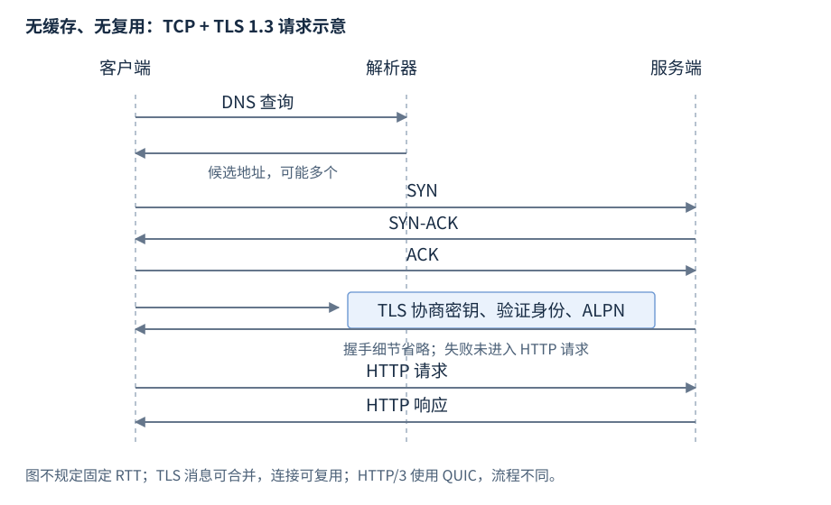

# 网络协议与连接

名称解析给出候选地址，IP 提供寻址与转发，TCP/UDP 提供传输，TLS 建立受保护通道，HTTP 定义请求响应。本章按协议实体、报文与交互学习；socket 的平台接口在 R29。

**范围与先修**：TCP 依据 RFC 9293，TLS 1.3 依据 RFC 8446，HTTP 语义与版本依据 RFC 9110–9114；这些不是 C++ 标准网络类型。先修为字节与字节序，协议报文无需 C++ 程序才能表达。

## 协议层与端点

**基础概念**。协议（protocol）规定参与者的消息格式、状态与交互规则。端点（endpoint）是通信一端，包含对应层识别它所需的地址或名称；不同层使用不同身份。

| 层或机制 | 识别与交付对象 | 正常任务 |
| --- | --- | --- |
| DNS | 名称与记录 | 查候选地址 |
| IP | IPv4/IPv6 地址 | 转发数据报到目的地址 |
| TCP/UDP | 地址与端口 | 交付字节流或数据报 |
| TLS | 通道、协商参数、认证身份 | 握手与保护记录 |
| HTTP | 方法、目标、字段、状态与内容 | 发送请求并解释响应 |

TCP 连接常按源/目的地址、源/目的端口和协议区分；NAT、代理和负载均衡改变观察端点。客户端到代理、代理到源站是不同连接。TCP connect 成功只说明当前对端一段建立，不证明所有上游或业务成功。

## DNS 名称与记录

**基础操作**。域名系统（Domain Name System，DNS）用名称及记录类型查询记录集合。A 返回 IPv4 地址，AAAA 返回 IPv6 地址，CNAME 表示名称别名；TTL 是记录可缓存的时间约束。

示意查询与记录，不代表对这些名称发起实际查询：

```text
问题：service.example. 的 A 记录是什么？
回答：service.example.  300  IN  A  192.0.2.10
```

这里 300 为 TTL 秒数，IN 为互联网记录类，A 为类型。查询可返回多个记录，也可得到不存在/无该类型或其他错误；地址只是候选，需要随后建连。

常见解析过程是应用请求本地解析器 → 本地缓存命中或向 DNS 服务查询 → 必要时沿委派找到权威数据 → 缓存并返回。系统 hosts 与本地配置也可给结果，getaddrinfo 不保证每次都发送外部 DNS 报文。DNS 更新不立即改变已有连接，地址缓存与连接池寿命分别管理。[DNS 概念 RFC 1034](https://www.rfc-editor.org/rfc/rfc1034)、[记录/报文 RFC 1035](https://www.rfc-editor.org/rfc/rfc1035)

## IP 地址、路由与 MTU

**基础概念**。IP 数据报包含网络层头与载荷；IPv4 地址为 32 位，IPv6 为 128 位。路由（routing）决定下一跳，端口不是 IP 地址的一部分。IP 本身不保证可靠交付、顺序或应用身份。

IPv4 常用点分十进制表示，IPv6 常用冒号十六进制表示；URL 中带端口的 IPv6 字面量使用方括号，例如 `https://[2001:db8::1]:443/`。IPv6 不能塞入 IPv4 的 32 位槽位，地址族和候选集合需要保留。

最大传输单元（maximum transmission unit，MTU）限制一跳可承载的网络层包；路径 MTU 是整条路径对应的限制。协议头占用部分空间，TCP 可分段，UDP 单数据报需自己的尺寸策略，不能把常见以太网值当任意公网容量。IPv6 路由器不对转发包做分片，发送方需处理相应路径条件。[IPv6 RFC 8200](https://www.rfc-editor.org/rfc/rfc8200)

## 端口与服务身份

**基础概念**。端口（port）是传输层区分端点的 16 位标识；TCP 与 UDP 各有命名空间，监听服务通常使用约定端口，客户端常使用 OS 分配的临时端口。

地址与端口用于传输定位，HTTPS 的目标名称、TLS 认证名和 HTTP 路由仍是独立条件。把域名改为某个 IP 字面量可能改变证书名字验证、SNI 或虚拟主机选择；调查时保留逻辑目标与实际连接地址。

## TCP 字节流与报文段

**基础概念**。传输控制协议（Transmission Control Protocol，TCP）向应用提供可靠有序字节流。TCP 段（segment）包含头及字节载荷；序列号标记流中位置，确认号表示接收侧下一期望位置，标志位控制建连/关闭等过程。

应用一次 send 的边界不成为接收消息边界：一个消息可经多个 recv 获得，多条消息可在一次读取中出现。头中的序号、确认与重传支持传输进展；应用仍负责分帧与业务结果。

| TCP 头信息 | 作用 | 应用观察 |
| --- | --- | --- |
| 源/目的端口 | 区分传输端点 | 连接本地/远端 |
| 序列号与确认号 | 标记字节序及接收进度 | 流按序交付 |
| SYN/ACK/FIN/RST 等 | 建连、确认、关闭与重置 | 状态转换/EOF/错误 |
| 接收窗口 | 告知接收方可承受量 | 发送可能等待 |

TCP ACK 不是数据持久化或交易提交确认；重传修复传输丢失，不替代业务重试。[TCP RFC 9293](https://www.rfc-editor.org/rfc/rfc9293)

## TCP 建立与关闭

**基础交互**。普通主动/被动打开的三次握手示意：

```text
客户端                         服务端（监听）
  SYN, seq=x          ------>
                      <------  SYN+ACK, seq=y, ack=x+1
  ACK, ack=y+1        ------>
双方进入已建立状态，随后可交换字节
```

SYN 占用一个序列位置，握手建立双方序号与状态；成功连接不表示服务端已经处理业务请求。

有序关闭结束发送方向，仍可接收另一方向数据。以下仅是两侧依次结束的典型示意，ACK 与 FIN 可以合并，不规定固定四个独立包：

```text
A发送FIN -> B确认 -> B读完并看到A方向EOF
B完成剩余发送后发送FIN -> A确认 -> 两侧完成关闭状态转换
```

FIN 之后到达的 EOF 只说明该方向字节结束，是否得到完整消息由应用定界决定。RST 表示重置/异常终结。TIME_WAIT 是避免旧段混淆等协议目的的正常状态，数量需结合建连与主动关闭速率理解。[TCP 建立 §3.5](https://www.rfc-editor.org/rfc/rfc9293.html#section-3.5)、[关闭 §3.6](https://www.rfc-editor.org/rfc/rfc9293.html#section-3.6)

流量控制（flow control）限制发送方不超出接收方能力；拥塞控制（congestion control）适应网络负载，两者是不同限制。连接终止、重传、窗口和业务超时都需分层取证。

## UDP 数据报

**基础概念**。用户数据报协议（User Datagram Protocol，UDP）交付有边界的数据报，不建立 TCP 式握手，也不保证交付、顺序或去重。UDP 头为 8 字节，包含源端口、目的端口、长度和校验和，各 16 位；长度包含头与载荷。

正常操作是应用指定对端并交付一份数据报 → IP 转发 → 接收应用获得该报文；也可能丢失、重复或重排。接收缓冲不足可造成截断，不会像 TCP 一样把剩余部分自动当后续流字节交付。零长度载荷仍是一份合法数据报，不是 TCP EOF。

| 能力 | TCP | UDP |
| --- | --- | --- |
| 应用交付单位 | 有序字节流，应用分帧 | 数据报边界 |
| 可靠/顺序 | 传输层处理，但连接可失败 | 基础协议不保证 |
| 建连 | TCP 连接状态与握手 | 无基础握手，socket connect 可只设置对端 |
| 大消息 | 分段后仍为字节流 | 需尺寸/路径策略，避免依赖分片 |

UDP 不保证更快；应用需按需求补丢失、重排、重复与拥塞策略。QUIC 可在 UDP 上实现可靠流，不能把 UDP 基础性质套给整个上层协议。[UDP RFC 768](https://www.rfc-editor.org/rfc/rfc768)、[QUIC RFC 9000](https://www.rfc-editor.org/rfc/rfc9000.html)

## TLS 1.3 握手与记录

**基础概念**。传输层安全（Transport Layer Security，TLS）通过握手协商密钥/参数，认证相应对端，并使用记录协议保护内容机密性与完整性。TLS 不负责业务授权，不保护解密后的端点内存，也不定义业务分帧。

普通服务器证书握手的逻辑消息示意，省略 HelloRetryRequest、客户端证书、会话恢复与 0-RTT：

```text
客户端 -> 服务端：ClientHello（版本、算法、密钥份额等）
服务端 -> 客户端：ServerHello
服务端 -> 客户端：EncryptedExtensions、Certificate、CertificateVerify、Finished
客户端 -> 服务端：Finished
双方交换受保护的应用数据记录
```

握手消息可合并传输，TLS 记录和 TCP 读取边界均不是业务消息边界。客户端验证证书链、有效期与目标名字；协商加密不自动证明身份正确。ALPN 协商上层协议，例如 HTTP/2，SNI 提供目标服务器名；使用库时需按对应认证与扩展规则配置。[TLS 1.3 RFC 8446](https://www.rfc-editor.org/rfc/rfc8446)、[ALPN RFC 7301](https://www.rfc-editor.org/rfc/rfc7301)



图28-1：无缓存/复用的 TCP + TLS 1.3 场景，不承诺固定 RTT；HTTP/3 的 QUIC 建立不同。恢复可减少握手成本，0-RTT early data 有重放风险，不能作为一次执行保证。关闭/截断由 TLS 库按协议解释。[TLS early data §8](https://www.rfc-editor.org/rfc/rfc8446.html#section-8)

## HTTP 请求与响应

**基础交互**。超文本传输协议（Hypertext Transfer Protocol，HTTP）定义方法、目标、状态、字段与内容语义。客户端发请求，服务器或中间参与者返回响应；缓存/代理可能参与，响应不总是来自源站实时计算。

以下为 HTTP/1.1 报文示意，每行终结为 CRLF，空行结束字段区。请求无内容：

```http
GET /status HTTP/1.1
Host: service.example
Accept: text/plain

```

响应内容是两个 ASCII 字节 OK，Content-Length 为 2，不包含字段区与空行：

```http
HTTP/1.1 200 OK
Content-Type: text/plain
Content-Length: 2

OK
```

方法表达操作语义，目标指定资源，字段补充路由/表示/控制信息；状态码说明响应语义，2xx 仍按接口解释业务效果，202 可表示已接受而尚未完成。消息完整与业务成功由不同证据确认。[HTTP 语义 RFC 9110](https://www.rfc-editor.org/rfc/rfc9110.html)

## HTTP/1.1 定界与连接复用

**机制解释**。HTTP/1.1 消息体长度由方法、状态和字段等规则确定，不是“一次 recv”。无消息体情形、Content-Length、chunked 编码及某些关闭定界形式分别适用；Transfer-Encoding/Content-Length 冲突不能凭本例随意处理，应按完整解析规则执行。

chunked 形式以十六进制块长度及数据交付，零块终结；字段/块头/内容均可跨读取分段。连接 EOF 对长度未满足的消息意味着截断，不能普遍当成功完整响应。复用前须消费当前消息，避免下一消息起点错位。[HTTP/1.1 定界 RFC 9112 §6](https://www.rfc-editor.org/rfc/rfc9112.html#section-6)

连接池减少建连/握手成本，但需限制每目标连接量、空闲寿命与取池等待；已有连接可通向 DNS 更新前的端点。复用不等于无限并发，池等待应单独计时。

## HTTP/2 与 HTTP/3

**基础概念**。HTTP/2 把消息映射为二进制帧与流，一条 TCP 连接可多路复用；流量控制存在连接和流层。HTTP/3 把 HTTP 映射到 QUIC 的流与帧，QUIC 运行在 UDP 上，可靠和安全能力来自 QUIC。

| 版本 | 常见承载与组织 | 主要边界 |
| --- | --- | --- |
| HTTP/1.1 | TCP；HTTPS 加 TLS | 消息定界与复用顺序 |
| HTTP/2 | TCP 上二进制帧与多个流 | TCP 丢失可影响多个流交付 |
| HTTP/3 | QUIC 上多个流 | 独立流减少跨流传输阻塞，拥塞/资源仍可共享 |

HEADERS 与 DATA 等帧组织请求/响应，帧边界不等于网络读取边界；实现应使用符合相应版本的协议库。独立流减少某些阻塞不意味着每次请求固定更快。[HTTP/2 RFC 9113](https://www.rfc-editor.org/rfc/rfc9113)、[HTTP/3 RFC 9114](https://www.rfc-editor.org/rfc/rfc9114)

## 分层调查入口

| 现象 | 检查依据 | 调查方向 |
| --- | --- | --- |
| 名称解析失败 | 类型、解析器、缓存、状态 | 名字层与服务状态分开 |
| 解析成功而连接超时 | 候选、路由、监听、防火墙 | 地址候选可达性 |
| TCP 成功而 TLS 失败 | 版本、证书、名字、时间、ALPN | 握手与认证配置 |
| TLS 成功而 HTTP 异常 | 定界、状态、代理、目标 | 协议消息和业务结果 |
| 间歇慢请求 | 解析/池/建连/握手/首字节分段耗时 | 避免总耗时混合多个阶段 |
| 多连接而吞吐低 | 流限制、背压、重试放大 | 找实际容量限制 |

socket 基础操作、完整请求重试与幂等见 [R29](R29-sockets-production.zh-CN.md)，字段编码见 [字节序](R24-cpu-memory-cost.zh-CN.md)。
