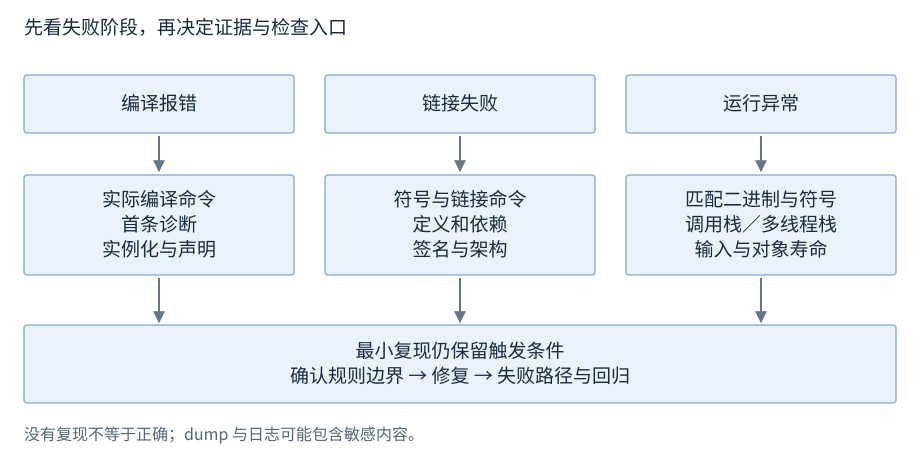

# 第29章 调试与正确性检查

故障发生的位置不一定是错误产生的位置。先保留可重现输入、构建身份和现场，再缩小到违反了哪条边界；调试器看现场，检查器找特定缺陷，两者互补。

**基线**：示例 C++17。**先修**：生命周期、边界、异常和 R28 构建。调试器命令依工具版本与平台而异，不能跨工具逐字照搬。

## 1 从症状选择证据

| 症状 | 最小证据 | 第一轮检查 | 常见误判 |
| --- | --- | --- | --- |
| 编译报错 | 完整命令与首条相关诊断 | 类型、约束、声明可见性 | 先处理几十条连锁错误 |
| 链接失败 | 未解析／重复的符号和链接命令 | 定义、依赖、签名、架构 | 添加任意路径直到通过 |
| 崩溃 | dump/core、符号与匹配二进制 | 调用栈、参数、所有者生命周期 | 崩溃在标准库所以是库错误 |
| 偶发错误／卡死 | 多线程栈、输入、时序日志 | 同步关系、锁顺序、退出协议 | 多加 sleep 视为修复 |

最小复现仍要保留触发问题的条件：一段单线程缩写可能删除了真正的数据竞争；关掉优化可能改变内存布局，不能因此证明问题不存在。



图29-1：按失败阶段选证据，最终回到边界、生命周期、同步或接口契约。没有复现只是降低观察机会，不是正确性结论。

## 2 调试器与故障现场

| 想看什么 | GDB 常用入口 | LLDB 常用入口 | Visual Studio 对应窗口 |
| --- | --- | --- | --- |
| 设置断点 | break 函数名／文件:行 | breakpoint set --name 函数名 | 断点 |
| 调用链 | bt，frame N | bt，frame select N | 调用堆栈 |
| 局部量与表达式 | info locals，print 表达式 | frame variable，expression | 局部变量、监视 |
| 各线程位置 | info threads，thread apply all bt | thread list，thread backtrace all | 线程、并行堆栈 |

优化可能内联函数、移除变量或改变源代码步进；保留匹配的符号和二进制。GDB 的 backtrace 是选中线程的调用链；卡死分析要查看所有相关线程，而不是只看主线程。[GDB 调用栈](https://sourceware.org/gdb/current/onlinedocs/gdb.html/Backtrace.html)、[线程](https://sourceware.org/gdb/current/onlinedocs/gdb.html/Threads.html)、[LLDB 命令对照](https://lldb.llvm.org/use/map.html)。

Linux core 与 Windows minidump 是现场制品。dump 可能不包含所有内存，错误的符号也会误导解释。调试现场可能携带口令、个人数据或业务内容，保存与分享前应遵循数据权限，不能为诊断随意上传。[Windows dump](https://learn.microsoft.com/en-us/windows-hardware/drivers/debugger/user-mode-dump-files)。

## 3 sanitizer 的用途与限制

| 工具 | 常见检测范围 | 边界 |
| --- | --- | --- |
| ASan | 越界、use-after-free 等内存错误 | 不是所有内存错误都能检测；覆盖的是实际执行路径 |
| UBSan | 多类未定义行为，如部分溢出与错误转换 | 具体检查集合随选项而变；不是完整 UB 判定器 |
| TSan | 数据竞争 | 不代替死锁与算法正确性证明；有平台和运行成本限制 |

典型 Clang 编译入口是 -g、合适的优化级别、-fsanitize=address 或 -fsanitize=undefined，并在最终链接步骤保留相应选项。TSan 单独构建测试版本，不与 ASan 混在一个可执行文件中。不要将带检查器的性能数字当生产基准。[ASan 用法](https://clang.llvm.org/docs/AddressSanitizer.html)、[UBSan](https://clang.llvm.org/docs/UndefinedBehaviorSanitizer.html)、[TSan 平台与限制](https://clang.llvm.org/docs/ThreadSanitizer.html)。

MSVC 有自己的 ASan 选项与支持范围；不能因 Windows 下能用 ASan，就推断 Clang TSan 在该平台同样可用。本书不要求安装检查器，使用前先核对现有工具链。[MSVC ASan](https://learn.microsoft.com/en-us/cpp/sanitizers/asan?view=msvc-170)。

## 4 检查正常路径与失败边界

例子将“先检查下标，再读取，再检查算术范围”写成明确接口。输入错误用空 optional 表达，示例不会通过运行 UB 来观察错误。

```cpp
#include <cstddef>
#include <iostream>
#include <limits>
#include <optional>
#include <vector>
std::optional<int> checked_double(const std::vector<int>& v,
                                  std::size_t index) {
    if (index >= v.size()) return std::nullopt;
    const int x = v[index];
    if (x > std::numeric_limits<int>::max() / 2 ||
        x < std::numeric_limits<int>::min() / 2) return std::nullopt;
    return x * 2;
}
int main() {
    const std::vector<int> v{3, std::numeric_limits<int>::max(),
                            std::numeric_limits<int>::min()};
    if (checked_double(v, 0) != 6 || checked_double(v, 1) ||
        checked_double(v, 2) || checked_double(v, 3)) return 1;
    std::cout << "PASS normal, overflow, underflow, index\n";
    return std::cout ? 0 : 2;
}
```

配套文件：[r29-debug.cpp](../examples/r29-debug.cpp)，按 R01 的 C++17 编译入口运行。预期输出 PASS normal, overflow, underflow, index。程序同时核对正常值、正向溢出、负向越界和无效下标；失败返回非零。它不依赖 assert，Release 下也不会因 NDEBUG 跳过检查。[optional](https://timsong-cpp.github.io/cppwp/n4659/optional)、[表达式规则](https://timsong-cpp.github.io/cppwp/n4659/expr)。

边界测试应包括空输入、最后合法位置、第一个非法位置、最大最小值、重复操作和失败之后的资源状态。发现缺陷后增加能保护相关契约的回归检查，不为凑覆盖率复制大量实现细节测试。

## 5 故障修复的完成条件

修复需要说明错误原因、修改的规则边界、回归输入和验证配置。网络错误、分配失败与超时可以通过可控接口做故障注入，不需要把生产系统真正搞坏。

遇到非确定性故障，记录线程协议和必要的先后关系；“重复跑一百次都正常”只是一条观察。生命周期问题见R05/R09，迭代器失效见R13/R14，内存模型见R22。故障定位后再做性能分析，不能靠关闭校验换得“稳定”。
