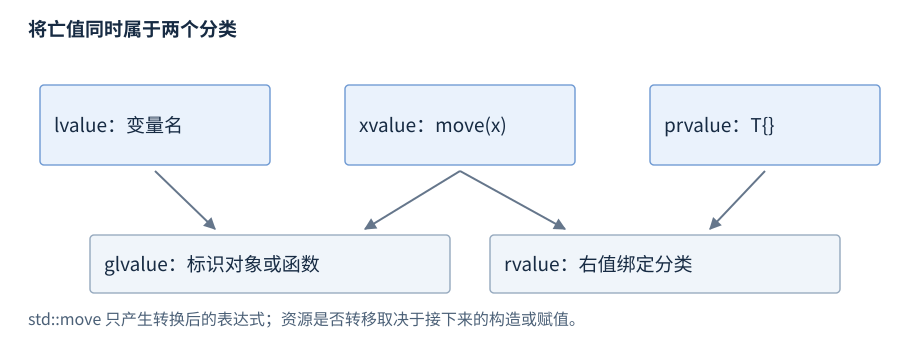

# 表达式与类型转换

表达式（expression）由操作数和运算符组成，用来计算值、标识对象或产生副作用。本章先按运算符介绍常用写法，再解释求值顺序、值类别和类型转换。

**版本**：C++17；后续标准可能改变部分转换和移位规则。**先修**：[类型与对象](R02-types-objects.zh-CN.md)、[初始化与类型推导](R03-initialization-deduction.zh-CN.md)。基础入口是算术、比较与逻辑运算；指针操作见[指针与引用](R05-pointers-references.zh-CN.md)，重载运算符见[运算符重载与 friend](R07-classes-lifetime.zh-CN.md#运算符重载与-friend)。

## 运算符分类

**基础操作**。操作数是参与运算的表达式，例如 `a + b` 中的 `a` 和 `b`。一元、二元、三元分别表示操作数数量；同一符号可能有不同用途，例如一元 `*p` 解引用与二元 `a * b` 乘法。

| 类别 | 常用符号或语法 | 主要结果 |
| --- | --- | --- |
| 算术 | `+ - * / %`，一元 `+ -` | 数值计算；`%` 用于整数余数 |
| 比较 | `== != < <= > >=` | 内建比较产生 `bool` |
| 逻辑 | `! && \|\|` | 判断布尔条件；内建 `&&/\|\|` 短路 |
| 位运算 | `~ & \| ^ << >>` | 整数位的取反、组合和移位 |
| 赋值与增减 | `= += -= *= /= %= ++ --` 等 | 修改对象；前置与后置返回不同结果 |
| 条件与逗号 | `condition ? a : b`，`(a, b)` | 选择分支，或依次求值后取右侧结果 |
| 访问与调用 | `a[i]`、`object.member`、`p->member`、`f(args)` | 访问元素/成员或调用函数 |
| 指针与类型查询 | `&object`、`*p`、`sizeof`、`alignof` | 获得地址、访问对象或查询类型性质 |

下面的结果说明针对内建运算符。类类型可以重载部分运算符，例如流的 `<<` 表示输出；重载后的语义需要查相应类型接口。`sizeof` 查询大小、`alignof` 查询对齐，详见[类型与对象](R02-types-objects.zh-CN.md)；资源创建和释放的 `new/delete` 见[RAII 与内存管理库](R09-raii-memory.zh-CN.md)。

## 算术运算符

**基础操作**。`+ - * /` 可用于算术类型；整数除法丢弃小数部分，向零截断。`%` 的两侧要求整数或适用的非作用域枚举类型。局部例子放在函数体内，无需头文件：

**独立片段**。

```cpp
int a = 7, b = 3;
int sum = a + b;               // 10
int quotient = a / b;          // 2
int remainder = a % b;         // 1
int negative = -7 / 3;         // -2
double ratio = 7.0 / 3;        // 约 2.33333
```

先确定操作数类型，才能确定运算方式。把 `7 / 3` 的结果赋给 `double` 仍得到 `2.0`；要做浮点除法，应在运算前让至少一侧成为浮点类型。非零除数且商可表示时，整数满足 `(a / b) * b + a % b == a`，非零余数的符号与被除数相同。

**必要条件**。整数除数为零时，除法和余数运算的行为未定义。最小有符号整数除以 `-1`，若商不可表示，除法及相应余数运算也具有未定义行为。有符号加减乘结果超出类型范围同样具有未定义行为；无符号运算按该类型的模数回绕。浮点表示、精度和异常处理依赖实现，不能把整数规则直接套到浮点运算。[C++17 乘法、除法与余数](https://timsong-cpp.github.io/cppwp/n4659/expr.mul)、[加减运算](https://timsong-cpp.github.io/cppwp/n4659/expr.add)。

## 比较与逻辑运算符

**基础操作**。比较产生真假值；逻辑运算将操作数转换为布尔条件。数值零和空指针为假，其他适用数值和非空指针为真。以下是函数体内的局部例子：

**独立片段**。

```cpp
int age = 20;
bool adult = age >= 18;        // true
bool in_range = 18 <= age && age < 65; // true
int value = 4;
int* p = &value;
bool positive = p && *p > 0;   // 先检查 p，再解引用
bool absent = !p;             // false
```

内建 `&&` 从左至右求值，左侧为假就跳过右侧；内建 `||` 左侧为真就跳过右侧。因此 `p && *p > 0` 在 `p` 为空时不会解引用。不要把区间比较写为 `18 <= age < 65`：它先算 `18 <= age`，再把 `bool` 与 `65` 比较。混合有符号和无符号比较的转换规则见[整数提升与通常算术转换](#整数提升与通常算术转换)。

**机制解释**。重载的 `operator&&`、`operator||` 是函数调用，两个操作数都会求值，不能用来实现内建短路。在 C++17 中，以运算符语法调用重载运算符仍遵循相应内建运算符的求值顺序规则；这不赋予它短路能力。[逻辑与](https://timsong-cpp.github.io/cppwp/n4659/expr.log.and)、[逻辑或](https://timsong-cpp.github.io/cppwp/n4659/expr.log.or)、[重载运算符表达式](https://timsong-cpp.github.io/cppwp/n4659/over.match.oper)。

## 位运算与移位

**基础操作**。按位与 `&` 保留两侧都为 1 的位，按位或 `|` 保留至少一侧为 1 的位，异或 `^` 保留两侧不同的位，按位取反 `~` 翻转各位。逻辑运算回答真假，位运算处理整数位。以下在函数体内演示设置、查询和清除一个标志：

**独立片段**。

```cpp
unsigned flags = 0b0010u;
unsigned mask = 1u << 2;       // 0b0100
flags |= mask;                // 0b0110：设置第 2 位
bool enabled = (flags & mask) != 0; // true
flags &= ~mask;               // 0b0010：清除第 2 位
unsigned shifted = flags >> 1; // 0b0001
```

位运算先执行整数提升；移位结果类型由提升后的左操作数决定，而不是两侧共同决定。移位次数必须非负，且小于提升后左侧类型的位宽。C++17 中无符号左移按模数计算，右移相当于除以 2 的相应幂并取整数部分。

**进阶后查**。C++17 的有符号左移要求左值非负，且移位后的数学结果可由对应无符号类型表示，再转换回有符号类型；否则行为未定义。负有符号值的右移结果由实现定义。位掩码通常选择无符号类型，并在动态移位前检查次数。字节序与协议编码分别见[CPU 与程序执行成本](R24-cpu-memory-cost.zh-CN.md)和[数值、随机与位工具](R33-numeric-random-bits.zh-CN.md)。[移位规则](https://timsong-cpp.github.io/cppwp/n4659/expr.shift)、[按位与](https://timsong-cpp.github.io/cppwp/n4659/expr.bit.and)。

## 赋值、自增与自减

**基础操作**。赋值 `lhs = rhs` 把右侧转换为左侧类型后写入可修改对象。复合赋值把运算和写回合在一起，例如 `n += 3`；相对于 `n = n + 3`，其左操作数只求值一次。前置 `++n/--n` 修改后返回对象本身，后置 `n++/n--` 返回修改前的值。

**独立片段**。

```cpp
int n = 4;
n += 3;                       // n 为 7
int before = n++;             // before 为 7，n 为 8
int after = ++n;              // after 为 9，n 为 9
int a = 0, b = 0;
a = b = 5;                    // a、b 均为 5
```

`a = b = 5` 按 `a = (b = 5)` 分组，内建赋值表达式是指向左操作数的左值。自增和复合赋值仍受类型范围约束，不会自动防止有符号溢出。C++17 赋值的右操作数先于左操作数求值；多个修改之间的关系见[求值顺序与副作用](#求值顺序与副作用)。[赋值](https://timsong-cpp.github.io/cppwp/n4659/expr.ass)、[前置增减](https://timsong-cpp.github.io/cppwp/n4659/expr.pre.incr)、[后置增减](https://timsong-cpp.github.io/cppwp/n4659/expr.post.incr)。

## 条件运算符与逗号运算符

**基础操作**。条件运算符的形状是 `条件 ? 真分支 : 假分支`；先判断条件，只求值选中的一个分支。以下片段放在函数体内：

**独立片段**。

```cpp
int a = 3, b = 8;
int larger = a > b ? a : b;    // 8
int changes = 0;
int selected = true ? ++changes : 0; // selected、changes 均为 1
int result = (++changes, changes * 10); // changes 为 2，result 为 20
```

条件表达式的类型和值类别仍由两个分支共同参与确定；没有被选中的分支也需要符合编译期语义要求。内建逗号运算符先完整求值左侧，再求值右侧，结果的类型和值类别取自右侧。函数调用 `f(a, b)` 和声明中的逗号通常是语法分隔符，不保证这两个表达式按逗号运算符的方式执行。[条件运算符](https://timsong-cpp.github.io/cppwp/n4659/expr.cond)、[逗号运算符](https://timsong-cpp.github.io/cppwp/n4659/expr.comma)。

## 优先级与结合性

**基础操作**。优先级决定不同运算符怎样分组；结合性决定同级运算符怎样分组。它们解释表达式的语法结构，求值先后由另一组规则规定。

| 运算符组（由高到低，常用部分） | 结合性 | 分组示例 |
| --- | --- | --- |
| 调用、下标、成员访问、后置增减、具名 cast | 从左到右 | `p->member[i]` |
| 一元、前置增减、C 风格 cast | 从右到左 | `!*p` 为 `!(*p)` |
| `* / %`；随后 `+ -` | 各组从左到右 | `a + b * c` 为 `a + (b * c)` |
| `<< >>`；随后关系；随后相等 | 各组从左到右 | `a << 1 == b` 为 `(a << 1) == b` |
| `&`；随后 `^`；随后 `\|` | 各组从左到右 | `a & b == c` 为 `a & (b == c)` |
| `&&`；随后 `\|\|` | 各组从左到右 | `a \|\| b && c` 为 `a \|\| (b && c)` |
| 条件、赋值 | 从右到左 | `a = b = c` 为 `a = (b = c)` |
| 逗号 | 从左到右 | `a, b, c` 为 `(a, b), c` |

这是常用部分的摘要，不包含所有语法。位掩码判断写成 `(flags & mask) != 0` 可直接表达意图；写成 `flags & mask != 0` 会按 `flags & (mask != 0)` 分组。括号改变分组，不为原本未排序的操作增加先后保证。[运算符优先级表](https://en.cppreference.com/w/cpp/language/operator_precedence.html)。

## 求值顺序与副作用

**机制解释**。求值包括计算结果及副作用，例如写入变量、输入输出。先序关系（sequenced before）规定一项求值在另一项之前完成；不确定先后但有序（indeterminately sequenced）允许两种先后次序，但不交错；未排序（unsequenced）没有这样的先后保证。

完整表达式之间通常按语句顺序执行：

**独立片段**。

```cpp
int i = 0;
int first = i++;               // first 为 0，i 为 1
int second = i++;              // second 为 1，i 为 2
int total = first + second;    // 1
```

常用的局部保证是：内建 `&&/||` 先左后右并短路；条件运算符先判断再执行选中分支；内建逗号先左后右；C++17 赋值先右后左。普通算术 `a + b` 的优先级不规定先算哪侧。

**进阶后查**。C++17 函数参数的初始化彼此不确定先后但有序。若 `f` 接受两个 `int`，从 `i = 0` 调用 `f(i++, i++)` 后 `i` 为 2，实参可为 `(0, 1)` 或 `(1, 0)`，不能依赖其中一种。`i++ + i++` 对同一对象的两次修改未排序，仍具有未定义行为；不要通过运行它来推断规则。将修改拆成上面的几条语句可明确所需顺序。[执行与序列](https://timsong-cpp.github.io/cppwp/n4659/intro.execution)、[函数调用](https://timsong-cpp.github.io/cppwp/n4659/expr.call)。

| 行为类别 | 标准对实现的要求 | 例子 |
| --- | --- | --- |
| 未指定行为（unspecified behavior） | 可在允许的行为中选择，不要求记录选择 | 上述函数参数先后 |
| 实现定义行为（implementation-defined behavior） | 实现选择并记录行为 | 普通 `char` 的有符号性；C++17 负有符号值右移 |
| 未定义行为（undefined behavior） | 标准不施加行为要求 | 有符号溢出、冲突的未排序修改、越界访问 |

一次输出不能把未指定行为固定为通用保证，也不能证明存在未定义行为的写法有效。

## 值类别

**基础操作**。值类别（value category）描述某个表达式如何标识对象或产生值，与表达式的类型一起影响引用绑定和重载选择。三种基本类别互斥，另外两种是它们的组合：

| 类别 | 定义与例子 | 常见使用 |
| --- | --- | --- |
| 左值 lvalue | 标识对象或函数；`n`、`*p`、返回 `T&` 的调用 | 访问已有对象，绑定 `T&` 或适用的 `const T&` |
| 将亡值 xvalue | 标识资源可被复用的对象；对对象的 `std::move(n)`、返回 `T&&` 的调用 | 参与右值引用重载 |
| 纯右值 prvalue | 计算值或初始化结果对象；`42`、`n + 1`、`T{}`、返回 `T` 的调用 | 提供计算结果或初始化目标 |
| 泛左值 glvalue | lvalue 与 xvalue 的并集 | 表示对象或函数的身份 |
| 右值 rvalue | xvalue 与 prvalue 的并集 | 参与右值引用绑定等规则 |

下面用 `decltype` 展示类别怎样影响引用类型；需要 `<type_traits>`、`<utility>`，放在函数体内。额外括号让 `decltype((n))` 按表达式类别判断，区别于变量名的特殊规则 `decltype(n)`：

**独立片段**。

```cpp
int n = 7;
int&& rr = 8;
static_assert(std::is_same_v<decltype((n)), int&>); // lvalue
static_assert(std::is_same_v<decltype(std::move(n)), int&&>); // xvalue
static_assert(std::is_same_v<decltype(n + 1), int>); // prvalue
static_assert(std::is_same_v<decltype((rr)), int&>); // 命名 rr 是 lvalue
```

`rr` 的声明类型是右值引用，但名称表达式 `rr` 是左值。`std::move(n)` 产生将亡值，既不执行资源转移，也不延长生命周期；后续构造或赋值选中了相应操作才可能移动。移动与转发的用法由[拷贝与移动](R08-copy-move.zh-CN.md)维护。



图：lvalue 和 xvalue 组成 glvalue；xvalue 和 prvalue 组成 rvalue。分类表达身份与值的语义，不表示内存区域。

**机制解释**。C++17 的类 prvalue 可直接初始化结果对象；需要对象身份的上下文才进行临时物化（temporary materialization），产生指向临时对象的 xvalue。例如 `const int& ref = 42;` 需要物化临时对象；其生命周期规则见[指针与引用](R05-pointers-references.zh-CN.md)。不能假定每个 prvalue 都先创建独立临时再拷贝。[值类别定义](https://timsong-cpp.github.io/cppwp/n4659/basic.lval)、[临时物化](https://timsong-cpp.github.io/cppwp/n4659/conv.rval)、[decltype](https://timsong-cpp.github.io/cppwp/n4659/dcl.type.simple)。

## 隐式转换

**基础操作**。隐式转换是上下文要求类型发生变化时自动执行的转换，例如初始化、赋值、传参、返回或运算。下面是函数体内的局部例子：

**独立片段**。

```cpp
int n = 7;
double real = n;               // 整数转换为浮点数，值为 7.0
int data[3] = {10, 20, 30};
int* first = data;             // 数组到首元素指针
const int* read_only = first;  // 增加 const 限定
bool present = first;          // 非空指针转换为 true
```

读一个标量对象的值通常涉及左值到右值转换；数组到指针、函数到指针、数值转换、布尔转换和限定转换分别有自己的适用上下文。并非每处都会发生数组到指针转换，例如 `sizeof(data)` 查询整个数组大小。类类型还可通过转换构造函数、转换函数参与用户定义转换，见[类与对象生命周期](R07-classes-lifetime.zh-CN.md)。[C++17 标准转换](https://timsong-cpp.github.io/cppwp/n4659/conv)。

## 整数提升与通常算术转换

**机制解释**。整数提升（integral promotion）先将适用的小整数类型提升到 `int`，若 `int` 不能表示原类型全部值则提升到 `unsigned int`；字符类型有相应规则，`bool` 提升到 `int`。通常算术转换（usual arithmetic conversions）随后为许多二元运算选择共同类型。

**独立片段**。

```cpp
short small = 7;
int promoted = small + 1;      // small 先提升，结果为 int
double mixed = small + 0.5;    // 共同类型为 double，值为 7.5
bool surprising = -1 < 1u;     // false：-1 转成 unsigned int
long long wide = static_cast<long long>(small) * small; // 49
```

浮点共同类型按 `long double`、`double`、`float` 的次序选择；纯整数先提升，再按转换等级（rank）、符号和范围判断。两侧同号时选择较高等级；混合符号时，若无符号侧等级不低于有符号侧，选择无符号侧；否则看较高等级有符号类型能否表示无符号侧全部值，能则选择它，不能则选择它对应的无符号类型。等级关系不是只比较 `sizeof`。[整数提升](https://timsong-cpp.github.io/cppwp/n4659/conv.prom)、[通常算术转换](https://timsong-cpp.github.io/cppwp/n4659/expr#11)。

把结果赋给宽类型发生在运算之后。`long long wide = a * b;` 中两个 `int` 会先按 `int` 相乘；需要更宽运算时，在乘法前转换一侧，并确认所选宽类型足以容纳结果。无符号长度 `size - 1` 在 `size == 0` 时先回绕，访问最后位置应先判断非空。构造字节长度应在乘法前检查上界，不能检查已经回绕的结果。

## 数值转换与窄化

**基础操作**。浮点到整数会截断小数部分；转换后整数不可表示时行为未定义。转换到无符号整数按模数得到结果；C++17 转换到有符号整数，若值不可表示，结果由实现定义。普通赋值、初始化和 `static_cast` 不自动执行范围检查。[整数转换](https://timsong-cpp.github.io/cppwp/n4659/conv.integral)、[浮点与整数转换](https://timsong-cpp.github.io/cppwp/n4659/conv.fpint)。

**独立片段**。

```cpp
double price = 12.75;
int whole = static_cast<int>(price); // 12，示例值处于 int 范围内
unsigned wrapped = static_cast<unsigned>(-1); // unsigned 的最大值
int count{12};                 // 可表示的整数常量
// int rejected{price};        // 不通过编译：浮点到整数的列表窄化
```

列表初始化拒绝标准规定的窄化，部分可表示的常量表达式有豁免；这不同于任意运行时范围检查。初始化类别和完整窄化条件见[初始化与类型推导](R03-initialization-deduction.zh-CN.md)。在转换来自外部输入的浮点值时，先检查有限性、截断后范围和接口要求，再转换；不要先 cast 再检查。实际边界要考虑浮点对整数端点的表示精度。

## 显式转换分类

**基础操作**。四种具名 cast 统一写成 `cast_name<目标类型>(表达式)`，但允许的转换不同。这里的 `cv` 指 `const`、`volatile` 限定。

| 转换 | 常用任务 | 检查方式 |
| --- | --- | --- |
| `static_cast` | 数值转换、相关类型转换、转为 `void` | 编译期检查转换是否合法；不检查数值范围和对象动态类型 |
| `dynamic_cast` | 多态对象的向下或横向转换 | 适用场景运行时检查；指针失败返回空，引用失败抛异常 |
| `const_cast` | 调整指针或引用的 cv 限定 | 不改变原对象是否实际可修改 |
| `reinterpret_cast` | 低层指针/表示接口 | 按规定转换类型；不建立目标对象或保证任意访问合法 |

C 风格 `(T)expression` 和函数式 `T(expression)` 也能进行显式转换，其规则可能涉及多个转换能力。具名 cast 可直接表达转换意图。下面分别给出常用入口；类层次转换需要先了解[继承与多态](R07-classes-lifetime.zh-CN.md)。[C++17 显式转换](https://timsong-cpp.github.io/cppwp/n4659/expr.cast)。

## static_cast

**基础操作**。常见用途是明确要求一次数值转换，例如在除法前把整数转换为浮点数；或把作用域枚举转换为整数。以下在函数体内使用：

**独立片段**。

```cpp
int completed = 3, total = 4;
double fraction = static_cast<double>(completed) / total; // 0.75
enum class Status : unsigned { ready = 1, done = 2 };
unsigned code = static_cast<unsigned>(Status::done);      // 2
static_cast<void>(code);        // 明确丢弃结果
```

结果为目标类型；目标为左值引用时结果是左值，为对象右值引用时是将亡值，其他通常是纯右值。`static_cast` 不能去掉 `const`，也不验证浮点转整数范围。

**进阶后查**。相关类的向上转换常可隐式完成；适用的向下转换不执行动态检查。将 `Base*` 转成 `Derived*` 时，非空源指针必须实际指向相应 `Derived` 中的基类子对象，且须满足可访问、非歧义、非虚基类等静态限制。指针转换成功编译不能替代这一对象关系证明。[static_cast 规则](https://timsong-cpp.github.io/cppwp/n4659/expr.static.cast)。

## dynamic_cast

**基础操作**。需要在多态类层次中检查对象实际类型时，使用 `dynamic_cast<Derived*>(base)`。多态类型是声明或继承了至少一个虚函数的类；本例用虚析构函数建立它。以下局部例子放在函数体内：

**独立片段**。

```cpp
struct Base { virtual ~Base() = default; };
struct Derived : Base { int value = 42; };
Derived object;
Base* base = &object;
Derived* derived = dynamic_cast<Derived*>(base); // 指向 object
int value = derived ? derived->value : 0;        // 42
Base other;
Derived* missing = dynamic_cast<Derived*>(&other); // nullptr
```

指针形式检查失败返回空指针；源是空指针时结果也是空。引用形式 `dynamic_cast<Derived&>(base_ref)` 检查失败抛出 `std::bad_cast`，异常类型在 `<typeinfo>` 中声明。运行时向下或横向转换要求适用的多态源类型和有效对象，并受公开继承、唯一性等关系约束；转换不能移除 `const`。成功证明当前类型关系适用，不转交所有权，也不建立线程安全保证。[dynamic_cast 规则](https://timsong-cpp.github.io/cppwp/n4659/expr.dynamic.cast)。

## const_cast

**进阶后查**。`const_cast<T*>(p)` 或相应引用形式用于调整 cv 限定，常见于历史接口适配。下面从指向只读接口的指针恢复一个原本可修改对象的访问，放在函数体内：

**独立片段**。

```cpp
int value = 7;                 // 原始对象可修改
const int* view = &value;
int* writable = const_cast<int*>(view);
*writable = 9;                 // 合法，value 为 9
const int fixed = 7;           // 原始对象本身为 const
const int* fixed_view = &fixed;
// *const_cast<int*>(fixed_view) = 9; // 未定义行为，不执行
```

去掉访问路径上的 `const` 不改变对象的实际性质。适配一个接受 `char*` 的旧函数之前，应确认它是否写入以及原对象是否可修改；声明表面上的 `const` 不提供这项证明。`volatile` 的调整同样不能消除相关访问要求，函数指针等还有适用范围限制。[const_cast 规则](https://timsong-cpp.github.io/cppwp/n4659/expr.const.cast)、[cv 限定](https://timsong-cpp.github.io/cppwp/n4659/dcl.type.cv)。

## reinterpret_cast

**进阶后查**。`reinterpret_cast<T>(expression)` 用于标准允许的低层转换，例如把对象地址转换为字节访问指针。下面只查看已有对象的表示；需 `<cstddef>`，放在函数体内：

**独立片段**。

```cpp
unsigned value = 0x1234u;
const unsigned char* bytes = reinterpret_cast<const unsigned char*>(&value);
unsigned checksum = 0;
for (std::size_t i = 0; i < sizeof value; ++i) {
    checksum += bytes[i];      // 读取对象表示中的字节
}
```

允许通过 `char`、`unsigned char` 或 C++17 的 `std::byte` 访问对象表示，但字节顺序及可能的填充由实现决定。该例不把某组字节值写成可移植输出。向任意 `T*` 转换并不在该地址建立 `T` 对象；使用结果还要满足对象类型访问、对齐和生命周期要求。不能把字节缓冲强制转换后解引用当成通用反序列化。字节复制与存储重用由[类型与对象](R02-types-objects.zh-CN.md)解释，文本解析由[文本处理](R18-text-numeric.zh-CN.md)维护。[reinterpret_cast 规则](https://timsong-cpp.github.io/cppwp/n4659/expr.reinterpret.cast)、[对象类型访问](https://timsong-cpp.github.io/cppwp/n4659/basic.lval#11)。

## 组合应用：有符号加法检查

**进阶后查**。以下摘录在加法之前判断 `int` 结果是否可表示；失败时保持输出参数原值。需要 `<limits>`。

**独立片段**。

<!-- source: examples/r04-expressions-conversions.cpp -->
```cpp
bool checked_add(int a, int b, int& result) {
    const int hi = std::numeric_limits<int>::max();
    const int lo = std::numeric_limits<int>::min();
    if ((b > 0 && a > hi - b) || (b < 0 && a < lo - b)) {
        return false;
    }
    result = a + b;
    return true;
}
```

`b > 0` 时 `hi - b` 可表示，`b < 0` 时 `lo - b` 可表示；短路保证只执行适用的检查。完整[加法检查程序](../examples/r04-expressions-conversions.cpp)以 `20 + 22` 得到 42，再拒绝最大 `int` 加 1，成功输出 `sum=42 overflow=rejected`。
