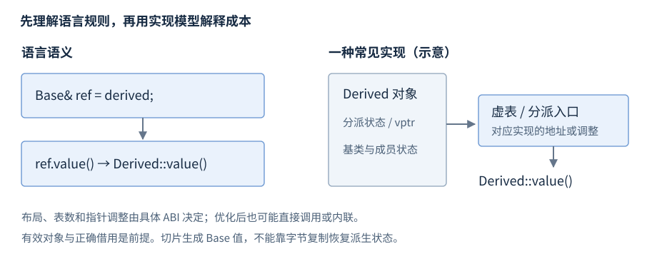

# 类与对象生命周期

类（class）把数据成员与操作成员组合为一个类型；构造函数建立对象状态，析构函数结束对象并释放所管理资源。本章先展示类的声明、初始化和调用，再展开继承、多态与对象模型。

**版本**：C++17。**先修**：[初始化](R03-initialization-deduction.zh-CN.md)、[引用](R05-pointers-references.zh-CN.md)、[函数](R06-statements-functions.zh-CN.md)。一般生命周期定义由[类型与对象](R02-types-objects.zh-CN.md)维护，资源所有权由[RAII](R09-raii-memory.zh-CN.md)维护。

## class、struct 与访问控制

**基础操作**。类定义的形状是 `class Name { 成员声明 };`。class 默认成员和继承访问为 private，struct 默认为 public，其余能力相同。

```cpp
class Counter {
    int value_ = 0;           // 默认 private
public:
    void increment() { ++value_; }
    int value() const { return value_; }
};
// 使用片段
Counter counter;
counter.increment();
int count = counter.value(); // 1
```

public 成员提供调用接口；private 成员由类成员及授权 friend 访问；protected 还支持适用的派生访问规则。简单记录可公开成员；有跨字段约束的类应通过成员函数维护不变量（invariant），即有效对象必须持续满足的状态条件。[C++17 类](https://timsong-cpp.github.io/cppwp/n4659/class)、[成员访问](https://timsong-cpp.github.io/cppwp/n4659/class.access)。

## 数据成员、成员函数与 const

**基础操作**。非静态数据成员各对象各有一份；成员函数通过隐含 this 访问当前对象。静态成员属于类，调用不依赖某个对象。

```cpp
struct Meter {
    int value = 0;
    inline static int created = 0; // C++17 inline 变量
    Meter() { ++created; }
    int read() const { return value; }
    void set(int n) { value = n; }
};
```

const 成员函数可通过 const 对象调用，不能通过 this 修改普通非 mutable 成员；mutable 成员有相应例外。指针成员指向的外部对象不会因为成员函数 const 就成为 const，const 也不自动保证线程安全。类内定义的函数通常隐式 inline，跨文件定义规则见[ODR](R01-program-build.zh-CN.md#单一定义规则与多文件程序)。

## 构造函数与成员初始化

**基础操作**。构造函数与类同名、无返回类型，成员初始化列表写在冒号后；初始化阶段先于函数体。

```cpp
class Count {
    int value_;
public:
    explicit Count(int value) : value_(value) {}
    int value() const { return value_; }
};
// 使用片段
Count count{7};               // value 为 7
```

函数体内 `value_ = value;` 是成员已初始化后的赋值；引用和 const 成员通常必须在初始化阶段绑定或设值。默认成员初始化器在该构造没有另外初始化该成员时提供缺省值。`explicit` 阻止适用的隐式转换，不禁止直接构造。

委托构造把同类另一构造函数作为唯一初始化器：

```cpp
struct Point {
    int x, y;
    Point(int a, int b) : x(a), y(b) {}
    Point() : Point(0, 0) {}  // 先完成目标构造，再执行本构造体
};
```

委托初始化列表不能同时初始化其他成员。构造成功应建立完整可用状态，避免对象先发布到外部再补齐不变量。[构造与初始化](https://timsong-cpp.github.io/cppwp/n4659/class.base.init)。

## 析构函数

**基础操作**。`~T()` 声明析构函数，无参数、无返回类型；它在对象销毁时执行清理，然后成员与基类继续按规则销毁。普通自动对象离开作用域时自动析构，拥有资源成员的析构实现资源释放。

```cpp
struct Record {
    int value;
    ~Record() = default;     // 请求默认析构规则
};
```

析构应保持必要释放且不向外传播异常；需要报告的 flush/commit 等业务结果放显式成员接口，见[错误处理](R11-errors-exception-safety.zh-CN.md)。在构造函数未完成时，不能指望该完整对象析构函数补救所有资源；应从取得资源起交给成员拥有者。

## 特殊成员函数

**基础操作**。以下六种是特殊成员函数。表中列常见形状，拷贝函数还可能有标准允许的其他参数限定；声明展示放在类 T 内。

| 操作 | 常见声明 | 作用 |
| --- | --- | --- |
| 默认构造 | `T();` | 无实参构造 |
| 析构 | `~T();` | 结束对象、释放资源 |
| 拷贝构造 | `T(const T&);` | 用既有对象建立新对象 |
| 拷贝赋值 | `T& operator=(const T&);` | 替换已有目标状态 |
| 移动构造 | `T(T&&);` | 从适用源建立新对象 |
| 移动赋值 | `T& operator=(T&&);` | 接收源状态并处理目标旧状态 |

`= default` 请求按成员与基类生成实现，仍可能被定义为删除；`= delete` 禁止操作，显式删除的函数仍参与重载。编译器只按条件生成，不承诺六项都可用：unique_ptr 成员使拷贝不可用，引用成员使默认赋值受限，用户声明析构会抑制隐式移动，即使写 `~T() = default`。

**基础操作**。Rule of Zero 指让标准资源成员负责资源，业务类不自行实现资源型特殊成员；需要 `<string>`：

```cpp
struct Message {
    std::string text;
};
Message original{"hello"};
Message copy = original;      // string 提供独立字符串值
```

默认操作逐个处理子对象；引用或裸指针复制仍保留借用关系，复制 string 则可能分配并抛异常。自管资源时整体审查拷贝、移动、赋值、自赋值与异常保证，而非机械写齐五个函数。详细操作、const 右值与生成条件见[拷贝与移动](R08-copy-move.zh-CN.md)。[特殊成员](https://timsong-cpp.github.io/cppwp/n4659/special)、[拷贝与移动](https://timsong-cpp.github.io/cppwp/n4659/class.copy)。

## 构造与销毁顺序

**机制解释**。非委托构造按语言规定的顺序，不按初始化列表书写顺序：

1. 最派生类负责按规定遍历顺序初始化虚基类；中间类相应虚基初始化器不一定执行。
2. 按基类列表顺序初始化直接基类。
3. 按类内声明顺序初始化非静态数据成员。
4. 执行构造函数体。

正常销毁先执行析构函数体，再逆序销毁成员及适用基类。若成员 first 的初值需要 second，而 first 声明更早，交换初始化列表书写顺序无效，应调整声明或消除依赖。


图：无虚基类的例子按 Base、first、second、Derived 函数体构造，逆序清理；不表示物理成员地址。

非委托构造失败时，仅销毁已完成构造的子对象，不调用失败完整对象的析构。委托构造若目标已经完成，而委托函数体抛异常，则会调用该对象析构。构造失败清理与异常传播见[错误处理](R11-errors-exception-safety.zh-CN.md)。[构造顺序](https://timsong-cpp.github.io/cppwp/n4659/class.base.init)、[构造失败](https://timsong-cpp.github.io/cppwp/n4659/except.ctor)。

## 组合与继承

**基础操作**。组合是把另一个对象作为成员，常表达拥有或组成；继承将基类子对象纳入派生对象，公开继承常表达可替代接口。

```cpp
struct Point { int x; int y; };
struct Segment { Point begin; Point end; }; // 组合
struct Base { int id = 7; };
struct Derived : public Base { int value = 42; };
Derived object;
Base& view = object;          // 借用其中的 Base 子对象
```

公开、受保护、私有继承改变外部使用及成员访问权限；struct/class 未显式写继承访问时的默认值不同。继承不转交释放权，Base 引用仍依赖完整对象寿命。

## 虚函数、override 与 final

**基础操作**。虚函数通过适用指针或引用按对象动态类型选择最终覆盖函数。override 要求确实覆盖基类虚函数，可发现签名或 const 写错；final 禁止继续覆盖某虚函数或继承某类。

```cpp
struct Base {
    virtual ~Base() = default;
    virtual int value() const { return 0; }
};
struct Derived final : Base {
    int value() const override { return 42; }
};
Derived object;
const Base& view = object;
int answer = view.value();    // 42，动态分派
```

有虚函数的类是多态类。构造/析构期间的虚调用按当前正在构造/销毁的类处理，不调用尚未构造或已经销毁的更派生部分；基类构造不能依赖派生 override 建立状态。[虚函数](https://timsong-cpp.github.io/cppwp/n4659/class.virtual)、[构造析构中的调用](https://timsong-cpp.github.io/cppwp/n4659/class.cdtor)。

## 抽象类与虚析构

**基础操作**。纯虚函数用 `= 0` 声明；含有未获得适用最终实现的纯虚函数的类是抽象类，不能直接创建它的对象，但可用指针/引用表示接口。

```cpp
struct Shape {
    virtual ~Shape() = default;
    virtual double area() const = 0;
};
struct Square : Shape {
    double side;
    explicit Square(double s) : side(s) {}
    double area() const override { return side * side; }
};
```

经基类指针删除动态派生对象时，基类须满足适用删除规则，通常提供可访问虚析构；否则该 delete 路径具有未定义行为。纯借用接口可用受保护非虚析构禁止外部经基类删除。纯虚析构仍需定义，因为派生销毁经过它；构造析构中依赖纯虚调用还有专门危险条件。[抽象类](https://timsong-cpp.github.io/cppwp/n4659/class.abstract)、[delete](https://timsong-cpp.github.io/cppwp/n4659/expr.delete)。

## 完整对象、子对象与多态实现

**机制解释**。派生完整对象含基类和成员子对象，多重继承等情况下转换到某个基类可能调整指针位置。使用语言的派生到基类转换，不用数值地址或 reinterpret_cast 推断关系。



图：语言保证动态分派；虚表（vtable）、虚指针及其位置是常见实现模型，由 ABI 决定。标准不要求固定虚表数目或所有对象都额外包含一个指针。优化器在信息充分时可直接调用或内联，不保证每个 virtual 调用具有同样间接成本。

| 操作 | 语言含义 | 结果边界 |
| --- | --- | --- |
| `Base& ref = derived` | 借用基类子对象 | 保留适用动态分派，不取得释放权 |
| `Base value = derived` | 建立独立 Base 值 | 派生状态被切片 |
| 虚析构 + 合法 Base* 删除 | 销毁完整派生对象 | 借用指针不因此应被删除 |
| 增加成员或虚函数 | 修改类型及可能 ABI | private 成员也可能影响布局 |

RTTI（Run-Time Type Information，运行时类型信息）支持 `typeid` 和适用的 `dynamic_cast`；转换只检查类型关系，不负责所有权或并发。转换语法与失败结果由[dynamic_cast](R04-expressions-conversions.zh-CN.md#dynamic_cast)维护，跨库布局见[链接与装载](R27-linking-loading-libraries.zh-CN.md)。

## 切片、克隆与外部表示

**进阶后查**。按值复制派生对象到 Base 只复制基类状态；例如 `vector<Base>` 不能保存每个元素的派生动态类型。混合动态类型可使用具有适当虚析构的 `vector<unique_ptr<Base>>`；独立多态复制可定义 `clone` 返回拥有者，由各派生实现自己的完整复制。

需要 `<memory>` 的完整接口及一个实现：

```cpp
struct Cloneable {
    virtual ~Cloneable() = default;
    virtual std::unique_ptr<Cloneable> clone() const = 0;
};
struct Value final : Cloneable {
    int number = 7;
    std::unique_ptr<Cloneable> clone() const override {
        return std::make_unique<Value>(*this);
    }
};
```

对 Value 调用 clone 建立独立的 Value，保留动态类型并由 unique_ptr 管理返回对象。

固定类型集合可用[variant](R17-utility-results.zh-CN.md)。合法多态复制使用构造与资源操作，不能按字节复制虚指针；序列化使用类型标签、字段和版本，无法把进程内虚表地址、指针和所有权直接恢复到另一个进程。

保存 this 的回调需要把注销、在途调用结束与销毁连接起来；析构中注销不自动证明其他线程已经停止调用。对象发布和任务关闭由[异步执行](R23-async-execution.zh-CN.md)展开。

## 配套对象模型例子

完整[分派与销毁顺序程序](../examples/r07-classes-lifetime.cpp)保留 Base、两个 Part 成员及 Derived；固定事件缓冲记录无虚基类的构造/析构次序，Base 引用调用派生 value 得到 42。程序用于组合机制查阅，基本类写法由本章短例提供，类型字节复制规则见[类型与对象](R02-types-objects.zh-CN.md#类型特征与字节复制)。
