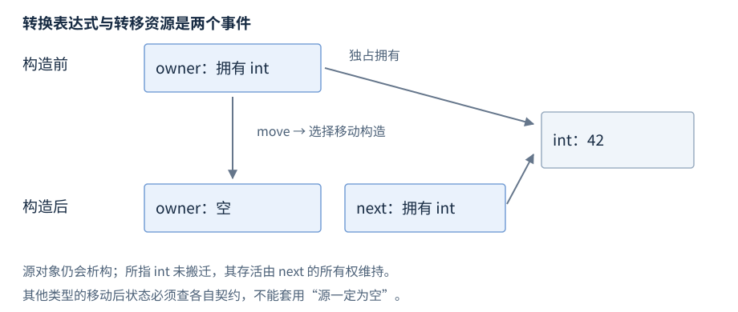

# 拷贝与移动

拷贝与移动是构造或赋值时选择的操作：构造建立新对象，赋值替换已有对象状态。移动允许接收源资源，具体转移和源状态由类型契约规定。

**版本**：C++17，尤其是同类型 prvalue 的直接构造。**先修**：[值类别](R04-expressions-conversions.zh-CN.md#值类别)、[引用](R05-pointers-references.zh-CN.md)、[特殊成员](R07-classes-lifetime.zh-CN.md#特殊成员函数)。先查四种基本操作与 move，转发和异常选择供泛型接口查阅。

## 拷贝与移动操作分类

**基础操作**。表中给常见签名形状，具体类可以受成员和基类条件限制。

| 操作 | 常见签名 | 目标关系 |
| --- | --- | --- |
| 拷贝构造 | `T(const T&)` | 建立新对象，按契约复制状态 |
| 拷贝赋值 | `T& operator=(const T&)` | 替换已有对象状态，处理目标旧资源 |
| 移动构造 | `T(T&&)` | 建立新对象，允许接收源资源 |
| 移动赋值 | `T& operator=(T&&)` | 替换已有状态，处理旧资源并接收源状态 |

默认操作逐个处理成员与基类；裸指针只复制地址，不自动深拷贝目标。共享句柄的拷贝可增加共同所有权，独占拥有者则通常禁止拷贝。固定数组可能逐元素移动，小字符串也可能复制内嵌字节，成本不能只由“移动”一词推断。[C++17 拷贝与移动](https://timsong-cpp.github.io/cppwp/n4659/class.copy)。

## 拷贝构造

**基础操作**。用既有左值建立独立目标；需 `<string>`：

**独立片段**。

```cpp
std::string source = "hello";
std::string copy(source);      // 拷贝构造
copy[0] = 'H';                 // copy 为 Hello，source 仍为 hello
```

字符串具有独立值语义；其他类型可能共享资源或保留借用，要查类型契约。构造目标之前不存在目标旧资源，复制失败时按构造失败规则清理已构造子对象。

## 拷贝赋值

**基础操作**。给已经存在的目标赋予源状态；需 `<string>`：

**独立片段**。

```cpp
std::string source = "hello";
std::string target = "old";
target = source;              // 拷贝赋值，target 为 hello
source[0] = 'H';              // target 仍为 hello
```

赋值操作负责目标原状态和资源；自赋值和异常路径由实现及契约处理，不能把赋值等同于重新执行构造函数。

## 移动构造与移动赋值

**基础操作**。以下使用 `<memory>`、`<utility>`，展示明确规定的独占所有权转交：

**独立片段**。

```cpp
auto source = std::make_unique<int>(42);
auto target = std::move(source); // 移动构造，source 为空
int value = *target;           // 42
auto old = std::make_unique<int>(7);
old = std::move(target);       // 移动赋值，旧 int(7) 被释放
// target 为空，old 拥有 int(42)
```

移动赋值不同于移动构造，因为已有目标可能要释放旧资源。**显式写成 `= delete` 的移动函数仍参与重载**，选中它会使调用非法；**默认化后被定义为删除的移动构造或移动赋值会被重载决议忽略**，右值因而可能走可用的 const 引用拷贝路径。根本没有适用移动时，也可能这样拷贝。

| 移动成员的情况 | 重载决议 | 从右值构造或赋值的可能结果 |
| --- | --- | --- |
| 未声明，且未隐式生成 | 没有移动候选 | 可选可用的 const 引用拷贝 |
| 显式 `= delete` | 仍作为候选 | 若它胜出，调用非法 |
| `= default` 后因成员或基类条件被定义为删除 | 忽略该移动候选 | 可选可用的 const 引用拷贝 |

**独立片段 · `<utility>` · 类型定义放在命名空间作用域，使用语句放在函数体内**。下面让成员的显式删除移动使外层默认化移动被定义为删除：

```cpp
struct Member {
    Member() = default;
    Member(const Member&) = default;
    Member(Member&&) = delete;
};
struct Outer {
    Member member;
    Outer() = default;
    Outer(const Outer&) = default;
    Outer(Outer&&) = default; // 被定义为删除，重载决议忽略
};
// 函数体内：
Outer source;
Outer copy(std::move(source)); // 选择 Outer(const Outer&)
// Member rejected(std::move(source.member)); // 非法：选中显式删除的移动
```

同样的忽略规则适用于默认化后被定义为删除的移动赋值。依据：[C++17 移动构造规则](https://timsong-cpp.github.io/cppwp/n4659/class.copy.ctor#10)、[移动赋值规则](https://timsong-cpp.github.io/cppwp/n4659/class.copy.assign#7)。

对 const 对象调用 move 通常产生 `const T&&`，不能绑定常见 `T&&` 移动构造，因此可能复制或报错。`is_move_constructible` 为真只说明可从相应右值构造，不保证调用了移动函数。

## std::move

**基础操作 · `<utility>`**。声明摘要：`template<class T> std::remove_reference_t<T>&& move(T&& value) noexcept`（返回类型相关特征来自 `<type_traits>`）。它把适用对象表达式转换为右值引用，产生将亡值。

**独立片段**。

```cpp
std::string source = "hello";  // 需 <string>、<utility>
std::string target(std::move(source));
// target 为 hello；source 仍存活，可赋值或销毁
source = "again";
```

move 调用本身不转移资源、不搬内存、不结束源寿命；后续重载决定实际操作。



图：unique_ptr 的资源转移发生在移动构造；源拥有者对象仍存活但为空。这不是所有类型的通用移动后布局。[move 与 forward 声明](https://timsong-cpp.github.io/cppwp/n4659/forward)。

## 移动后状态与借用

**机制解释**。标准库对象通常移动后处于有效但未指定状态（valid but unspecified state），除非接口给出更强保证。其不变量仍成立，可以销毁、赋值及执行满足前置条件的操作；不能假定原内容不变或无条件调用 front/pop_back。string 不保证移动后为空，unique_ptr 明确保证适用所有权转移后源为空。

自定义类型须说明自己的移动后及自移动赋值契约，至少保持所承诺的不变量、避免泄漏或双重释放，不能从标准库默认约定推导自定义实现。只观察对象的函数不应无条件 move；需要原请求用于重试或日志时先保存必要信息。

移动也不普遍使外部借用跟随目标：借用源对象自身、内嵌成员或独立分配目标有不同关系；容器移动还受分配器与操作的失效条件影响。上例 unique_ptr 移动不搬迁其 int，源 unique_ptr 自身的引用却不会变成目标引用。[库移动后约定](https://timsong-cpp.github.io/cppwp/n4659/lib.types.movedfrom)。

## 转发引用与引用折叠

**机制解释**。形如 `template<class T> void f(T&&)` 的函数模板中，T 是推导的无 cv 模板类型参数时，T&& 可以是转发引用（forwarding reference）。传左值时 T 可推导为引用，传右值时可推导为非引用类型。

| 引用组合 | 折叠结果 | 常见来源 |
| --- | --- | --- |
| `T& &`、`T& &&`、`T&& &` | `T&` | 参数推导或类型别名替换 |
| `T&& &&` | `T&&` | 右值引用的组合 |

这描述替换过程的类型组合，不是可以直接写任意相邻引用符号的普通声明。类模板已经确定的 T&&、const T&&、非模板右值引用不能套用同一种推导。参数名在函数体内仍是左值表达式。[模板实参推导](https://timsong-cpp.github.io/cppwp/n4659/temp.deduct.call)、[引用折叠](https://timsong-cpp.github.io/cppwp/n4659/dcl.ref)。

## std::forward

**基础操作 · `<utility>`**。`std::forward<T>(value)` 根据已经推导的 T 恢复调用者的值类别。接口摘要有接受 `remove_reference_t<T>&` 和 `remove_reference_t<T>&&` 两种形式，结果为 `T&&`，均为 noexcept；右值形式不能用于把右值错误地转成左值。

**独立片段**。

```cpp
int category(int&) { return 1; }
int category(int&&) { return 2; }
template<class T>
int relay(T&& value) {
    return category(std::forward<T>(value));
}
// 使用片段
int value = 7;
int first = relay(value);      // 1，转发左值
int second = relay(7);         // 2，转发右值
```

对明确要消费的对象用 move，对包装调用中的推导参数用 forward。重复 forward 同一个右值可能重复消费；完美转发（perfect forwarding）仍不能自动推导花括号列表、消除重载集歧义或引用不允许绑定的位域。

## 拷贝消除与返回对象

**机制解释**。C++17 同类型类 prvalue 可以直接初始化结果对象，不要求先建立独立临时再移动；下面的不可复制不可移动类型仍可这样返回：

**独立片段**。

```cpp
struct Immovable {
    Immovable() = default;
    Immovable(const Immovable&) = delete;
    Immovable(Immovable&&) = delete;
};
Immovable make_value() { return Immovable{}; }
Immovable result = make_value();
```

析构函数仍须可访问且未删除。返回命名局部 `return local;` 的 NRVO（Named Return Value Optimization，具名返回值优化）允许但不强制；符合条件时不消除仍可能走隐式移动。通常直接返回 local，`return std::move(local);` 往往妨碍 NRVO。借用返回不因拷贝消除延长被借用对象寿命。[C++17 拷贝消除](https://timsong-cpp.github.io/cppwp/n4659/class.copy.elision)。

## noexcept 与 move_if_noexcept

**进阶后查 · `<utility>`**。`std::move_if_noexcept(x)` 在移动可能抛且类型可拷贝时给 const 左值引用路径，否则给右值引用路径；它本身不执行复制或移动。需要 `<type_traits>` 的机制片段：

**独立片段**。

```cpp
struct Item {
    Item() = default;
    Item(const Item&) = default;
    Item(Item&&) noexcept(false) {}
};
Item item;
static_assert(std::is_same_v<decltype(std::move_if_noexcept(item)), const Item&>);
```

实际声明为不抛的移动更易支持容器重分配的强异常保证，但不能推断每个容器操作都采用同一选择。vector 的插入位置、分配器和元素操作各有条件；不可拷贝且移动可能抛时某些失败保证会弱化，见[vector](R13-sequence-containers.zh-CN.md)。随意加 noexcept 会令逃出的异常终止程序，详见[错误处理](R11-errors-exception-safety.zh-CN.md)。

完整[转发、所有权转移与直接构造程序](../examples/r08-copy-move.cpp)保留三个机制的组合示例；正文不依赖检查框架来介绍基本操作。
