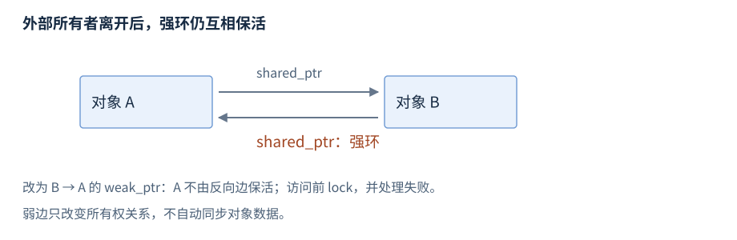

# RAII 与内存管理库

RAII（Resource Acquisition Is Initialization，资源获取即初始化）让对象持有资源，并在析构时释放。资源可以是内存、锁、文件或系统句柄；所有权（ownership）规定谁负责释放及何时转交。

**版本**：C++17，包含 pmr 多态分配设施。**先修**：[指针与引用](R05-pointers-references.zh-CN.md)、[类](R07-classes-lifetime.zh-CN.md)、[移动](R08-copy-move.zh-CN.md)。先查 RAII 与智能指针，分配器和内存资源用于后查。

## RAII 资源对象

**基础操作**。把资源交给成员拥有者后，作用域正常退出和异常展开共用析构清理路径；需 `<memory>` 的类定义及使用片段：

```cpp
struct Buffer {
    std::unique_ptr<int[]> data;
    explicit Buffer(std::size_t n) : data(std::make_unique<int[]>(n)) {}
};
// 使用片段
{
    Buffer buffer(3);          // 取得三个值初始化的 int
    buffer.data[0] = 7;
}                             // 析构释放数组
```

构造成功即拥有可用资源；取得资源后、交给拥有者前避免可能抛出的间隙。成员拥有者还能清理外层构造未完成时已取得的资源。析构通常保持不抛，需要报告的刷新/提交/关闭结果用显式操作提供，见[错误处理](R11-errors-exception-safety.zh-CN.md)。

## new 与 delete

**基础操作**。new 表达式通常取得存储并初始化对象；delete 表达式销毁对象并释放适用存储。以下在函数体内展示配对，不包含异常插入路径：

```cpp
int* value = new int(7);
int observed = *value;         // 7
delete value;
int* values = new int[3]{};    // 三个元素均为 0
values[1] = 9;
delete[] values;
```

`new/delete` 与 `new[]/delete[]` 分别配对；`malloc/free` 有自己的配对，不可混用。普通分配失败通常抛 `std::bad_alloc`，`new (std::nothrow) T` 在适用分配失败时返回空，需要 `<new>`，但构造函数自身抛出的异常仍可能传播。

分配函数 `operator new` 本身取得存储，不等于对象构造；构造失败按规则调用匹配释放函数。placement new 在已有存储建立对象，其对齐和生命周期规则见[类型与对象](R02-types-objects.zh-CN.md#placement-new-与存储重用)。日常代码优先容器或 make 系列，把裸拥有指针保留在确需表达转交的接口边界。[new](https://timsong-cpp.github.io/cppwp/n4659/expr.new)、[delete](https://timsong-cpp.github.io/cppwp/n4659/expr.delete)。

## 智能指针分类

**基础操作 · `<memory>`**。智能指针是管理或观察对象关系的库类型，不把所有裸指针都自动变成拥有者。

| 类型 | 所有权 | 主要操作组 |
| --- | --- | --- |
| `unique_ptr<T,D>` | 独占，可移动转交 | 构造、访问、reset/release、删除器 |
| `shared_ptr<T>` | 多个句柄共享释放责任 | 构造、复制/移动、访问、reset、所有权观察 |
| `weak_ptr<T>` | 观察共享关系，不保活 | 从 shared/weak 构造、lock、expired、reset |

下面按具体类型提供入口。默认删除器适用时负责 delete/delete[]，自定义删除器则按资源来源释放。

## unique_ptr 构造与访问

**基础操作 · C++11 · `<memory>`**。声明摘要：`template<class T, class D = std::default_delete<T>> class unique_ptr;`，T 是目标类型，D 是删除器类型。空构造/`nullptr` 构造建立空拥有者；指针构造接收所有权；移动构造转交；拷贝构造被删除。

```cpp
std::unique_ptr<int> empty;
auto owner = std::make_unique<int>(7); // C++14
int* borrowed = owner.get();   // 只借用，不释放
int value = *owner;            // 7
bool present = static_cast<bool>(owner); // true
```

`get()` 返回存储指针，`operator bool` 检查它是否非空；`*` 和 `->` 访问有效目标，空指针不能解引用。传 `get()` 给其他接口不转交所有权，不应让接收者独立释放它。默认删除器实际删除时要求 T 完整，PImpl 通常在实现类型可见的源文件定义拥有者析构。[unique_ptr 声明及构造](https://timsong-cpp.github.io/cppwp/n4659/unique.ptr)。

## unique_ptr 转移、reset 与 release

**基础操作**。下面的片段需要 `<memory>`、`<utility>`：

```cpp
auto source = std::make_unique<int>(7);
auto target = std::move(source); // source 为空，target 拥有原对象
target.reset(new int(9));      // 释放旧 int，接收新的 int
int* transferred = target.release(); // target 为空；未释放 int
std::unique_ptr<int> received(transferred); // 接收者重新管理
received.reset();              // 释放 int，received 为空
```

`reset(p)` 用删除器释放旧目标并保存 p，默认 p 为空；`release()` 只取出指针且清空拥有者，调用者负责立即转交或重新接管。转交接口若失败且未接收资源，责任仍在调用方。`swap` 交换指针和删除器状态，`get_deleter()` 取得删除器引用；不要用 `reset(get())` 制造指向已释放对象的状态。

## unique_ptr 数组与删除器

**基础操作**。`unique_ptr<T[]>` 使用数组删除并提供 `operator[]`，不携带长度，仍须由接口保存和检查边界：

```cpp
auto values = std::make_unique<int[]>(3); // 需 <memory>，元素初值为 0
values[1] = 7;
int value = values[1];         // 7
```

**机制解释**。删除器 D 是类型的一部分，可以把正确的标准或平台释放函数绑定到拥有者。需要 `<cstdio>`、`<memory>` 的定义和局部使用：

```cpp
struct FileCloser {
    void operator()(std::FILE* file) const noexcept {
        if (file) std::fclose(file);
    }
};
std::unique_ptr<std::FILE, FileCloser> file(std::fopen("data.txt", "r"));
// file 为空表示未打开；离开作用域时关闭已取得的文件
```

例子只演示清理；需要向调用者报告关闭失败的接口应显式关闭并处理状态。删除器依赖的上下文也需活到调用时；模块/DLL/插件间资源按协议由对应模块或提供的删除器释放，标准不保证任意运行库兼容。

## shared_ptr 构造、共享与访问

**基础操作 · C++11 · `<memory>`**。声明形状是 `template<class T> class shared_ptr;`。默认构造为空；可从适用裸指针（及可选删除器）、unique_ptr、shared_ptr 或有效 weak_ptr 构造；常用 make_shared 建立对象与共享关系。

```cpp
auto owner = std::make_shared<int>(42);
auto copy = owner;             // 共同所有权
int value = *copy;             // 42
long owners = owner.use_count(); // 本同步局部例中为 2
owner.reset();                // copy 仍保活对象
copy.reset();                 // 最后强所有者离开，销毁对象
```

`get/*/->/operator bool` 检查和访问存储指针，`reset` 清空或替换此句柄，`swap` 交换状态；复制增加共同所有权，移动转交句柄。shared_ptr 没有 unique_ptr 式的 `release()`。不要从同一已管理裸指针独立构造两个共享关系，`shared_ptr(owner.get())` 会造成重复管理。

**进阶后查**。别名构造可共享完整拥有者却保存子对象指针，所有权与 `get()` 不等同。适用的所有权比较用 `owner_before`，不能只据相同存储指针判断同一所有权关系；`get_deleter<D>` 是自由函数，用于查询适用删除器。[shared_ptr](https://timsong-cpp.github.io/cppwp/n4659/util.smartptr.shared)。

## weak_ptr 构造、lock 与 expired

**基础操作 · C++11 · `<memory>`**。声明形状是 `template<class T> class weak_ptr;`，它从共享关系建立观察，不计为强所有者。

```cpp
auto owner = std::make_shared<int>(42);
std::weak_ptr<int> observer = owner;
auto kept = observer.lock();   // 成功，得到临时强所有者
owner.reset();                // kept 仍保活 int
kept.reset();                 // int 销毁
bool gone = observer.expired(); // true
auto missing = observer.lock(); // 空 shared_ptr
```

`lock()` 将检查和取得强所有权合为一个操作，失败返回空 shared_ptr，不抛异常；`expired()` 等价于检查强计数是否为零，不保活。先 expired 再使用裸指针会留下状态改变窗口，应直接 lock 并检查结果。`use_count` 查询强所有者数量，`reset/swap/owner_before` 分别清空、交换和比较所有权。它没有直接解引用操作。[weak_ptr](https://timsong-cpp.github.io/cppwp/n4659/util.smartptr.weak)。

## make_unique、make_shared 与 allocate_shared

**基础操作 · `<memory>`**。工厂将构造实参转交给对象构造，返回已管理的拥有者；下面是声明摘要，省略约束：

```cpp
// template<class T, class... Args> unique_ptr<T> make_unique(Args&&...); // C++14
// template<class T, class... Args> shared_ptr<T> make_shared(Args&&...); // C++11
// template<class T, class Alloc, class... Args>
// shared_ptr<T> allocate_shared(const Alloc&, Args&&...);              // C++11
```

单对象 make_unique 转交构造实参，未知界数组 `make_unique<T[]>(n)` 值初始化 n 个元素，已知界数组形式被删除。C++17 make_shared/allocate_shared 的这里展开范围是非数组对象；数组扩展须按后续版本查阅。allocate_shared 使用提供的分配器管理相关分配。

```cpp
struct Item { int value; explicit Item(int n) : value(n) {} };
auto unique = std::make_unique<Item>(7);
auto shared = std::make_shared<Item>(42);
auto allocated = std::allocate_shared<Item>(std::allocator<Item>{}, 9);
```

make_shared 常见实现把对象与控制状态共同分配，减少分配次数；标准不规定控制块字段布局或每次恰好一次分配。自定义删除器通常用相应 shared_ptr 构造，不能任意传给 make_shared。

## 控制状态、循环与并发

**机制解释**。控制状态管理共享对象的释放关系；最后一个强所有者离开会销毁对象，弱观察所需的控制状态仍可存在。


图：对象析构与控制状态结束是不同事件；合并分配的实现中，尚存弱引用可能使相关存储保持更久。对象析构、分配器归还与进程驻留内存下降也不是同一事件。



图：两个节点互存强所有者会保活彼此；把反向关系改成 weak_ptr 可切断强环，访问时处理 lock 失败。

不同 shared_ptr 句柄的控制状态更新可以安全并发，不意味着同一个句柄变量可以无保护读写，更不意味着所指对象线程安全。一次 use_count 为一不能证明无人访问，其他线程可经 weak_ptr 取得新句柄，裸借用也不计数；同步及原子共享指针的版本边界见[原子共享指针](R22-atomics-memory-order.zh-CN.md#原子共享指针)。

## enable_shared_from_this

**进阶后查 · `<memory>`**。`enable_shared_from_this<T>` 为适当纳入共享所有权的对象提供 `shared_from_this()`；C++17 还提供 `weak_from_this()`。使用公开、适用的唯一基类关系：

```cpp
struct Node : std::enable_shared_from_this<Node> {
    std::shared_ptr<Node> self() { return shared_from_this(); }
};
auto node = std::make_shared<Node>();
auto same_owner = node->self(); // 共享 node 的已有控制关系
```

调用时适用共享关系必须已经建立，构造函数中不能先假定它已存在；没有可用关系的 shared_from_this 会抛 `std::bad_weak_ptr`。`shared_ptr(this)` 则新建独立管理关系，不能作为替代。[enable_shared_from_this](https://timsong-cpp.github.io/cppwp/n4659/util.smartptr.enab)。

## allocator 与 allocator_traits

**进阶后查 · `<memory>`**。allocator 管理原始存储，allocator_traits 统一调用分配、构造、销毁与释放。示例的 int 构造不抛，先取得存储再建立对象：

```cpp
std::allocator<int> allocator;
using Traits = std::allocator_traits<std::allocator<int>>;
int* slot = Traits::allocate(allocator, 1);
Traits::construct(allocator, slot, 7);
int value = *slot;             // 7
Traits::destroy(allocator, slot);
Traits::deallocate(allocator, slot, 1);
```

`allocate(n)` 取得适用存储，`construct` 建立对象，`destroy` 结束对象，`deallocate(p,n)` 按来源归还。通常由容器执行这些操作；泛化到可抛构造须清理未完成步骤。自定义分配器还要满足相等性、传播与类型等条件，不能仅实现 allocate 就推导移动/swap 安全。[allocator_traits](https://timsong-cpp.github.io/cppwp/n4659/allocator.traits)。

## memory_resource 与 polymorphic_allocator

**进阶后查 · C++17 · `<memory_resource>`**。`std::pmr::memory_resource` 是分配策略的抽象接口，公开 `allocate(bytes, alignment)`、`deallocate(p, bytes, alignment)`、`is_equal(other)`；派生资源实现相应虚函数。调用者匹配字节数、对齐及资源来源。

`template<class T> class std::pmr::polymorphic_allocator` 保存 memory_resource 的借用，把分配请求转交给它；`std::pmr::vector<T>` 等别名据此在运行期选择资源。资源不替容器管理元素值或并发访问。

## monotonic_buffer_resource 与池资源

**进阶后查 · C++17**。monotonic_buffer_resource 以递增批次取得空间，单次 deallocate 不回收单块，整体 release 或销毁统一释放。需要 `<cstddef>`、`<memory_resource>`、`<vector>` 的局部片段：

```cpp
std::byte buffer[1024];
std::pmr::monotonic_buffer_resource arena(buffer, sizeof buffer);
{
    std::pmr::vector<int> values(&arena);
    values.push_back(7);
}                             // 先销毁元素和容器
arena.release();              // 再释放资源管理的分配
```

资源必须比借用它的容器活得久，release 不替元素执行析构。初始缓冲用尽后可转向上游，不能凭提供缓冲保证全程不再分配；以 `null_memory_resource()` 作为上游可形成拒绝后续分配的边界，失败会抛 bad_alloc。

unsynchronized_pool_resource 以池复用不同大小的分配，不可据此无锁跨线程共享；synchronized_pool_resource 支持其分配接口的适用并发，仍不保护容器业务操作。两种池的构造、release、upstream_resource 等用于低频策略查询，具体调优不展开。[内存资源](https://timsong-cpp.github.io/cppwp/n4659/mem.res)、[多态分配器](https://timsong-cpp.github.io/cppwp/n4659/mem.poly.allocator.class)。

## 配套所有权例子

完整[独占转移、共享保活与弱观察程序](../examples/r09-raii-memory.cpp)保留存活计数：lock 得到的强所有者可跨一个 shared_ptr.reset 保活对象，最后强所有者离开后弱引用过期。三个智能指针的基础操作由本章各自条目维护，平台内存与模块边界见[进程与虚拟内存](R25-process-virtual-memory.zh-CN.md)和[库与装载](R27-linking-loading-libraries.zh-CN.md)。
