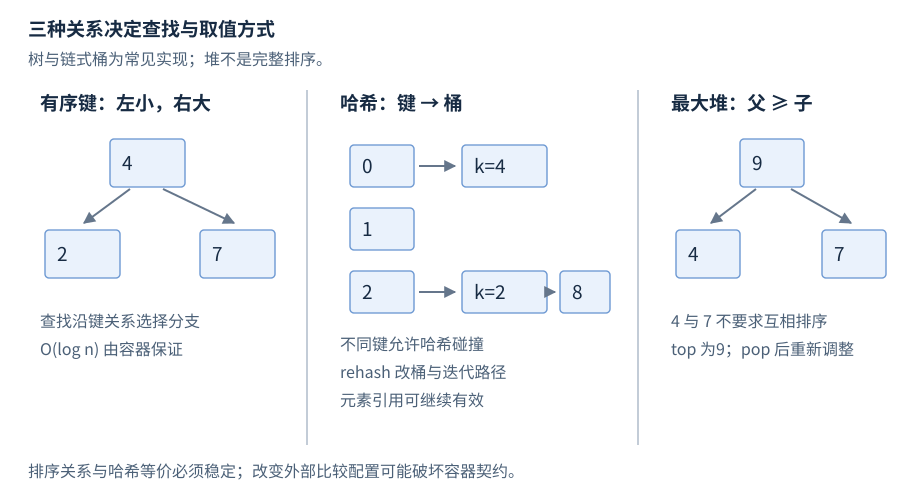
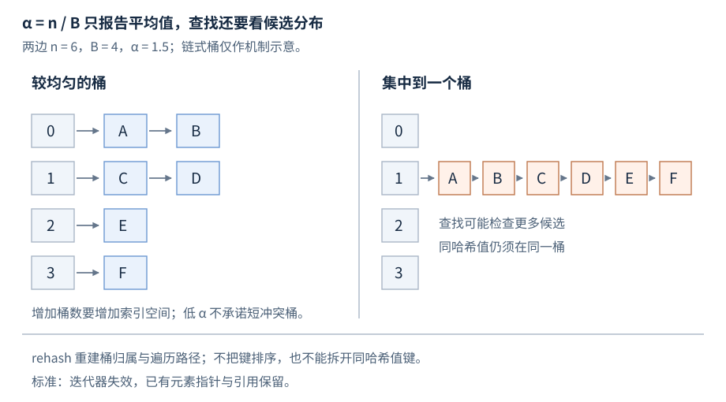

# 关联容器与容器适配器

有序关联容器按比较关系索引键，无序关联容器按哈希与相等关系索引键；适配器只开放栈、队列或优先值操作。本章先按具体类型提供构造和常用成员，再集中说明共享查找与失效规则。

**基线**：C++17；`try_emplace`、`insert_or_assign` 和节点句柄为 C++17，`contains` 为 C++20。区间和迭代器先修见 [R15](R15-iterators-ranges.zh-CN.md)，比较器见 [R16](R16-algorithms.zh-CN.md)。公开声明摘要均省略成员和约束，示例均为局部摘录。

## 关联容器分类

| 类型组 | 键的唯一性 | 索引与遍历 |
| --- | --- | --- |
| `set/map` | 唯一键 | 有序，单键查找 O(log n) |
| `multiset/multimap` | 允许等价键 | 有序，边界查找 O(log n)，扫描另计匹配数 |
| `unordered_set/unordered_map` | 唯一键 | 无序，查找平均 O(1)、最坏 O(n) |
| `unordered_multiset/unordered_multimap` | 允许等价键 | 无序，全部匹配成本另计匹配数 |

### 组合应用与参考资料

[配套 C++17 程序](../examples/r14-associative-adaptors.cpp) 组合唯一键更新、rehash 后的引用与最小优先队列，完整源码供组合应用参考。分类索引见 [cppreference containers](https://en.cppreference.com/w/cpp/container.html)。

## std::set

**基础操作**。`<set>` 中的唯一键有序集合，元素就是键。声明摘要为 `template<class Key, class Compare = less<Key>, class Allocator = allocator<Key>> class set;`。`Compare` 定义严格弱序，`Allocator` 管理节点；迭代器不能直接改键。

**独立片段**。

```cpp
// 需要 <set>；局部摘录
std::set<int> keys{3, 1, 3};                 // {1,3}
auto inserted = keys.insert(2);             // pair<iterator,bool>，bool 为 true
auto found = keys.find(3);
if (found != keys.end()) keys.erase(found); // 只删 3
for (int key : keys) { (void)key; }          // 按比较关系遍历 1、2
```

默认构造空；初始化列表和 `set(first,last)` 插入区间，复制构造得到独立集合。`emplace` 与值插入都返回位置和是否插入；`erase(key)` 返回删除数量（零或一），`lower_bound/upper_bound/equal_range` 查询有序边界。

## std::multiset

**基础操作**。`<set>` 中允许等价键的有序集合。声明摘要为 `template<class Key, class Compare = less<Key>, class Allocator = allocator<Key>> class multiset;`；模板参数与 set 对应。

**独立片段**。

```cpp
// 需要 <set>；局部摘录
std::multiset<int> keys{1, 2, 2};
auto inserted = keys.insert(2);             // iterator，允许再插入一个 2
auto range = keys.equal_range(2);
for (auto it = range.first; it != range.second; ++it) { /* 三个 2 */ }
auto removed = keys.erase(2);               // 删除全部三个等价键，返回 3
```

默认、范围、列表、复制/移动构造均可用；`insert/emplace` 返回迭代器，没有表示重复失败的布尔值。只删除一个匹配时用 `find` 后 `erase(iterator)`；`count` 返回匹配数。

## std::map

**基础操作**。`<map>` 中的唯一键映射，元素是 `pair<const Key,T>`。声明摘要为 `template<class Key, class T, class Compare = less<Key>, class Allocator = allocator<pair<const Key,T>>> class map;`。`T` 是映射值，可经迭代器修改。

**独立片段**。

```cpp
// 需要 <map>、<string>；局部摘录
std::map<std::string, int> counts{{"red", 1}};
counts["blue"] += 1;                       // 缺键先值初始化 int 为 0
counts.try_emplace("red", 9);               // 不覆盖 red
counts.insert_or_assign("red", 3);          // 覆盖为 3
if (auto it = counts.find("red"); it != counts.end()) it->second += 1;
int red = counts.at("red");                 // 4；缺失时抛 out_of_range
```

默认、范围、列表、复制/移动构造均可用。下标是可插入操作，不能用于 const 容器；只读查询用 `find/at`。插入和更新返回的布尔值表示是否产生新键，不表示是否发生赋值。

## std::multimap

**基础操作**。`<map>` 中允许等价键的映射，元素仍是 `pair<const Key,T>`。声明摘要为 `template<class Key, class T, class Compare = less<Key>, class Allocator = allocator<pair<const Key,T>>> class multimap;`。

**独立片段**。

```cpp
// 需要 <map>、<string>；局部摘录
std::multimap<std::string, int> scores{{"Ada", 80}, {"Ada", 90}};
auto added = scores.emplace("Lin", 85);     // iterator
const auto range = scores.equal_range("Ada");
for (auto it = range.first; it != range.second; ++it) it->second += 1;
```

默认、范围、列表及复制/移动构造均可用；`insert/emplace` 返回迭代器，`count` 和 `equal_range` 处理多匹配。没有 `operator[]/at/try_emplace/insert_or_assign`，不能以一个下标推断应更新哪条记录；选择迭代器后修改 `second`。

## std::unordered_set

**基础操作**。`<unordered_set>` 中的唯一键哈希集合。声明摘要为 `template<class Key, class Hash = hash<Key>, class Pred = equal_to<Key>, class Allocator = allocator<Key>> class unordered_set;`。`Hash` 计算哈希，`Pred` 判断键等价，等价键必须同哈希。

**独立片段**。

```cpp
// 需要 <unordered_set>；局部摘录
std::unordered_set<int> keys{1, 3};
keys.reserve(16);                          // 计划容纳元素数，不创建元素
auto added = keys.insert(2);                // pair<iterator,bool>
auto found = keys.find(3);
if (found != keys.end()) keys.erase(found);
```

默认构造空，桶数、区间、初始化列表、复制/移动构造可用。遍历顺序未规定，迭代器不可改键；`insert/emplace` 可能 rehash。桶与负载成员见共享规则。

## std::unordered_multiset

**基础操作**。`<unordered_set>` 中允许等价键的哈希集合。声明摘要为 `template<class Key, class Hash = hash<Key>, class Pred = equal_to<Key>, class Allocator = allocator<Key>> class unordered_multiset;`。

**独立片段**。

```cpp
// 需要 <unordered_set>；局部摘录
std::unordered_multiset<int> keys{2, 2, 3};
auto added = keys.insert(2);                 // iterator
const auto range = keys.equal_range(2);
for (auto it = range.first; it != range.second; ++it) { /* 三个 2 */ }
auto n = keys.erase(2);                     // 3
```

桶数、范围、列表和复制/移动构造与唯一键版本对应。等价键形成可由 `equal_range` 遍历的组；不据此推断各不同键组有排序。删除一个匹配用位置删除，按键删除全部匹配。

## std::unordered_map

**基础操作**。`<unordered_map>` 中的唯一键哈希映射，元素是 `pair<const Key,T>`。声明摘要为 `template<class Key, class T, class Hash = hash<Key>, class Pred = equal_to<Key>, class Allocator = allocator<pair<const Key,T>>> class unordered_map;`。

**独立片段**。

```cpp
// 需要 <unordered_map>、<string>；局部摘录
std::unordered_map<int, std::string> names{{7, "Ada"}};
names.reserve(32);
auto created = names.try_emplace(8, "Lin");
names.insert_or_assign(7, "Ava");
if (auto it = names.find(7); it != names.end()) it->second += '!';
auto name = names.at(7);                    // "Ava!"
```

桶数、范围、列表和复制/移动构造可用。下标缺键时插入，访问/更新语义与 map 对应；无有序的 `lower_bound/upper_bound`。桶调整会影响迭代器，引用保留规则见后文。

## std::unordered_multimap

**基础操作**。`<unordered_map>` 中允许等价键的哈希映射。声明摘要为 `template<class Key, class T, class Hash = hash<Key>, class Pred = equal_to<Key>, class Allocator = allocator<pair<const Key,T>>> class unordered_multimap;`。

**独立片段**。

```cpp
// 需要 <unordered_map>、<string>；局部摘录
std::unordered_multimap<int, std::string> labels{{7, "Ada"}, {7, "Ava"}};
auto added = labels.emplace(8, "Lin");
auto group = labels.equal_range(7);
for (auto it = group.first; it != group.second; ++it) it->second += '!';
```

默认、桶数、区间、列表与复制/移动构造均可用；`insert/emplace` 返回迭代器。没有下标、`at/try_emplace/insert_or_assign`；通过匹配区间访问具体记录。多个匹配的成本按匹配数另计。

## 键等价、比较与哈希

有序容器以 `!comp(a,b) && !comp(b,a)` 判断键等价，不一定调用 operator==。comp 必须给出严格弱序：不允许 comp(x,x)，顺序应传递，由“不互相小于”形成的等价也应传递。比较结果不能因外部可变配置而在存储期间漂移；用 ≤ 比较器或按变化中的字段比较，会破坏契约。[N4659 有序关联要求](https://timsong-cpp.github.io/cppwp/n4659/associative.reqmts)。

哈希容器要求 Pred 为等价关系，且 Pred(a,b) 为真时 Hash(a) == Hash(b)。反方向不成立，碰撞是正常情况。键存放期间，其哈希和相等判断必须稳定。大小写不敏感相等若搭配大小写敏感哈希，属于契约错误，不能靠测试数据没碰到来证明可用。字符串哈希通常还需扫描键，平均 O(1) 说的是容器规模上的访问次数，非任意长键的一次操作耗时。[N4659 无序关联要求](https://timsong-cpp.github.io/cppwp/n4659/unord.req)。



图14-1：树与链式桶是常见实现示意，不规定平衡树种类、桶节点布局；堆图表示父子优先关系，不表示整段已排序。

### 有序索引：查找路径为什么取决于树高

二叉搜索树的教学模型在每个节点用键关系选择左／右分支；一次查找访问的节点数受树高 h 限制，而不是因为结构叫“树”就自动 O(log n)。若顺序插入导致普通未平衡树退化成链，h 可达 O(n)。常见标准库使用平衡搜索树，靠旋转等维护动作约束树高；例如 libstdc++ GCC 14.3 用红黑树实现这组容器。**标准保证的是有序遍历、相关接口复杂度与借用规则，未指定红黑树、颜色或旋转方式**。[N4659 有序关联接口要求](https://timsong-cpp.github.io/cppwp/n4659/associative.reqmts)、[libstdc++ GCC 14.3 树实现](https://gcc.gnu.org/onlinedocs/gcc-14.3.0/libstdc++/api/a00401_source.html)。

这个索引支持按键 find，也支持按序 lower_bound／upper_bound；获得边界后按迭代器扫描 k 个结果，总成本通常为 O(log n+k)。它不提供“第 k 小元素”的常数下标：有序容器的迭代器只有双向导航能力，从 begin 走到第 k 个仍需逐个递增。比较器若每次处理长度为 m 的键，O(log n) 次比较也须乘入单次比较的实际代价；节点链接和分配则是额外空间成本。


## 关联容器的共享操作


以 map 和 unordered_map 的唯一键形式为例；下列形式省略转发重载。

| 常用形式 | 返回与副作用 |
| --- | --- |
| `find(key)` | iterator；未找到为 end，无插入 |
| `count(key)` / `contains(key)`，20 | 唯一键返回0或1／bool；多键 count 返回匹配数 |
| `at(key)` | T&；缺失抛 out_of_range，不插入 |
| `operator[](key)` | T&；缺失时插入并值初始化 T |
| `insert(value)` / `emplace(args…)` | `pair<iterator,bool>`；已有键不覆盖 |
| `try_emplace(key,args…)`，17 | `pair<iterator,bool>`；已有键不构造新 T |
| `insert_or_assign(key,value)`，17 | `pair<iterator,bool>`；已有键赋值，bool 表示是否新插入 |
| `erase(it)` / `erase(key)` | 下一迭代器／删除数；it 必须可解引用 |
| `equal_range(key)` | `pair<iterator,iterator>`；匹配半开区间 |

“读取”用下标会使缺失键出现，且要求对应插入可构造 T；诊断计数膨胀时先查 operator[]。map 的 lower_bound 返回首个不小于键的位置，upper_bound 返回首个严格大于位置；unordered 容器没有这些排序成员。查找成本按上表；删除已知有序位置摊还常数，按键删除还要查找。多键容器删除键会删除全部匹配，而不是一个。[N4659 map 访问](https://timsong-cpp.github.io/cppwp/n4659/map.access)。

try_emplace 不代表参数表达式延迟求值：传入昂贵的 `make_value()` 仍会先执行，只是键存在时不以其结果构造 mapped 对象。若确需延迟，应先 find 或设计工厂层。emplace 在发现重复前可能已构造候选对象；异常和用户函数的副作用也不能用“未插入”来消除。


## 关联容器失效与哈希桶


| 成功操作 | 有序关联容器 | unordered 容器 |
| --- | --- | --- |
| 插入／emplace | 既有元素引用、迭代器保留 | 无 rehash 时保留；rehash 使迭代器失效 |
| erase | 只使被删元素借用失效 | 同左；其他元素次序按要求保留 |
| rehash／reserve | 无这些成员 | 迭代器失效；元素指针、引用保留 |
| clear／销毁 | 元素借用全部失效 | 同左 |

`load_factor()` 是 size/bucket_count；`max_load_factor(z)` 要求 z 为正，标准允许实现将其作为修改最大装载因子的提示，实际阈值应通过无参数 `max_load_factor()` 读取。`reserve(n)` 表示计划容纳 n 个元素，按当前阈值安排桶；`rehash(b)` 是请求桶数，实际值还须满足装载约束。rehash 平均为线性工作，标准最坏可到平方级；不能把批量预留理解成一次常数操作。[N4659 装载与重建](https://timsong-cpp.github.io/cppwp/n4659/unord.req)。

### 桶、冲突与装载不是同一个指标

查找先计算 Hash(key)，再确定桶，在候选元素中用 Pred 判等。同哈希值必须落入同桶；不同哈希值也可能映射到同桶。常见实现将桶内元素组织成节点链，但标准未规定冲突链的布局或桶号必须按取模求得。查找成本要包含哈希键、访问候选元素和相等比较；桶内候选很多时会从平均常数退化到最坏线性。[N4659 无序容器桶与查找](https://timsong-cpp.github.io/cppwp/n4659/unord.req)。

装载因子 α=n/B 是**平均每桶元素数**，不限制某一个桶的长度。降低 α 往往要增加桶索引的空间，且只能在哈希分布合理时减少候选；若 Hash 对所有键都返回同一个值，扩大桶数仍不能拆开这些同哈希值元素。`bucket(key)`、`bucket_size(i)` 可用于诊断实际分布，不能仅看 α 就断言查找不会退化。`max_load_factor` 的设置与 `rehash` 是不同操作；若需立即按新阈值安排桶，应显式 rehash／reserve。



图14-2：两边均有 6 个元素、4 个桶，α=1.5；右边只命中一个桶。节点链是教学示意，桶内排列、哈希到桶的映射和桶数策略不作可移植保证。

rehash 重建桶组织并重新分配元素的桶归属；它不是重新排序成有序索引。常见节点实现可以保留元素地址而更新桶链接，因此引用保留与迭代器失效并不矛盾。应把哈希容器的预算分为元素存储、桶索引和重建时可能并存的工作存储；标准没有给出每元素固定字节数。

unordered 插入不失效迭代器的标准条件可写为 (N+n) ≤ z×B：原元素数、插入数、最大装载因子与桶数共同决定。指针或引用在 rehash 后保留，不意味着原迭代器还能递增；本章例子只保存 mapped 对象地址。桶顺序、增长策略和哈希值跨进程稳定均无一般保证。[N4659 桶、装载与失效](https://timsong-cpp.github.io/cppwp/n4659/unord.req)。

需要按字符串键查找而不临时创建 string 时，有序容器可选透明比较器，例如 `map<string,int,std::less<>>`；它使相应异构 find、lower_bound 等重载可参与调用。不同参与类型之间也必须建立一致的严格弱序。C++17 的 unordered_map 不因此自动获得透明异构查找；相关能力需按 C++20 及具体重载定位。透明比较器是减少临时构造的入口，不是改变键等价的权限。

批量导入时先预估总元素数并 reserve，有助于控制哈希容器重建次数。估计错误只影响成本与后续失效，不应影响结果正确性；正确代码仍须在每次可能 rehash 后重新取得迭代器。若要删除并继续扫描，使用 erase 返回的下一位置，不能删除后再递增旧位置。循环内插入还可能使 unordered 的整个遍历路径失效，最好先收集待新增键，再分阶段修改。

查找失败和构造失败也应分开：find == end 是正常未命中；分配或用户哈希抛异常是调用失败。记录容器规模、装载因子和键分布可以帮助判断哈希退化，但不能仅凭一次慢请求就宣称发生攻击或实现错误。性能结论须结合实际键代价与负载测量。


## 节点句柄


C++17 的 `extract(it)` 从容器摘出节点，返回拥有节点的句柄；`insert(std::move(node))` 尝试接入目标，唯一键冲突时需检查返回对象中的 node。节点非空时可用 node.key() 修改 map 的键；普通 map 迭代器不能改 const Key。转移要求分配器满足相等条件，跨容器还要满足相应类型及比较／哈希兼容条件。

被摘节点的旧迭代器失效。旧引用虽有特殊保留规则，在节点句柄拥有期间不能据此继续访问元素；用句柄自身接口，重新插入后重新建立借用，便于避免条件混淆。merge 遇重复键会留下源节点，调用后源容器未必为空。[N4659 节点句柄](https://timsong-cpp.github.io/cppwp/n4659/container.node)。

分配、键与值的构造、比较器、哈希器都可能抛异常。单元素插入的保证受容器及异常来源约束；更新已有 mapped 值则还受 T 的赋值异常保证影响。需要强事务效果时先构造候选结果，再安排能满足保证的提交步骤，不能把全部关联操作都标成 noexcept。


## std::stack

**基础操作**。`<stack>` 的后进先出适配器。声明摘要为 `template<class T, class Container = deque<T>> class stack;`；底层容器元素类型须与 `T` 一致，并支持 `back/push_back/pop_back`。可默认构造或从底层容器复制/移动构造；不能把数量构造从底层自动套到适配器。

**独立片段**。

```cpp
// 需要 <stack>；局部摘录
std::stack<int> work;
work.push(1);
work.emplace(2);
if (!work.empty()) {
    int value = work.top();                 // 2
    work.pop();                            // 返回 void，留下 1
}
```

`top()` 返回顶部引用，`empty/size` 查询状态；取顶与删除要求非空。默认 deque 下观察和两端操作为常数成本；改用其他底层容器须按其规则分析借用和成本。没有一般迭代与任意位置删除。

## std::queue

**基础操作**。`<queue>` 的先进先出适配器。声明摘要为 `template<class T, class Container = deque<T>> class queue;`；底层需支持 `front/back/push_back/pop_front`，vector 不满足。

**独立片段**。

```cpp
// 需要 <queue>；局部摘录
std::queue<int> pending;
pending.push(1);
pending.emplace(2);
if (!pending.empty()) {
    int first = pending.front();            // 1
    int last = pending.back();              // 2
    pending.pop();                          // 删除 1
}
```

默认或从底层容器复制/移动构造；`front/back` 返回引用，`pop` 返回 void。访问、删除要求非空；`empty/size` 可随时查询。默认 deque 下基本操作为常数成本，借用按底层容器判断。

## std::priority_queue

**基础操作**。`<queue>` 的优先值适配器。声明摘要为 `template<class T, class Container = vector<T>, class Compare = less<typename Container::value_type>> class priority_queue;`。底层须支持随机访问和尾部增删；比较器建立严格弱序。

**独立片段**。

```cpp
// 需要 <queue>、<vector>、<functional>；局部摘录
std::priority_queue<int> largest;
largest.push(2);
largest.push(9);                            // top 为 9
std::priority_queue<int, std::vector<int>, std::greater<int>> smallest;
smallest.push(2);
smallest.emplace(9);
int best = smallest.top();                  // 2
smallest.pop();                             // 剩下 9
```

默认构造空；比较器/底层容器构造与区间构造可用，区间构造通过线性建堆形成结构。默认 `less` 使最大值在顶，`greater` 使最小值在顶；`top` 返回 const 引用，访问和 `pop` 要求非空。顶访问 O(1)，堆调整 O(log n) 比较；push 还可能扩容，整次最坏成本不能只写对数。没有一般迭代、按键查找或就地修改优先值。

### 堆的父子关系

堆把随机访问序列视为一棵完全二叉树：下标 i>0 的父节点在 (i−1)/2 的整数商位置，孩子在 2i+1、2i+2（存在时）。它要求 `comp(parent, child)` 为假；默认 less 因而使最大值在根。兄弟与不同分支没有完整排序关系，不能对其底层序列直接二分查找。树高为 O(log n)，新末尾值沿祖先上移、取出根后沿孩子向下调整，各只涉及一条高度量级的路径；具体交换和移动步骤可因实现而变。[N4659 堆的下标关系](https://timsong-cpp.github.io/cppwp/n4659/alg.heap.operations)。

priority_queue 的 push 对应底层 push_back 后 push_heap；pop 对应 pop_heap 后 pop_back。这里只能取得最优先值，不能按任意键查找、稳定定位或就地更新。若保存 top 的引用，后续堆调整可能使那个槽位的值换成另一个业务对象；即使 vector 未扩容也不能把它当稳定身份。需要前 k 个优先值可重复弹出，是否允许破坏原队列须由业务决定；独立堆算法与建堆成本见 R16 的堆算法条目。
