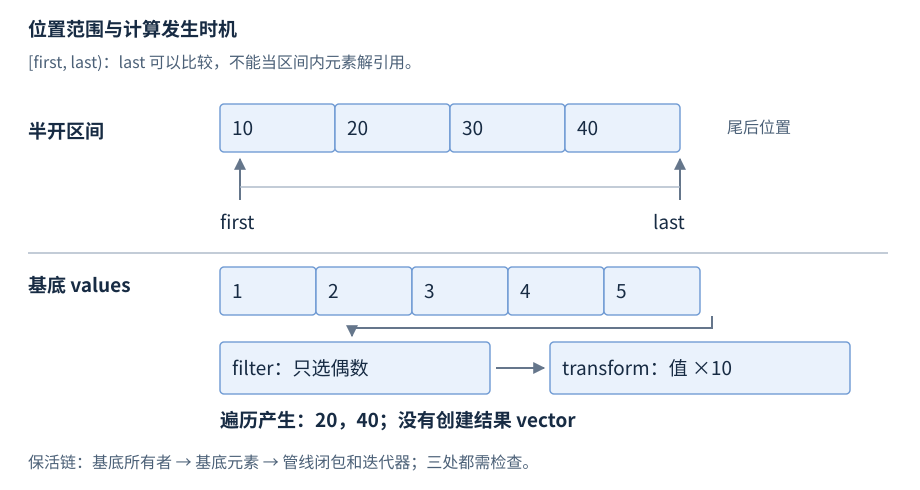

# 迭代器与 ranges

迭代器（iterator）表示序列中的访问位置；区间（range）给出起点和终止条件。传统算法接收迭代器对，C++20 ranges 算法还可直接接收范围并使用投影；视图（view）组织可组合的范围操作。

**基线**：传统操作为 C++17，ranges/views 为 C++20。借用与容器失效先修见 [R05](R05-pointers-references.zh-CN.md)、[R13](R13-sequence-containers.zh-CN.md)。先读 begin/end 和遍历，再查类别、适配器与管线。

## std::begin 与 std::end

**基础操作**。`<iterator>` 的自由函数统一取得容器/数组起点与尾后位置。常用形式省略 const 重载：

**声明摘要**。

```cpp
namespace std {
    template<class C> auto begin(C& c) -> decltype(c.begin());
    template<class C> auto end(C& c) -> decltype(c.end());
    template<class T, size_t N> T* begin(T (&array)[N]) noexcept;
    template<class T, size_t N> T* end(T (&array)[N]) noexcept;
}
```

**独立片段**。

```cpp
// 需要 <iterator>；局部摘录
int values[]{1, 2, 3};
for (auto it = std::begin(values); it != std::end(values); ++it) {
    *it += 1;                              // {2,3,4}
}
```

`*it` 访问当前元素，`++it` 前进。`cbegin/cend` 取得 const 访问，`rbegin/rend` 取得反向迭代器。对象必须存活，迭代器仍受容器的修改规则约束。

## 半开区间与尾后位置

普通区间 `[first,last)` 包含 first 所指元素，不包含 last。first == last 表示空区间；last 通常等于 end，却不一定是容器的 end。合法区间要求从 first 按允许的递增操作可到达 last，不能把不同容器的两个迭代器拼在一起。

end 是尾后哨兵，不能解引用；对非空双向区间可先 --end 再解引用。begin 在空容器中也等于 end。默认构造或已经失效的迭代器并不因此成为可递增位置。调用 find 后必须先判断结果 != last；未命中也不是空指针。[N4659 迭代器要求](https://timsong-cpp.github.io/cppwp/n4659/iterator.requirements)。



图15-1：上半图的箭头是可递增位置；下半图表示 filter/transform 遍历时访问基底的机制，不规定缓存布局。视图构造不物化结果，生命周期仍由底部所有者支撑。

返回迭代器的接口同时返回了一份借用。跨过容器修改后，即使比较两个旧迭代器看似还能工作，也不能用它证明有效性。保存下标可避免存储地址失效，但插删后下标可能指向另一业务对象；稳定位置、稳定地址和稳定身份是三种需求。


## 迭代器类别与访问成本


| 类别 | 增加的主要能力 | 常见入口与限制 |
| --- | --- | --- |
| 输入 | 读取、向前、单遍 | istream_iterator；不能假定复制后可独立多遍扫描 |
| 输出 | 写入、向前 | back_insert_iterator；不提供一般读取 |
| 前向 | 可多遍扫描 | forward_list；不要求 -- |
| 双向 | 后退 -- | list；不要求下标或相减 |
| 随机访问 | +=n、相减、下标、位置比较 | vector/deque；std::sort 需要此类 |
| 连续，20 概念 | 元素地址连续对应 | 一般 vector、array；deque 不满足 |

线性 distance 往往是隐藏的性能来源。对 list 在循环中反复从 begin 计算距离，累计可能平方；要计数时随遍历维护计数。随机访问不等于可跨不同分配段做裸指针运算，deque 的迭代器能够相减不授予 data 指针形式的连续保证。

### 比较与导航成本

| 任务 | 随机访问序列 | 前向／双向序列 | 选择接口的含义 |
| --- | --- | --- | --- |
| 到第 k 个位置、advance(k) | O(1) 的跳转 | O(k) 次递增／递减 | 知道编号不等于已经持有位置 |
| distance(first,last) | O(1) 的相减 | O(n) 次递增 | list.size() 为常数，不会让通用 distance 自动变常数 |
| find 扫描 n 个值 | 最坏 n 次比较和线性导航 | 同左 | 随机访问不能免除线性搜索 |
| lower_bound，在分区前提成立时 | O(log n) 比较与导航 | O(log n) 比较，O(n) 导航 | map 成员可走树索引；通用算法只看迭代器 |

通用二分不断缩小待查区间，但到达各次中点仍需导航。链表不能像数组一样直接跳到中点，所以“二分比较很少”与“总访问仍线性”可同时成立。这也是有序 map 应优先调用成员 lower_bound 的原因：成员能使用容器内部索引，通用算法不能从双向迭代器恢复树根。[N4659 advance／distance 计量](https://timsong-cpp.github.io/cppwp/n4659/iterator.operations)、[二分的比较与导航界](https://timsong-cpp.github.io/cppwp/n4659/alg.binary.search)。

能力还包括能否重排与能否反复读：std::sort 需要随机访问，并要求元素可交换、移动构造与移动赋值；const vector 迭代器虽能跳转却不能用于排序，list 应调用成员 sort。输入流迭代器只承诺单遍读取，先 distance 再从复制的起点处理可能已消费来源。访问能力、元素操作成本和生命周期三项必须一起核对。[N4659 sort 类型要求](https://timsong-cpp.github.io/cppwp/n4659/alg.sort)、[输入迭代器单遍语义](https://timsong-cpp.github.io/cppwp/n4659/input.iterators)。

接口若只需读取一次，不必要求随机访问迭代器；过高的类别要求会排除流输入或链表。反过来，算法确实需要多遍扫描时，不能把输入迭代器复制一份当成前向迭代器。类别是语义能力，不是“这个类型编译时有哪个操作符”的简单清单。

距离类型通常有符号，容器 size_type 通常无符号；混合比较或把负距离转成 size_t 都可能得到巨大的值。对同一随机访问序列内、顺序正确的 first/last，差值才适合转为长度。C++20 ranges::distance 还可利用 sized sentinel，复杂度取决于终止器能力，不能仅按迭代器类别一刀切。


## std::iterator_traits

**机制解释**。`<iterator>` 的 `template<class I> struct iterator_traits;` 提供 `value_type/difference_type/reference/pointer/iterator_category`。`value_type` 是元素值类型，`difference_type` 是表示距离的类型；不以容器 `size_type` 代替它。

**独立片段**。

```cpp
// 需要 <iterator>、<vector>；局部摘录
using I = std::vector<int>::iterator;
using Value = std::iterator_traits<I>::value_type;     // int
using Difference = std::iterator_traits<I>::difference_type;
```

C++20 用迭代器概念表达更细语义，单个传统类别标签不证明全部概念成立。

## std::advance、std::next、std::prev 与 std::distance

**基础操作**。这些函数在 `<iterator>` 中导航或查询距离；常用签名省略完整约束：

**声明摘要**。

```cpp
namespace std {
    template<class InputIt, class Distance> void advance(InputIt& it, Distance n);
    template<class InputIt> InputIt next(InputIt it,
        typename iterator_traits<InputIt>::difference_type n = 1);
    template<class BidirectionalIt> BidirectionalIt prev(BidirectionalIt it,
        typename iterator_traits<BidirectionalIt>::difference_type n = 1);
    template<class InputIt> typename iterator_traits<InputIt>::difference_type
        distance(InputIt first, InputIt last);
}
```

**独立片段**。

```cpp
// 需要 <list>、<iterator>；局部摘录
std::list<int> values{10, 20, 30};
auto it = values.begin();
std::advance(it, 2);                       // 原 it 指向 30
int middle = *std::prev(it);                // 20，原 it 不变
auto n = std::distance(values.begin(), values.end()); // 3，线性
```

负距离前进需要双向能力，结果须处在有效导航范围；从 `end()` 前进一步不合法。`distance` 对单遍输入来源可能消费输入，不能再假定起点副本可重读。

## std::reverse_iterator

**基础操作**。`<iterator>` 的 `template<class Iterator> class reverse_iterator;` 将双向或更强迭代器反向访问。默认构造、从正向基底构造、兼容反向迭代器转换构造可用，公开形状省略成员与约束。

**独立片段**。

```cpp
// 需要 <vector>、<iterator>；局部摘录
std::vector<int> values{1, 2, 3};
auto it = std::make_reverse_iterator(values.end());
int last = *it;                            // 3
++it;
int middle = *it;                          // 2
```

`reverse_iterator<I>(base)` 的解引用相当于取得 base 的前一位置，所以 rbegin().base() == end()、rend().base() == begin()。base 指向反向所指元素之后的正向位置。将反向查找结果直接交给 erase(base()) 会删错位置或把 end 当元素；先确认命中，再转换到真正所指位置。[N4659 反向迭代器](https://timsong-cpp.github.io/cppwp/n4659/reverse.iterators)。


## 插入迭代器

**基础操作**。`back_insert_iterator<Container>`、`front_insert_iterator<Container>`、`insert_iterator<Container>` 在 `<iterator>` 中把赋值转换为容器插入。工厂 `back_inserter/front_inserter/inserter` 构造对应适配器，元素仍由容器拥有。

**独立片段**。

```cpp
// 需要 <algorithm>、<iterator>、<vector>、<deque>；局部摘录
std::vector<int> source{1, 2, 3};
std::vector<int> copied;
std::copy(source.begin(), source.end(), std::back_inserter(copied));
std::deque<int> reversed;
std::copy(source.begin(), source.end(), std::front_inserter(reversed)); // {3,2,1}
```

尾插要求底层有 `push_back`，头插要求 `push_front`，位置插入要求 `insert`；不会绕过底层类型、异常与失效条件。裸 `dest.begin()` 作为输出前需已建立足够元素，单独 `reserve` 不够。

## ranges 算法与投影

**基础操作，C++20**。算法在 `<algorithm>` 中，提供迭代器/终止器和范围两组重载；声明为受约束的算法对象，下面列调用形式而非普通自由函数声明：

**独立片段**。

```cpp
// C++20；需要 <algorithm>、<vector>、<functional>；局部摘录
struct Item { int key; };
std::vector<Item> items{{3}, {1}, {2}};
std::ranges::sort(items, std::less<>{}, &Item::key);
auto it = std::ranges::find(items, 2, &Item::key);
if (it != items.end()) { /* it->key 为 2 */ }
```

投影（projection）在比较前从元素取出字段；排序与查找使用一致字段和关系。`sort` 返回终止迭代器，`find` 返回首个命中或终止位置。算法约束不免除有效区间与排序前提。[N4861 ranges algorithms](https://timsong-cpp.github.io/cppwp/n4861/algorithms)。

## range、sentinel 与 borrowed_range

**机制解释，C++20**。range 能取得起点和终止条件；终止器（sentinel）可以与迭代器不同类型，只负责判断结束。`common_range` 二者同型，`sized_range` 支持取得大小。`borrowed_range` 表示迭代器可在范围描述对象销毁后保留相应语义，外部元素来源仍须有效；算法可能用 `ranges::dangling` 避免返回明显悬垂的借用。[N4861 range concepts](https://timsong-cpp.github.io/cppwp/n4861/range.range)、[dangling](https://timsong-cpp.github.io/cppwp/n4861/range.dangling)。

## views 与惰性管线

**基础操作，C++20**。`<ranges>` 中的适配器保存基底和操作，遍历时按需计算。重点入口如下：

| 适配器调用 | 输入与结果 | 条件 |
| --- | --- | --- |
| `views::filter(pred)` | 保留谓词为真的元素 | 谓词有效，可能扫描并缓存起点 |
| `views::transform(f)` | 映射每个元素 | 遍历时调用，不自动物化 |
| `views::take(n)` / `drop(n)` | 前至多 n 项/跳过前 n 项 | 数量合法，范围持续有效 |
| `views::reverse` | 逆序遍历 | 基底支持必要的双向访问 |
| `views::iota(first,last)` | 生成值序列 | 终止与递增条件有效 |

**独立片段**。

```cpp
// C++20；需要 <ranges>、<vector>；局部摘录
std::vector<int> values{1, 2, 3, 4};
auto selected = values
    | std::views::filter([](int x) { return x % 2 == 0; })
    | std::views::transform([](int x) { return x * 10; });
for (int x : selected) { /* 顺序得到 20、40 */ }
```

view 是适合廉价移动、作为管线组件的 range 类型，不等价于“永远不拥有”，也不等价于“借用一定安全”。例如 ref_view 借用现有范围，span 与 string_view 借用外部元素；iota_view 可按值保存生成所需状态。N4861 的 viewable_range 对临时非 view 容器有约束，不能把较新实现允许的临时 vector 管线反填为原始 C++20 规则。

构造管线不生成 vector；遍历才筛选和计算。filter::begin 可能扫描并缓存首个匹配，递增仍可能扫描多个输入；随机访问与已知长度能力可能因此丢失。反复遍历可重复计算，不能把构建管线当计算已经完成。[N4861 filter_view](https://timsong-cpp.github.io/cppwp/n4861/range.filter)。

保活要检查三处：基底所有者、视图对象、闭包捕获。返回引用局部容器的管线会悬垂；返回捕获局部变量引用的谓词同样会悬垂。遍历期间结构性修改基底会影响底层迭代器和缓存，应重新建立管线并按容器规则判断。


## 组合应用与参考资料

[配套 C++17 程序](../examples/r15-iterators-ranges.cpp) 组合链表导航、反向复制与未命中处理；完整源码供组合应用参考。算法参数与结果见 [R16](R16-algorithms.zh-CN.md)。
