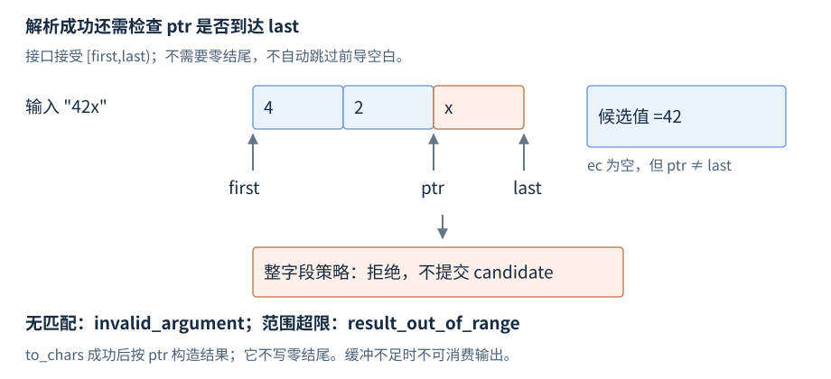

# 文本转换与格式化

字符转换（charconv）在字符区间与数值之间转换；格式化把多个值按格式串组合成文本。这里分别展开输入范围、结果位置、错误和缓冲要求，数值/随机/位工具见 [R33](R33-numeric-random-bits.zh-CN.md)。

**基线**：`<charconv>` 为 C++17，`<format>` 为 C++20。先修为 [字符串与视图](R12-strings-views.zh-CN.md)；示例是接口局部摘录，浮点和格式化需要提供相应设施的标准库。

## std::from_chars

**基础操作，C++17**。`<charconv>` 的函数从 `[first,last)` 解析数值，不依赖零结尾，不分配字符串，不使用全局 locale。常用签名摘要选取 int、double 重载，省略其他数值类型：

**声明摘要**。

```cpp
namespace std {
    from_chars_result from_chars(const char* first, const char* last,
                                 int& value, int base = 10);
    from_chars_result from_chars(const char* first, const char* last,
                                 double& value,
                                 chars_format fmt = chars_format::general);
    struct from_chars_result { const char* ptr; errc ec; };
}
```

### from_chars 的整数解析

`base` 在 2 至 36，输入范围须有效；返回 `ptr` 是首个未解析字符，`ec` 为错误状态。空输入可按上层策略提前处理，避免从空视图的空指针构造范围。

**独立片段**。

```cpp
// 需要 <charconv>、<string_view>、<system_error>；局部摘录
std::string_view text("42x");
int candidate = 0;
auto result = std::from_chars(text.data(), text.data() + text.size(), candidate);
bool complete = result.ec == std::errc{} && result.ptr == text.data() + text.size();
// candidate 为 42，ptr 指向 x，complete 为 false
```

整数不跳过前导空白，不接受前导 `+`；负号只对有符号类型允许，base 16 不自动消费 `0x`。例如 `"0x2a"` 会在初始零之后停止，并不得到 42。

| `ec` | `ptr` 与值 | 调用者处理 |
| --- | --- | --- |
| `errc{}` | 值更新，ptr 是未消费位置 | 整字段要求 ptr==last |
| `invalid_argument` | ptr==first，原值不变 | 没有匹配的数值语法 |
| `result_out_of_range` | 指向匹配部分结束，原值不变 | 超出目标表示范围 |

先解析候选、完整校验后再提交是上层策略；允许日志前缀消费的接口与要求配置字段完全消费的接口应明确区分。



图：`42x` 的数值前缀可以解析，但整字段校验拒绝后缀；提交候选是应用策略，不是 from_chars 自带事务。

### from_chars 的浮点解析

`chars_format` 为 `scientific/fixed/hex/general`；scientific 要求指数，fixed 不接受指数，general 使用通常的十进制浮点模式。hex 的输入不带 `0x` 前缀，且同样不跳过空白或接受前导加号。

**独立片段**。

```cpp
// 需要 <charconv>、<string_view>、<system_error>；局部摘录
std::string_view text("1.25e2");
double value = 0;
auto result = std::from_chars(text.data(), text.data() + text.size(), value,
                              std::chars_format::scientific);
// 成功完整消费时 value 为 125；仍须检查 ec 和 ptr
```

是否允许 NaN、无穷和业务量级由应用另作校验，解析成功不等于业务合法。[N4861 from_chars](https://timsong-cpp.github.io/cppwp/n4861/charconv.from.chars)。

## std::to_chars

**基础操作，C++17**。`<charconv>` 在可写区间 `[first,last)` 输出数字，不补零结尾。签名摘要选取 int、double，省略其他数值类型：

**声明摘要**。

```cpp
namespace std {
    to_chars_result to_chars(char* first, char* last, int value, int base = 10);
    to_chars_result to_chars(char* first, char* last, double value);
    to_chars_result to_chars(char* first, char* last, double value, chars_format fmt);
    to_chars_result to_chars(char* first, char* last, double value,
                             chars_format fmt, int precision);
    struct to_chars_result { char* ptr; errc ec; };
}
```

### to_chars 的整数输出与缓冲

**独立片段**。

```cpp
// 需要 <charconv>、<string_view>、<system_error>；局部摘录
char buffer[32];
auto result = std::to_chars(buffer, buffer + sizeof buffer, 42);
if (result.ec == std::errc{}) {
    std::string_view text(buffer, result.ptr - buffer); // "42"
}
```

成功时 ptr 为输出尾后，`ec` 为零；空间不足时 `value_too_large`、ptr==last，缓冲内容不能解释为有效结果。整数进制 2 至 36，输出不带 `0x` 或填充零。

需要 C 字符串时另留一格，例如把 `buffer + sizeof buffer - 1` 作为 last，成功后 `*result.ptr='\0'`。不能把不带零的缓冲直接传 `strlen`。

### to_chars 的浮点输出

无格式参数的形式产生可往返还原的最短表示；带 fmt 的最短形式按对应记法，带 precision 的形式按指定精度产生表示，精度不是缓冲长度。

**独立片段**。

```cpp
// 需要 <charconv>、<string_view>、<system_error>；局部摘录
char buffer[64];
auto result = std::to_chars(buffer, buffer + sizeof buffer,
                            3.5, std::chars_format::fixed, 2);
if (result.ec == std::errc{}) {
    std::string_view text(buffer, result.ptr - buffer); // "3.50"
}
```

缓冲上限仍由调用者提供；特殊值和协议允许的文本形式单独定义。[N4861 to_chars](https://timsong-cpp.github.io/cppwp/n4861/charconv.to.chars)。

## std::format

**基础操作，C++20**。`<format>` 用格式串将实参转换为新字符串。下面是常用调用形式，省略签名中的参数包和格式串检查类型；普通窄字符 `format` 返回 `std::string`。

**独立片段**。

```cpp
// C++20；需要 <format>、<string>；局部摘录
std::string label = std::format("id={:04d}", 7); // "id=0007"
std::string text = std::format("{}: {:.2f}", "price", 3.5); // "price: 3.50"
```

`{}` 使用下一个参数，`{0}` 显式索引，两种索引模式不能混合。冒号后是格式说明；`{{` 和 `}}` 输出字面花括号。宽度通常为最小宽度而非长度上限，五位整数不会因 `04d` 变成四位。

N4861 原文用运行期格式解析与 `format_error` 描述失败；应用后续缺陷修正的实现可对字面格式串做编译期检查。动态串在 C++20/23 通常经 `vformat` 与 `make_format_args`；这里用命名对象避免引入临时参数生命周期差异：

**独立片段**。

```cpp
// C++20；需要 <format>、<string>；局部摘录
std::string pattern = "value={}";
int value = 7;
std::string text = std::vformat(pattern, std::make_format_args(value));
```

参数及格式器必须有效，返回文本的编码和数值范围由对应格式器与应用规定。[N4861 format](https://timsong-cpp.github.io/cppwp/n4861/format)。

## std::format_to、std::format_to_n 与 std::formatted_size

**C++20**。`format_to(out,fmt,args...)` 返回输出终点，`formatted_size(fmt,args...)` 返回完整结果大小。`format_to_n(out,n,fmt,args...)` 最多输出 n 个字符，返回 `{out,size}`，size 是未截断结果大小。

**独立片段**。

```cpp
// C++20；需要 <format>、<iterator>、<string>；局部摘录
std::string text;
std::format_to(std::back_inserter(text), "id={}", 7); // text="id=7"
char buffer[8];
auto result = std::format_to_n(buffer, sizeof buffer, "id={:04d}", 7);
// result.size 为 7，result.out == buffer+7；不自动补零
```

裸指针输出要保证目标容量；`format_to` 不知道边界，`format_to_n` 的 n 必须合法且范围足够。截断可能切断编码单位或字段，不能将其等同于协议合法格式。

## 组合应用与参考资料

[原配套源码](../examples/r18-text-numeric.cpp) 的整数解析和输出部分演示候选提交与缓冲范围；随机、字节部分归 [R33](R33-numeric-random-bits.zh-CN.md)。进一步重载查 [cppreference charconv](https://en.cppreference.com/w/cpp/header/charconv.html)、[format](https://en.cppreference.com/w/cpp/utility/format.html)。
