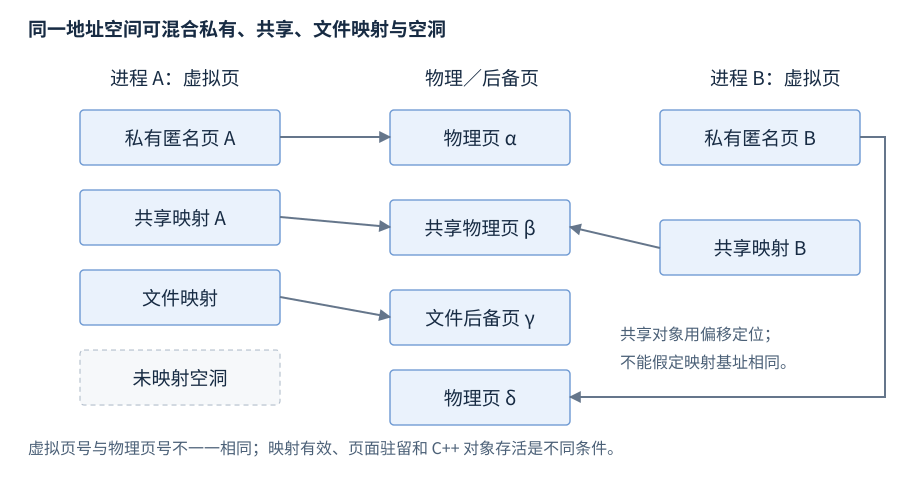

# 进程与虚拟内存

进程拥有地址空间与资源，线程在其中执行；虚拟页与映射决定地址怎样对应后备存储。本章先介绍进程、地址空间和页，再分别展示 Linux 与 Windows 的映射接口，最后解释内存指标与 IPC。

**范围与先修**：语言寿命按 C++17，平台条目标明 Linux/POSIX 或 Windows。先修为对象、指针、RAII 与线程；常规 C++ 分配先查资源管理，平台虚拟内存是需要页、保护或映射能力时的后查入口。

## 进程、线程与执行上下文

**基础概念**。进程（process）是 OS 管理的资源与隔离单元，包含地址空间、打开资源和一条或多条线程。线程（thread）是可调度执行流，同进程线程通常共享地址空间和资源，各自有寄存器上下文、栈与线程局部状态。

进程创建后，OS 建立映像与初始线程，运行时初始化后调用入口；运行期间可创建线程、打开文件或建立映射；退出时 OS 回收其系统资源。正常结束还需要应用自行完成结果交付、外部协议及持久化，不能以“OS 会回收”替代 C++ 对象析构。

调度（scheduling）选择可运行线程；上下文切换保存当前执行状态并恢复另一线程。被条件变量通知只表示可能继续竞争执行，不保证立即运行。运行、可运行和等待是不同状态；CPU 高/低利用率不能独自区分计算、忙等或阻塞。[Windows 进程与线程](https://learn.microsoft.com/en-us/windows/win32/procthread/processes-and-threads)

## Linux/POSIX：创建、执行与回收进程

**基础操作**。`fork()` 创建子进程，返回值在父进程为子 PID，在子进程为 0，失败为 -1；父子最初内存内容相同而地址空间独立，常见实现以写时复制减少立即复制成本。`exec` 家族以新程序替换当前进程映像，成功不返回。`waitpid` 等待并回收指定子进程的退出状态。

**声明摘要**。

```cpp
pid_t fork();
int execvp(const char* file, char* const argv[]);
pid_t waitpid(pid_t pid, int* status, int options);
```

声明摘要需 `<unistd.h>`、`<sys/wait.h>`。`argv` 以空指针结束，argv[0] 通常为程序名；execvp 搜索 PATH，失败返回 -1 并设置 errno。`waitpid(child, &status, 0)` 等待该子进程，成功返回其 PID；先用 `WIFEXITED(status)` 再用 `WEXITSTATUS(status)` 解读正常退出，信号退出另用对应宏。

正常流程为 fork → 子进程 exec → 父进程 waitpid；exec 失败时子进程使用适合该路径的 `_exit`，不重复父进程用户缓冲和退出处理。多线程进程 fork 后子进程只留下调用线程，其他线程所持锁可能遗留；exec 前仅调用 async-signal-safe 函数的限制使它不能等同 thread 构造。[fork](https://man7.org/linux/man-pages/man2/fork.2.html)、[exec](https://man7.org/linux/man-pages/man3/exec.3.html)、[waitpid](https://man7.org/linux/man-pages/man2/waitpid.2.html)

## Windows：进程创建与句柄

**基础操作**。`CreateProcessW` 创建新进程与初始线程，接收程序路径、可修改命令行、继承/环境/目录选项、STARTUPINFO 和 PROCESS_INFORMATION。成功返回非零；失败为零并提供 GetLastError。它不是 fork 的地址空间复制模型。

API 的主要输出 `PROCESS_INFORMATION` 含进程/线程句柄及 ID；两个句柄由调用者分别 CloseHandle。创建成功不表示初始化或工作完成；可用 WaitForSingleObject 等待进程句柄信号，再 GetExitCodeProcess 取得退出值。

**承接上文**。

```cpp
STARTUPINFOW startup{};
startup.cb = sizeof startup;
PROCESS_INFORMATION child{};
BOOL ok = CreateProcessW(path, commandLine, nullptr, nullptr, FALSE,
    0, nullptr, nullptr, &startup, &child);
```

局部摘录需 `<windows.h>`；path 指向宽字符程序路径，commandLine 是可修改宽字符缓冲。成功后关闭不再需要的 child.hThread，等待/查询完成后关闭 child.hProcess；错误和超时按返回状态解释。指定程序路径和正确引用命令行是独立条件。[CreateProcessW](https://learn.microsoft.com/en-us/windows/win32/api/processthreadsapi/nf-processthreadsapi-createprocessw)、[进程退出](https://learn.microsoft.com/en-us/windows/win32/procthread/terminating-a-process)

## 虚拟地址空间与常见区域

**基础概念**。虚拟地址空间（virtual address space）是进程可使用的地址集合；地址转换把有效访问关联到物理页或后备对象。不同进程同一地址数值可指不同内容，某物理页也可被多个进程显式共享。

| 常见区域 | 内容与用途 | 语言/实现边界 |
| --- | --- | --- |
| 代码与只读数据 | 指令、常量等映像内容 | 节/段与装载归 R27 |
| 静态数据 | 全局或静态对象的存储 | 对象初始化规则归语言层 |
| 动态分配区域 | 分配器向 OS 取得并管理的存储 | 不一定来自单一连续堆 |
| 线程栈 | 调用上下文及部分自动对象 | 局部变量可在寄存器或被优化 |
| 文件/共享映射 | 文件页、库、显式共享区域 | 映射权限与对象寿命不同 |

OS 地址布局不是 C++ 对每个变量住所的保证。线程栈通常有容量限制，深递归/大局部数组可耗尽；栈映射存在也不使已退出作用域的对象复活。[Windows 虚拟地址空间](https://learn.microsoft.com/en-us/windows/win32/memory/virtual-address-space)

## 页、页表与缺页

**基础概念**。页（page）是虚拟内存管理的基本粒度，页表（page table）记录虚拟页的映射与权限。页大小、大页与映射粒度由系统查询，不能在所有平台硬编码 4096。



图25-1：地址和页号为示意。共享页由显式映射建立，空洞不能直接访问；有物理页不表示非平凡 C++ 对象已构造。

缺页异常（page fault）表示访问需要 OS 处理，可能为首次触碰、文件读取或换入，也可能是无效地址/权限错误。合法缺页不等于崩溃。Linux minor/major fault 帮助区分是否需要 I/O，但需结合映射和负载；首次触碰成本和稳定阶段应分开解释。

预留、建立后备承诺和驻留是不同状态。Windows reserve 保留地址范围，commit 建立相应后备承诺，实际触碰可能才取得物理页；Linux 的映射、过量承诺与分配策略不能直接用 Windows 术语代替。[Windows 虚拟内存](https://learn.microsoft.com/en-us/windows/win32/memory/virtual-memory)

## Linux/POSIX：mmap 与 munmap

**基础操作**。`<sys/mman.h>` 提供映射接口，常用形状：

**声明摘要**。

```cpp
void* mmap(void* address, size_t length, int protection,
           int flags, int fd, off_t offset);
int munmap(void* address, size_t length);
```

address 为 nullptr 时由 OS 选址；length 为非零字节长度，protection 用 PROT_READ/WRITE/EXEC 或 PROT_NONE；flags 指定 MAP_PRIVATE 或 MAP_SHARED。文件映射提供打开的 fd 与按页对齐的 offset；匿名映射使用 MAP_ANONYMOUS，fd 取 -1、offset 为 0。

**承接上文**。

```cpp
void* address = mmap(nullptr, length, PROT_READ | PROT_WRITE,
    MAP_PRIVATE | MAP_ANONYMOUS, -1, 0);
if (address == MAP_FAILED) report(errno);
else if (munmap(address, length) == -1) report(errno);
```

局部摘录需 `<sys/mman.h>`、`<cerrno>`，length 是调用方决定的非零长度，report 为错误处理。mmap 成功返回映射地址，失败为 MAP_FAILED 而不是 nullptr；munmap 成功为 0，失败为 -1。解除后原地址区间失效。

MAP_SHARED 修改可以对共享该后备对象的映射可见；MAP_PRIVATE 修改不写回原文件。共享可见性不代替并发协议或持久化。映射成功后可关闭不再需要的文件 fd，映射有独立寿命；映射文件被截短后访问无后备文件页可触发 SIGBUS。映射提供存储，非平凡 T 仍需语言层构造/析构。[mmap/munmap](https://man7.org/linux/man-pages/man2/mmap.2.html)

## Windows：VirtualAlloc 与 VirtualFree

**基础操作**。`<windows.h>` 的匿名虚拟内存接口：

**声明摘要**。

```cpp
void* VirtualAlloc(void* address, SIZE_T size, DWORD allocation, DWORD protection);
BOOL VirtualFree(void* address, SIZE_T size, DWORD freeType);
```

`MEM_RESERVE` 预留、`MEM_COMMIT` 提交，可组合；`PAGE_READWRITE` 允许读写。成功返回地址，失败为 nullptr 并提供 GetLastError。正常的一次取得/释放摘录：

**承接上文**。

```cpp
void* address = VirtualAlloc(nullptr, length,
    MEM_RESERVE | MEM_COMMIT, PAGE_READWRITE);
if (!address) report(GetLastError());
else if (!VirtualFree(address, 0, MEM_RELEASE)) report(GetLastError());
```

length 为非零字节长度，report 为调用方处理。`MEM_RELEASE` 要求原预留基址和 size 为 0，释放整个预留区；`MEM_DECOMMIT` 撤销指定区域提交，仍保留地址。不能用 delete/free 释放 VirtualAlloc 存储，亦不把取得存储视为构造非平凡对象。[VirtualAlloc](https://learn.microsoft.com/en-us/windows/win32/api/memoryapi/nf-memoryapi-virtualalloc)、[VirtualFree](https://learn.microsoft.com/en-us/windows/win32/api/memoryapi/nf-memoryapi-virtualfree)

## Windows：文件映射对象与视图

**基础操作**。文件句柄、文件映射对象（file mapping object）与映射视图（mapped view）是三个资源。CreateFileMappingW 建立映射对象，MapViewOfFile 取得可访问视图，UnmapViewOfFile 解除视图，CloseHandle 关闭映射句柄。

**声明摘要**。

```cpp
HANDLE CreateFileMappingW(HANDLE file, LPSECURITY_ATTRIBUTES security,
    DWORD protection, DWORD sizeHigh, DWORD sizeLow, LPCWSTR name);
void* MapViewOfFile(HANDLE mapping, DWORD access,
    DWORD offsetHigh, DWORD offsetLow, SIZE_T bytes);
BOOL UnmapViewOfFile(const void* baseAddress);
```

普通只读映射使用已可读的文件句柄，PAGE_READONLY 与 FILE_MAP_READ；最大尺寸 high/low 都为 0 使用当前文件大小，零长度文件不能建立该映射；name 为 nullptr 创建未命名对象。下面假设 file 为已打开的非空只读文件，report 接收错误码：

**承接上文**。

```cpp
HANDLE mapping = CreateFileMappingW(file, nullptr, PAGE_READONLY, 0, 0, nullptr);
if (!mapping) report(GetLastError());
else {
    void* view = MapViewOfFile(mapping, FILE_MAP_READ, 0, 0, 0);
    if (!view) report(GetLastError());
    else if (!UnmapViewOfFile(view)) report(GetLastError());
    if (!CloseHandle(mapping)) report(GetLastError());
}
```

MapViewOfFile 的 bytes 为 0 表示从指定偏移映射至结尾；偏移须满足系统 allocation granularity，可由 GetSystemInfo 查询。映射对象创建失败为 nullptr，视图失败为 nullptr；视图与句柄分别释放，不能用 VirtualFree 或 delete 解除视图。刷新及稳定存储归 [系统 I/O](R26-syscalls-file-io.zh-CN.md)。[CreateFileMappingW](https://learn.microsoft.com/en-us/windows/win32/api/memoryapi/nf-memoryapi-createfilemappingw)、[MapViewOfFile](https://learn.microsoft.com/en-us/windows/win32/api/memoryapi/nf-memoryapi-mapviewoffile)

## 虚拟量、RSS、PSS 与 working set

**基础概念**。内存指标从 OS 观察页，不直接等于存活 C++ 对象的 sizeof 总和。

| 指标 | 定义 | 解释边界 |
| --- | --- | --- |
| 虚拟地址空间用量 | 进程建立或预留的地址范围 | 不等于驻留物理量 |
| Linux RSS | 进程驻留页量，含共享/私有等页 | 多进程相加可能重复计算共享页 |
| Linux PSS | 共享页按共享者比例分摊 | 与 RSS 不同，需详细页统计 |
| Windows working set | 当前驻留的页集合 | 可含共享页，不等于 private bytes |
| Windows private bytes | 进程私有提交量的常见计数 | 不等于当前物理驻留量 |

Linux `/proc/<pid>/status` 的 VmRSS 是快速指标，有精度限制；`smaps/smaps_rollup` 提供进一步页分类与 PSS。Windows working set 与提交量分别取证。[Linux status](https://man7.org/linux/man-pages/man5/proc_pid_status.5.html)、[smaps](https://man7.org/linux/man-pages/man5/proc_pid_smaps.5.html)、[Windows working set](https://learn.microsoft.com/en-us/windows/win32/memory/working-set)

## 分配器、碎片与资源持有

**机制解释**。delete 结束对象并交回分配器，不保证 RSS 立刻下降。分配器可保留空闲块供复用；块内浪费和空闲块不能满足所需连续尺寸是不同碎片问题。

| 现象 | 检查依据 | 调查方向 |
| --- | --- | --- |
| 分配后虚拟量增加而 RSS 小 | 预留/触碰情况 | 后备和驻留不同 |
| delete 后 RSS 不降 | 分配器缓存与其他活页 | 对象释放与 OS 回收不同 |
| 停负载后保持高位 | capacity、池上限、活对象 | 判断有限高水位还是持续持有 |
| 随请求持续增长 | 对象数、在途任务、映射 | 找实际持有者与释放条件 |
| 空闲多而分配失败 | 尺寸分布、连续区域 | 总空闲量不保证一次请求 |
| 多进程总 RSS 高 | 共享页与 PSS | 避免共享页重复计算 |

先记录分配、存活与所有者，再比较 OS 指标；队列无限增长、缓存不淘汰和 shared_ptr 环都可长期持有资源。进程容量预算还包含线程栈、映射、队列与分配器空闲块。

## 进程间通信与共享内存

**基础概念**。进程间通信（inter-process communication，IPC）通过 OS 提供的通道跨地址空间交付数据。

| 通道 | 交付模型 | 典型操作 |
| --- | --- | --- |
| 管道/命名管道 | 字节或平台支持的消息 | 建立端点、读写、关闭 |
| Unix domain socket / 网络 socket | 连接或数据报 | 地址绑定、收发、关闭 |
| 共享内存 | 多进程映射同一后备区 | 创建、映射、同步、解除 |

Linux POSIX 共享内存的正常流程为 shm_open → ftruncate 定尺寸 → mmap(MAP_SHARED) → 同步访问 → munmap/close；名称最后通过 shm_unlink 移除，持有的映射和引用另有寿命。Windows 可用命名文件映射或页文件支持的 CreateFileMapping(INVALID_HANDLE_VALUE, ...) 与 OpenFileMapping 建立共享视图；视图和句柄分别释放。[POSIX shared memory](https://man7.org/linux/man-pages/man7/shm_overview.7.html)、[Windows 命名共享内存](https://learn.microsoft.com/en-us/windows/win32/memory/creating-named-shared-memory)

共享区基址在各进程可不同，字段使用偏移/索引，不直接写裸指针。布局、版本、同步与参与者崩溃恢复均需协议；普通 std::mutex 没有可移植进程间同步保证。动态库加载只是向同一进程增加映射，不建立进程隔离，装载与卸载维护于 [链接与库](R27-linking-loading-libraries.zh-CN.md)。
