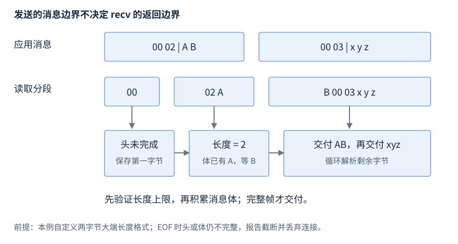

# socket 编程与网络操作

socket 是 OS 提供的通信端点。本章先按平台建立地址、创建、连接或监听、收发、关闭的正常路径，再介绍非阻塞进度、消息定界、背压与业务重试。

**范围与先修**：C++17 标准库没有这些 socket API；Linux/POSIX 与 Windows Winsock 分别标明。先修为 [协议与连接](R28-protocols-connections.zh-CN.md)、字节序、错误与所有权；TLS 库在 socket 上另有握手/记录状态。

## socket、地址与两种基本流程

**基础概念**。socket 是有协议、地址与状态的端点资源。流 socket 常用于 TCP，数据报 socket 常用于 UDP；监听端点与已接受连接是不同资源。

客户端正常路径为地址解析 → socket → connect → send/recv → shutdown（需要时）→ 释放。TCP 服务端为 socket → bind → listen → 循环 accept → 对每个新连接收发与释放；监听 socket 继续接受，不能用于已连接数据收发。

| 实体 | 保存的信息 | 资源寿命 |
| --- | --- | --- |
| 地址候选 | 地址族、协议、地址字节与长度 | 使用完列表后释放 |
| 监听 socket | 本地地址与待接受连接状态 | 停止接入时释放 |
| 已连接 socket | 本地/对端、发送/接收状态 | 操作全部结束后释放 |
| 应用连接状态 | 缓冲、偏移、消息状态与期限 | 无回调/I/O 借用后释放 |

平台错误处理不同，本文局部摘录的 report/consume 为调用方提供的不抛错误/数据处理函数；正常错误分支仍释放已取得资源。

## Linux/POSIX：地址解析与地址结构

**基础操作**。头文件 `<sys/socket.h>`、`<netdb.h>`；`getaddrinfo` 返回符合筛选条件的链表，不保证地址可达：

**声明摘要**。

```cpp
int getaddrinfo(const char* node, const char* service,
                const addrinfo* hints, addrinfo** result);
void freeaddrinfo(addrinfo* result);
```

node 为名称或数值地址，service 为服务名或十进制端口字符串。hints 先零初始化，ai_family 指 AF_INET/AF_INET6/AF_UNSPEC，ai_socktype 指 SOCK_STREAM/SOCK_DGRAM。成功为 0，失败返回 EAI_* 错误，通常不能直接按 errno 解释；gai_strerror 用于说明。

**承接上文**。

```cpp
addrinfo hints{};
hints.ai_family = AF_UNSPEC;
hints.ai_socktype = SOCK_STREAM;
addrinfo* addresses = nullptr;
int error = getaddrinfo("service.example", "8080", &hints, &addresses);
if (error != 0) report(gai_strerror(error));
else {
    // 遍历 addresses，使用每项 ai_family/ai_addr/ai_addrlen
    freeaddrinfo(addresses);
}
```

服务端设置 AI_PASSIVE 且 node 为空时取得相应通配绑定地址。候选按 ai_next 遍历；每个尝试使用该项的协议/地址族，失败关闭后试下一项，同时遵守总期限。[getaddrinfo](https://man7.org/linux/man-pages/man3/getaddrinfo.3.html)

数值 IPv4 地址使用 `<netinet/in.h>` 的 sockaddr_in，IPv6 使用 sockaddr_in6；通用传参以 sockaddr 指针及长度表达。端口存为网络字节序，htons/ntohs 转 16 位值；`<arpa/inet.h>` 的 inet_pton 将文本转换地址，返回 1 成功、0 文本不合法、-1 地址族等错误。这些转换与 DNS 查询不同。

## Linux/POSIX：socket 与 connect

**基础操作**。头文件 `<sys/socket.h>`；资源释放另需 `<unistd.h>`。

**声明摘要**。

```cpp
int socket(int domain, int type, int protocol);
int connect(int fd, const sockaddr* address, socklen_t length);
```

domain 选地址族，type 选流/数据报，protocol 为 0 时用该组合默认协议；socket 成功返回非负 fd、失败 -1。阻塞 TCP connect 成功为 0、失败 -1 并设置 errno。下面 candidate 是本条输入的有效 addrinfo 指针，类型来自 `<netdb.h>`，对应已存活的 TCP 地址结果：

**承接上文**。

```cpp
int fd = socket(candidate->ai_family, candidate->ai_socktype,
                candidate->ai_protocol);
if (fd == -1) report(errno);
else {
    if (connect(fd, candidate->ai_addr, candidate->ai_addrlen) == -1)
        report(errno);
    else { /* 已连接，在此进行同步收发 */ }
    if (close(fd) == -1) report(errno);
}
```

需 `<cerrno>`；错误值在清理之前处理。成功 connect 只说明 TCP 当前对端建立，不证明服务端完成业务。连接失败后关闭该 socket 再创建下一次尝试，不依赖失败 socket 的状态可复用。[socket](https://man7.org/linux/man-pages/man2/socket.2.html)、[connect](https://man7.org/linux/man-pages/man2/connect.2.html)

## Linux/POSIX：bind、listen 与 accept

**基础操作**。bind 将端点关联本地地址；listen 把流端点置为监听；accept 取出连接并返回新 fd。

**声明摘要**。

```cpp
int bind(int fd, const sockaddr* address, socklen_t length);
int listen(int fd, int backlog);
int accept(int listener, sockaddr* peer, socklen_t* peerLength);
```

bind/listen 成功为 0、失败 -1；backlog 是待接受队列请求上限，实际受 OS 条件影响。accept 成功返回新 fd、失败 -1；peer/peerLength 为可选的对端输出，提供时先将长度初始化为可用容量。

下面 listener 是本条输入的有效 TCP socket，localAddress 是已填好的 sockaddr 指针、localLength 为其长度；片段需 `<sys/socket.h>`、`<unistd.h>`、`<cerrno>`：

**承接上文**。

```cpp
if (bind(listener, localAddress, localLength) == -1) report(errno);
else if (listen(listener, 16) == -1) report(errno);
else {
    int client = accept(listener, nullptr, nullptr);
    if (client == -1) report(errno);
    else {
        // client 用于这条连接的收发，listener 仍用于后续 accept
        if (close(client) == -1) report(errno);
    }
}
```

这是接受一项的摘录；服务循环按关闭协议反复执行，最后释放 listener。Linux accept 的新 fd 不自动继承 O_NONBLOCK，可用 accept4 选标志或显式设置。[bind](https://man7.org/linux/man-pages/man2/bind.2.html)、[listen](https://man7.org/linux/man-pages/man2/listen.2.html)、[accept](https://man7.org/linux/man-pages/man2/accept.2.html)

## Linux/POSIX：send 与 recv

**基础操作**。头文件 `<sys/socket.h>`，TCP 常用形状：

**声明摘要**。

```cpp
ssize_t send(int fd, const void* data, size_t length, int flags);
ssize_t recv(int fd, void* buffer, size_t capacity, int flags);
```

fd 为已连接 socket；data 至少提供 length 可读字节，buffer 至少有 capacity 可写字节。flags 为 0 采用常规行为；Linux MSG_NOSIGNAL 可用于 send 避免失效连接的 SIGPIPE。成功返回实际数量，失败 -1 并设置 errno，正长度 TCP recv 为 0 表示对端有序结束发送。

下面 fd 为有效 TCP 连接，片段还需 `<cerrno>`；先处理本次取得字节，缓冲不自动补空字符：

**承接上文**。

```cpp
char buffer[256];
ssize_t n = recv(fd, buffer, sizeof buffer, 0);
if (n > 0) consume(buffer, static_cast<size_t>(n));
else if (n == 0) { /* TCP 接收方向 EOF，检查应用消息是否完整 */ }
else report(errno);
```

发送三字节的调用形状为 `send(fd, "abc", 3, MSG_NOSIGNAL)`；返回不足 3 时只推进该前缀。成功仅表示本地接受字节，不证明远端应用执行。SIGPIPE 是 OS 信号，不由 C++ catch 自动处理。[send](https://man7.org/linux/man-pages/man2/send.2.html)、[recv](https://man7.org/linux/man-pages/man2/recv.2.html)

## Linux/POSIX：shutdown 与 close

**基础操作**。`int shutdown(int fd, int how);` 用 SHUT_RD/SHUT_WR/SHUT_RDWR 结束本地接收/发送/两方向；成功 0，失败 -1。`close(fd)` 释放本地描述符，是另一操作。

**承接上文**。

```cpp
if (shutdown(fd, SHUT_WR) == -1) report(errno);
// 应用协议允许时继续 recv 剩余响应
if (close(fd) == -1) report(errno);
```

fd 是本条输入的有效 TCP socket，需 `<sys/socket.h>`、`<unistd.h>`、`<cerrno>`。半关闭不等于业务确认，也不保证对端马上回包；关闭时须结束活动访问，Linux close 不盲目重试。[shutdown](https://man7.org/linux/man-pages/man2/shutdown.2.html)

## Windows：Winsock 初始化与地址

**基础操作**。头文件按 `<winsock2.h>`、`<ws2tcpip.h>` 使用，调用者链接系统 Winsock 库 ws2_32。先 `WSAStartup(MAKEWORD(2, 2), &data)` 请求版本，成功返回 0，失败直接返回错误值；成功后核对 data.wVersion 是否符合应用要求，每次成功初始化最终由 WSACleanup 配对。

**承接上文**。

```cpp
WSADATA data{};
int error = WSAStartup(MAKEWORD(2, 2), &data);
if (error != 0) report(error);
else {
    if (data.wVersion == MAKEWORD(2, 2)) {
        // 本初始化寿命内创建、收发并关闭 socket
    } else { /* 协商版本不符合要求，结束初始化 */ }
    if (WSACleanup() == SOCKET_ERROR) report(WSAGetLastError());
}
```

Windows 同样用 getaddrinfo/freeaddrinfo 得到 addrinfo 候选；成功为 0，失败用返回的地址解析错误，不能当成本次收发结果。sockaddr_in/in6 和端口网络字节序形状相应，但长度参数常为 int，资源为 SOCKET。成功初始化不自动延长每个连接缓冲寿命。[Winsock 初始化](https://learn.microsoft.com/en-us/windows/win32/winsock/initialization-2)、[getaddrinfo](https://learn.microsoft.com/en-us/windows/win32/api/ws2tcpip/nf-ws2tcpip-getaddrinfo)

## Windows：socket 与 connect

**基础操作**。初始化后使用以下形状：

**声明摘要**。

```cpp
SOCKET socket(int family, int type, int protocol);
int connect(SOCKET s, const sockaddr* address, int length);
```

SOCKET 是平台端点值，不能假定为可用 POSIX close 处理的 int。socket 失败为 INVALID_SOCKET；connect 成功为 0、失败 SOCKET_ERROR，随后读取 WSAGetLastError。下面 candidate 为有效 TCP addrinfo 指针，所属地址列表仍存活：

**承接上文**。

```cpp
SOCKET s = socket(candidate->ai_family, candidate->ai_socktype,
                  candidate->ai_protocol);
if (s == INVALID_SOCKET) report(WSAGetLastError());
else {
    if (connect(s, candidate->ai_addr, static_cast<int>(candidate->ai_addrlen))
        == SOCKET_ERROR) report(WSAGetLastError());
    else { /* 已连接，在此收发 */ }
    if (closesocket(s) == SOCKET_ERROR) report(WSAGetLastError());
}
```

片段需 `<winsock2.h>`、`<ws2tcpip.h>`，初始化已成功；Winsock 错误用 WSAGetLastError，不照搬 errno/GetLastError。[Windows socket](https://learn.microsoft.com/en-us/windows/win32/api/winsock2/nf-winsock2-socket)、[connect](https://learn.microsoft.com/en-us/windows/win32/api/winsock2/nf-winsock2-connect)

## Windows：bind、listen 与 accept

**基础操作**。正常角色与 TCP 服务流程相同，类型与错误契约为 Winsock：

**声明摘要**。

```cpp
int bind(SOCKET s, const sockaddr* address, int length);
int listen(SOCKET s, int backlog);
SOCKET accept(SOCKET listener, sockaddr* peer, int* peerLength);
```

bind/listen 成功 0、失败 SOCKET_ERROR；accept 成功为新 SOCKET、失败 INVALID_SOCKET，错误用 WSAGetLastError。peerLength 为入/出容量。初始化成功后先 socket，按本地地址 bind，再 listen，循环 accept；每个新连接由 closesocket 独立释放，最后关闭监听 socket。

**承接上文**。

```cpp
SOCKET client = accept(listener, nullptr, nullptr);
if (client == INVALID_SOCKET) report(WSAGetLastError());
else {
    // client 是新连接，listener 继续接受其他连接
    if (closesocket(client) == SOCKET_ERROR) report(WSAGetLastError());
}
```

摘录需 `<winsock2.h>`，listener 是本条输入的成功监听 socket；不同 API 的失败哨兵不能混为零。[Winsock 服务流程](https://learn.microsoft.com/en-us/windows/win32/winsock/complete-server-code)

## Windows：send 与 recv

**基础操作**。Winsock 接口长度与结果使用 int：

**声明摘要**。

```cpp
int send(SOCKET s, const char* data, int length, int flags);
int recv(SOCKET s, char* buffer, int capacity, int flags);
```

请求非负且不能超过 int 与缓冲范围；flags 为 0 采用普通方式。成功返回本次数量，失败 SOCKET_ERROR；正长度 TCP recv 返回 0 表示该接收方向有序结束。下面 s 是本条输入的已连接 socket，初始化仍有效，需 `<winsock2.h>`：

**承接上文**。

```cpp
char buffer[256];
int n = recv(s, buffer, sizeof buffer, 0);
if (n > 0) consume(buffer, static_cast<size_t>(n));
else if (n == 0) { /* TCP EOF，检查完整消息 */ }
else report(WSAGetLastError());
```

`send(s, "abc", 3, 0)` 成功不足 3 时继续未发后缀。非阻塞 WSAEWOULDBLOCK 为暂不可进展。TLS 库可能要求继续读或写并持有内部缓冲，不能直接把明文 recv 分支当其完整状态机。[Windows send](https://learn.microsoft.com/en-us/windows/win32/api/winsock2/nf-winsock2-send)、[recv](https://learn.microsoft.com/en-us/windows/win32/api/winsock2/nf-winsock2-recv)

## Windows：shutdown 与 closesocket

**基础操作**。`shutdown(s, SD_RECEIVE/SD_SEND/SD_BOTH)` 结束相应方向，成功 0、失败 SOCKET_ERROR。`closesocket(s)` 释放端点，成功 0、失败 SOCKET_ERROR；都用 WSAGetLastError。

**承接上文**。

```cpp
if (shutdown(s, SD_SEND) == SOCKET_ERROR) report(WSAGetLastError());
// 应用协议允许时继续接收
if (closesocket(s) == SOCKET_ERROR) report(WSAGetLastError());
```

需 `<winsock2.h>`，s 为有效 TCP 连接；不能用 close/CloseHandle/delete。完成全部 socket 使用后配对 WSACleanup；异步操作的取消完成与缓冲释放按对应模型处理。[shutdown](https://learn.microsoft.com/en-us/windows/win32/api/winsock2/nf-winsock2-shutdown)、[closesocket](https://learn.microsoft.com/en-us/windows/win32/api/winsock2/nf-winsock2-closesocket)

## UDP 的 sendto 与 recvfrom

**基础操作**。数据报 socket 通常用 sendto 指定目标，用 recvfrom 得到来源；UDP connect 可设置默认对端，仍不建立 TCP 握手。

Linux/POSIX 形状，头文件 `<sys/socket.h>`：

**声明摘要**。

```cpp
ssize_t sendto(int fd, const void* data, size_t length, int flags,
               const sockaddr* target, socklen_t targetLength);
ssize_t recvfrom(int fd, void* data, size_t capacity, int flags,
                 sockaddr* source, socklen_t* sourceLength);
```

Windows 形状，头文件 `<winsock2.h>`：

**声明摘要**。

```cpp
int sendto(SOCKET s, const char* data, int length, int flags,
           const sockaddr* target, int targetLength);
int recvfrom(SOCKET s, char* data, int capacity, int flags,
             sockaddr* source, int* sourceLength);
```

参数是完整一份数据报与目标/来源地址；提供来源缓冲时先设长度容量。正常返回为数据字节数，零长度 UDP 报文返回 0 也不是断连。发送数据报过大可失败，不能按 TCP 短写思路把剩余后缀另发而当同一报文。截断结果按平台及 flags 处理：Linux MSG_TRUNC 可报告原报文长度，Winsock 可报 WSAEMSGSIZE；不把长度大于缓冲容量的结果交给业务读取。[Linux recvfrom](https://man7.org/linux/man-pages/man2/recv.2.html)、[Windows recvfrom](https://learn.microsoft.com/en-us/windows/win32/api/winsock2/nf-winsock2-recvfrom)

## 非阻塞连接与部分收发

**机制解释**。Linux 以 fcntl 先 F_GETFL 取得状态再 F_SETFL 加 O_NONBLOCK；Windows 以 ioctlsocket(s, FIONBIO, &mode) 设 mode 为非零。两者都要检查调用结果，不覆盖其他有效标志。

Linux TCP 非阻塞 connect 可给 EINPROGRESS；Winsock 常给 WSAEWOULDBLOCK。等到相应完成迹象后用 getsockopt(SOL_SOCKET, SO_ERROR, ...) 确认，通知可写不等于连接成功。平台等待 API 在 [系统 I/O](R26-syscalls-file-io.zh-CN.md) 维护。

| 操作结果 | 应用进度 | 下一步 |
| --- | --- | --- |
| 正数量 | 本次完成前缀 | 推进偏移，继续未完成后缀 |
| 正长度 TCP recv 为 0 | 接收方向 EOF | 检查半帧并结束相应状态 |
| 暂不可进展 | 偏移不变 | 等待就绪，避免忙等 |
| 其他错误 | 保存错误与累计量 | 结束或执行协议恢复 |

Linux EINTR 按接口及取消条件处理；EAGAIN/EWOULDBLOCK 与 Winsock WSAEWOULDBLOCK 分别解释。每条连接的发送队列保留消息所有权和偏移；同一流的并发消息写入需统一调度，避免交织。新连接是一条新流，不能沿用旧偏移重发残片。

## 消息定界与解析状态

**基础概念**。分帧（framing）从字节流恢复应用消息，常见形式为固定长度、分隔符加转义或长度前缀。长度格式明确字段宽度、字节序、最大值与空消息含义；收到头后先校验，再分配/积累内容。



图29-1：半头、消息尾加下一头都可出现在单次读取；状态跨调用保存，EOF 时未完成消息不能当成功。

以两字节大端长度、最大 8、允许空帧为例：

```text
00 02 41 42 | 00 03 78 79 7A | 00 00
长度2，AB    | 长度3，xyz     | 长度0，空消息
```

读取片段可为 `00`、`02 41`、`42 00 03 78 79 7A`、`00 00`，消息仍按格式恢复。状态机为读两字节头 → 验证长度 → 累计载荷 → 交付 → 回到读头。

[r29-length-framing.cpp](../examples/r29-length-framing.cpp) 保留原 Decoder 与完整示例。feed 接收本批字节并返回本批完成消息，finish 在 EOF 检查是否剩半帧；解析错误对象应丢弃。格式为自定义，不是 HTTP/TLS，也不承担 socket 的创建/连接覆盖。

## 背压、容量与处理预算

**机制解释**。收发缓冲、待办、连接数与单消息尺寸都要有上限；输出达到高水位时限制生产/读取，低水位恢复，并限制滞留时间。TCP 接收窗口不限制应用已复制到无界队列的数据。

区分消息过大、语法错误、内存不足与业务拒绝；过大在分配前拒绝，合法半帧可等待到期限。无法确认下一消息边界的解析失败通常结束连接；事件循环限制单连接每次处理字节/帧数，避免持续就绪者占用全部执行时间。队列协作见 R21，调度见 R23。

## 期限、重试与幂等

**机制解释**。总期限覆盖地址解析、池等待、建连、TLS、发送和响应；重试不应重新给予完整总预算。空闲超时、单阶段超时与总超时含义不同，超时后仍要收敛在途操作与所有权。

请求已发送而响应丢失时，服务端可能成功。幂等（idempotent）是重复操作的预期效果与一次相同，不是每次响应相同；HTTP PUT/DELETE 有相应语义，POST 自动重试需要接口额外保证，不能从方法名断言任意实现安全。[HTTP 幂等 RFC 9110 §9.2.2](https://www.rfc-editor.org/rfc/rfc9110.html#section-9.2.2)

| 失败位置 | 可能已执行 | 重试前判断 |
| --- | --- | --- |
| 未发送请求的解析/连接 | 通常未发该请求 | 候选与期限，防止建连洪峰 |
| 发送部分后断开 | 取决于协议/服务 | 是否识别完整请求，不能重发尾部到新流 |
| 请求完整发出，响应超时 | 可能成功 | 幂等键、最终状态查询、去重期限 |
| 明确业务拒绝 | 按接口状态 | 是否值得重试 |
| 响应截断/损坏 | 可能执行 | 分开处理未知结果与解析错误 |

尝试次数、总预算和并发设限；指数退避加抖动减轻集中重试，参数由业务负载决定。取消重试不撤销已提交事务；去重范围、并发一致性和保存期限是服务端契约。

## 网络操作调查入口

记录阶段时间、逻辑目标与实际地址、连接/请求身份、累计字节、错误码和剩余预算。

| 现象 | 优先检查 | 调查方向 |
| --- | --- | --- |
| 消息偶尔解析失败 | 跨 recv 的头/体状态、长度、EOF | 完整消息与读取片段分开 |
| 发送 CPU 高 | 暂不可进展仍重试、空队列关注可写 | 恢复等待及事件关注 |
| 超时后资源增加 | 在途操作与缓冲所有权 | 取消完成与终态清理 |
| 恢复后再度过载 | 重试量、退避、并发/队列上限 | 防止重试放大 |
| 业务重复 | 幂等键、最终状态、去重事务 | 区分结果未知与未执行 |
