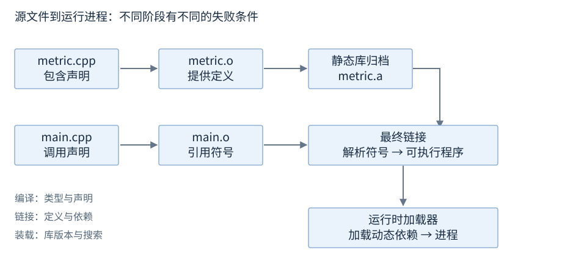

# 构建、依赖与工程交付

构建工具把源文件及其依赖组织成程序或库。CMake 描述目标与使用要求，生成器把描述转换为具体构建系统。二进制格式、符号与装载机制见链接装载章。

**范围**：C++17；基础 CMake 示例适用于 3.16 及以后。**先修**：声明、定义、多文件编译。基础阅读：配置与构建、最小 target、使用要求；安装导出及交付属于后查。

## 配置、构建与产物

配置阶段读取 CMakeLists.txt，选择工具链和生成器，写入独立构建目录；构建阶段调用底层编译/链接工具生成产物。

```text
cmake -S . -B build
cmake --build build
```

`-S` 指定源目录，`-B` 指定构建目录；第二行只使用已有配置。当前目录中的 CMakeLists.txt 是输入，build 中的构建文件和程序/库是输出。编译器变化时使用新构建目录，避免旧缓存继续指向原工具链。

| 阶段 | 输入 → 输出 | 首先查看 |
| --- | --- | --- |
| 预处理/编译 | 源文件及头 → 目标文件 | 首条相关诊断、包含路径、类型 |
| 链接 | 目标文件及库 → 程序/库 | 缺失/重复符号、依赖、架构 |
| 装载 | 程序及运行库 → 运行中的进程 | 库路径、版本、依赖链 |



图30-1：构建与装载属于不同阶段。基础阶段细分见程序构建章；本章关注工程目标。[CMake 构建模型](https://cmake.org/cmake/help/v3.16/manual/cmake-buildsystem.7.html)。

## 可执行目标与库目标

target 是构建对象的名字，常见有可执行目标、编译库和仅传播使用要求的接口库。

```cmake
cmake_minimum_required(VERSION 3.16)
project(demo LANGUAGES CXX)
add_library(metric STATIC metric.cpp)
target_include_directories(metric PUBLIC "${CMAKE_CURRENT_SOURCE_DIR}")
target_compile_features(metric PUBLIC cxx_std_17)
add_executable(app main.cpp)
target_link_libraries(app PRIVATE metric)
set_target_properties(metric app PROPERTIES CXX_EXTENSIONS OFF)
```

metric 编译实现，app 使用它；链接 target 名称后，依赖关系和 PUBLIC 使用要求随目标传播。`cxx_std_17` 要求至少 C++17 语言模式，不能单独证明库已实现所有设施。

源码角色分别为公共声明、唯一实现、使用者：

**声明摘要**。

```cpp
// metric.h 中的声明
int clamp_percent(int value) noexcept;
```

**承接上文**。

```cpp
// metric.cpp 中的定义，先包含 metric.h
int clamp_percent(int value) noexcept {
    return value < 0 ? 0 : (value > 100 ? 100 : value);
}
```

使用者包含头文件并调用 `clamp_percent(142)`，结果为 100。完整小工程见 [metric.h](../examples/r30-project/metric.h)、[metric.cpp](../examples/r30-project/metric.cpp)、[main.cpp](../examples/r30-project/main.cpp)。配套 [CMakeLists.txt](../examples/r30-project/CMakeLists.txt) 还演示下面的安装导出；上面的短例先建立最小依赖关系。

## 使用要求：PRIVATE、PUBLIC、INTERFACE

使用要求包括包含目录、编译特性、选项和链接依赖，附加到 target 而非无差别全局设置。

| 范围 | 本目标使用 | 下游继承 |
| --- | --- | --- |
| PRIVATE | 是 | 否 |
| PUBLIC | 是 | 是 |
| INTERFACE | 否 | 是 |

公共头文件需要的包含目录通常 PUBLIC；只供实现使用的宏或头文件路径通常 PRIVATE；头文件库通过 INTERFACE 传播要求。静态库的私有链接依赖仍可能为最终链接传播，不把 PRIVATE 等同于“最终程序完全不依赖该库”。[链接范围](https://cmake.org/cmake/help/v3.16/command/target_link_libraries.html)、[包含目录](https://cmake.org/cmake/help/v3.16/command/target_include_directories.html)。

## 生成器、配置与缓存

生成器决定采用哪套底层构建系统。已有环境可用 `cmake -G "生成器名称" -S . -B build` 明确选择，名称须匹配已有工具链。

单配置生成器一般在配置时设置 `CMAKE_BUILD_TYPE`；多配置生成器在构建时选择 `--config`：

```text
cmake -S . -B build -DCMAKE_BUILD_TYPE=Release
cmake --build build --config Release
```

两种选择机制按生成器解释；第二行不把单配置构建自动改成多配置。Debug/Release 是项目配置名称，其优化、符号和宏由工具链及项目决定；Release 可以保留符号。

CMakeCache.txt 记录配置变量，`-DNAME=value` 设置变量。影响结果的工具链、架构、编译选项、接口宏和配置应记录；私人绝对路径不作为可发布的接口。[构建配置](https://cmake.org/cmake/help/v3.16/manual/cmake-buildsystem.7.html#build-configurations)。

## 依赖接入与版本

源码依赖、预构建包和 imported target 是不同接入方式。imported target 描述外部产物及其使用要求，使用者仍用 `target_link_libraries` 连接目标。

| 记录内容 | 用途 |
| --- | --- |
| 来源、版本/提交、内容校验 | 再次获取相同输入 |
| 工具链、目标架构、运行库 | 判断产物兼容性 |
| 接口宏、标准要求、公共依赖 | 传播消费方需要的条件 |
| 配置、构建、安装入口 | 重现工程过程 |

固定输入有助于重现，逐字节相同还受时间戳、路径及生成步骤影响。交叉编译区分构建机工具与目标机程序；库名相同不证明二进制兼容。[Imported targets](https://cmake.org/cmake/help/v3.16/guide/importing-exporting/index.html)。

## 安装目录与导出目标

**进阶后查。** 安装把产物和公共头组织到独立前缀；导出将 target 的使用要求写成可被其他工程加载的文件。

```cmake
target_include_directories(metric PUBLIC
    $<BUILD_INTERFACE:${CMAKE_CURRENT_SOURCE_DIR}>
    $<INSTALL_INTERFACE:include>)
install(TARGETS metric EXPORT MetricTargets ARCHIVE DESTINATION lib)
install(FILES metric.h DESTINATION include)
install(EXPORT MetricTargets NAMESPACE Handbook::
    DESTINATION lib/cmake/Metric)
```

该摘录替换最小工程中的包含目录设置；BUILD_INTERFACE 用于源码构建，INSTALL_INTERFACE 的相对路径基于安装前缀。

```text
cmake --install build --config Release --prefix stage
```

stage 是项目内安装目录，预期包含公共头、库和导出文件。消费工程可加载 `MetricTargets.cmake` 并链接 `Handbook::metric`；完整 `find_package(Metric CONFIG)` 还需要包配置文件、可选版本文件及公共依赖的查找。导出文件存在不等于这些内容已齐备。[安装导出](https://cmake.org/cmake/help/v3.16/guide/importing-exporting/index.html)。

## API、ABI 与交付

API 是源码接口，ABI 是二进制交互约定。公共类型、语言要求和宏随 target 传播；布局、调用约定、导出、运行库及所有权边界见链接装载章。ODR 规则见程序构建章，不在这里重复完整规则。

交付清单包括程序、运行依赖、资源配置、构建身份和匹配符号。动态库的导入库/运行库及查找路径按平台处理；INSTALL_INTERFACE 不设置运行时查库路径。源提交与配置名称不能单独标识故障二进制。

特性判断区分语言模式与库特性宏。C++20 可使用 `<version>` 查询相关宏；`__has_include` 仅说明可找到头，不保证完整接口。MSVC 的 `__cplusplus` 报告受 `/Zc:__cplusplus` 影响，具体平台说明集中在构建配置资料中。[特性宏](https://timsong-cpp.github.io/cppwp/n4861/version.syn)、[MSVC](https://learn.microsoft.com/en-us/cpp/build/reference/zc-cplusplus?view=msvc-170)。

查阅顺序：构建命令与 target 查本章；二进制与装载查链接章；现场调试查调试章。交付检查围绕目标环境的依赖、资源和失败/关闭路径，不从开发机的一次运行推断普遍可用。
