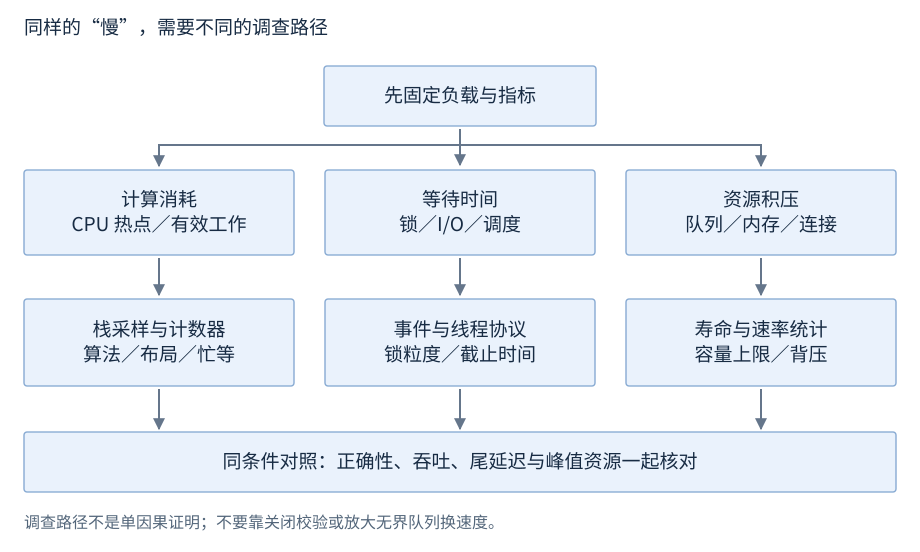

# 性能与资源调查

性能调查先确定要测量的工作和指标，再收集计算、等待及资源积压的证据。基准比较实现，剖析定位消耗；两者回答不同问题。

**范围**：标准 C++17 的计时写法，平台工具单独标范围。**先修**：算法、时间库、CPU/缓存、线程和 I/O。基础阅读：指标、计时和对照；平台剖析与资源故障属于后查。

## 吞吐量、延迟与分位数

吞吐量是单位时间完成的工作数，例如成功请求/秒；延迟是一次工作的耗时。计入口径要说明请求类型、并发、成功、超时和失败。

分位数描述排序后的样本位置。采用最近秩法时，n 个样本的 p99 取升序第 `ceil(0.99*n)` 个，编号从 1 开始；其他统计软件可能采用插值法，报告要注明方法。p99 不是通用的最大值，小样本尾部估计通常不稳定。

```text
样本（已排序，单位 ms）：2, 3, 4, 5, 6
最近秩 p50：第 ceil(0.5*5)=3 个，即 4 ms
```

这是统计定义示例，不是本书测得的服务延迟。增加吞吐可能通过扩大队列实现，却同时增加等待和内存，所以报告应包含延迟分布及资源条件。

## CPU、内存与队列指标

| 指标 | 表达什么 | 记录口径 |
| --- | --- | --- |
| CPU 时间/使用率 | 处理器执行消耗 | 单核或整机、进程或线程、时间窗 |
| RSS/工作集 | 驻留内存的某种平台统计 | 平台定义、共享页及采样范围 |
| 活对象/分配量 | 程序管理的数据与分配 | 对象数、字节量、生命周期 |
| 队列长度/等待时间 | 工作积压 | 上限、拒绝、取消及服务速率 |

驻留内存不等于活对象大小，增长也不自动证明泄漏。CPU 低、延迟高可能在等锁、I/O 或调度；CPU 高也可能是忙等。进程内存口径见虚拟内存章。

## steady_clock：测量时间区间

`std::chrono::steady_clock` 在 `<chrono>`，用于单调时间间隔。准备输入放在测量之外，结果在测量之后保留或消费。

**承接上文**。

```cpp
// 需要 <chrono>；work() 是被测工作，result 在计时后消费。
const auto begin = std::chrono::steady_clock::now();
auto result = work();
const auto elapsed = std::chrono::steady_clock::now() - begin;
const auto ns = std::chrono::duration_cast<std::chrono::nanoseconds>(elapsed).count();
```

代码展示计时语法，省略 work 与结果消费的领域实现。ns 是这次区间的计数，不给不同机器承诺相同数值。计时包括区间内全部工作，时钟读取本身也有成本；极短操作通常批量测量再分析。[steady_clock](https://timsong-cpp.github.io/cppwp/n4659/time.clock.steady)。

配套 [r32-performance.cpp](../examples/r32-performance.cpp) 展示输入准备、累加工作和结果校验的完整形式。其耗时随环境变化，程序中的结果校验用于说明语义，不将耗时作为通用性能结论。

## Benchmark：比较两个实现

基准需要相同任务、相同结果和可解释的实验条件。比较流程：

1. 固定输入分布及规模，先定义正确结果。
2. 选择相同语言模式、优化选项、硬件和线程条件。
3. 准备输入，按相同规则热身；交错或随机安排两种实现的测量。
4. 保留结果，使计算有可观察用途；检查优化器是否消除了预期工作。
5. 重复采样，报告分布与波动，再分析差异。

```text
任务：同一输入的查找
输入规模/分布：<记录实际条件>
实现 A：<算法、编译配置、结果、样本统计>
实现 B：<相同字段>
结论范围：<只对这些输入和条件成立>
```

这是结果记录格式，不填造运行数据。返回结果可观察也不保证每条源码逐次执行；防优化工具同样有边界，需要时结合生成的指令判断。专业基准框架可管理采样等工作，本书不要求安装。[Google Benchmark 指南](https://github.com/google/benchmark/blob/main/docs/user_guide.md)。

## Profiler：定位时间与事件

| 方法 | 适合观察 | 需要进一步解释 |
| --- | --- | --- |
| CPU 栈采样 | 时间常落在哪些调用路径 | 等待不一定表现为 CPU 热点 |
| 硬件计数器 | 指令、分支、缓存事件 | 计数变化是否与慢路径有关 |
| 调度/I/O/等待事件 | 线程等待的先后及持续时间 | 日志覆盖和关联是否完整 |

**Linux 工具入口**：在已有 perf 环境中，`perf stat -- ./app` 查看统计，`perf record -g -- ./app` 采样，`perf report` 阅读结果。默认 fp 用户栈展开需要程序保留帧指针；否则按环境选 `--call-graph dwarf`，核对支持与展开质量。先看事件单位、总量和热点路径；硬件及权限决定可用事件。这些是命令示例。[perf stat](https://man7.org/linux/man-pages/man1/perf-stat.1.html)、[perf record](https://man7.org/linux/man-pages/man1/perf-record.1.html)、[权限与事件](https://docs.kernel.org/admin-guide/perf-security.html)。

**Windows 工具入口**：WPR 收集 ETW，WPA 读取跟踪；已有环境的命令形状为 `wpr -start GeneralProfile -filemode`、结束时 `wpr -stop trace.etl`。按具体配置查看 CPU、调度和 I/O 关系；这里是工具语法入口，不是跨平台接口。[WPR 命令](https://learn.microsoft.com/en-us/windows-hardware/test/wpt/wpr-command-line-options)。

## 计算、等待与积压



图32-1：现象决定下一步证据，不代表一个症状只有一个原因。

内存增长按本章资源指标区分活对象、容量与驻留；线程停滞查[全线程栈](R31-debug.zh-CN.md#变量调用栈与线程)和等待条件；连接耗尽查[背压与容量](R29-sockets-production.zh-CN.md#背压容量与处理预算)。
