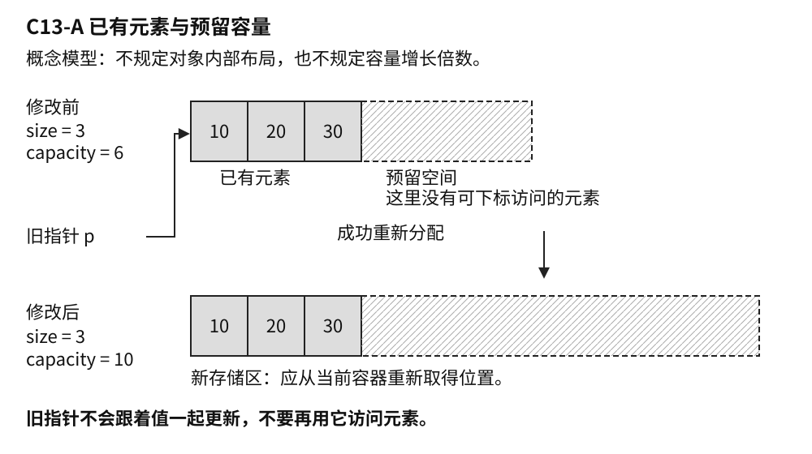
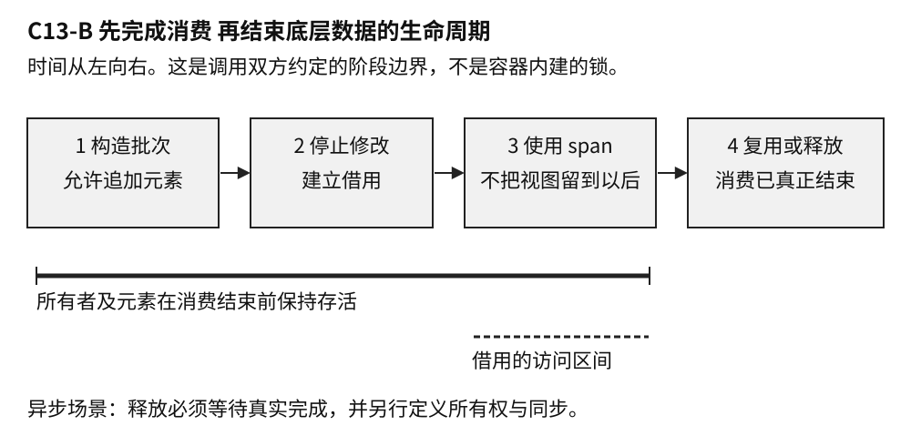

# C13 vector 的空间与时间

样章 v0.2 · 卷一 共享基础 · 2026-10-03

`vector` 把数量可变的一组元素放在连续存储中。这种安排让按下标访问、顺序遍历以及与许多底层接口交换数据都很直接，也让它成为 C++ 程序里常见的容器。代价出现在序列发生变化时：尾部增长可能需要换一块存储，中间插入要为新元素腾出位置，曾经交给别人的地址未必还能继续使用。

理解 `vector`，因而要同时看两件事：元素怎样占用空间，程序又在什么时间访问它们。前者解释性能，后者决定正确性。日志列表、图像处理中间结果、游戏里的对象集合，看起来是不同业务，碰到的往往是同一组边界。

本文讨论通常的 `std::vector<T>`，主线为 C++20，不包括有特殊表示的 `vector<bool>`。这是 C13 容器与分配主题中的局部样章，集中讨论容量、对象生命周期和借用；完整算法体系、分配器接口与多态内存资源另有章节。代码是未编译、未执行的说明示例，文中的成本推导也不冒充实测结果。

## 连续存储为什么值得付出代价

连续排列的元素给程序一个简单的数据布局。处理一批传感器读数时，遍历可以沿着相邻位置前进；把一段数值交给接受“指针加长度”的接口，也不必先重新组织元素。现代处理器通常能从这类访问规律中获益。不过，`vector<Record>` 中的 `Record` 连续，不代表记录引用的字符串或其他资源也连续。一个装着许多指针的容器，仍然可能把访问带到分散的地址。

这也是选容器时值得先问清的数据问题。图像的一行像素、待排序的订单摘要、准备一起上传的一批采样值，都很适合先考虑连续序列。若需求是大量中间插入，或者对象地址必须长期稳定，就要把维护序列的成本也算进去。C++ Core Guidelines 建议默认考虑 `vector`，是一项工程起点，并非宣称它对所有负载都最快。[S3]

`size()` 与 `capacity()` 描述这份布局的两个尺度。前者是已有元素的数量，后者是当前存储在不重新分配的情况下能容纳的元素数量。对空容器调用 `reserve(100)`，可以预留空间，却没有给它增加 100 个可按下标访问的元素。此时写 `v[0]` 仍然越界。

同样是处理一百条记录，两种程序可能需要不同接口。文件头已经给出记录数，后续代码准备逐项填充现成元素，可以按类型和任务需要使用 `resize`；记录数只是一项估计，解析器每读到一条才形成一个对象，则适合先 `reserve`，再逐条插入。对带复杂成员的类型，提前创建整批元素还可能付出随后又被覆盖的初始化成本。



图 C13-A 已有元素与预留容量。图中的容量只是示意，不代表增长公式；未用容量不能通过越过 size 的下标写入。

分配器参与管理容器的存储，元素的构造和销毁则决定哪些对象已经存在。两者有关联，却不能混为一件事：拿到足够多的字节，不等于可以跳过容器接口随意扩展元素范围。使用自定义分配器，或者把分配请求交给特定内存资源，也不会自动改变这套访问规则。本章只需要保留这条界线，具体分配策略可以稍后再研究。[S1]

## 地址的有效期比容器的寿命更短

一个 `vector` 变量可以活很久，它内部元素使用的那块存储却可能更换多次。重新分配后，序列中的值可以保持相同，旧的指针、引用和迭代器仍然失效。C++ 不会替已经传给其他模块的地址做登记，再在搬迁后统一更新。

例如，日志界面保存了一条记录的地址。随后，同一线程收到新的日志批次，把记录追加进容器，下一次刷新界面时再使用之前保存的地址。小文件时没有越过容量，错误可能长期不暴露；记录数增长到某个位置后，旧地址就不再能代表当前元素。这种现象很容易被误诊成“某条记录内容特殊”，实际触发条件可能只是一次重新分配。

不依赖任何增长倍率，也可以表达这个边界：

```cpp
// C++20 说明示例，未编译、未执行。
#include <vector>

int main() {
    std::vector<int> values{10, 20};
    const int* saved = &values[0];
    const auto capacity = values.capacity();
    if (capacity == values.max_size()) return 0;

    values.reserve(capacity + 1); // 成功返回时必定重新分配
    // 此后不能再通过 saved 访问原元素。
    const int current = values[0];
    return current == 10 ? 0 : 1;
}
```

这个例子没有尝试解引用失效指针来制造崩溃。规则本身已经足以判定那样的访问不成立；程序碰巧输出正确数值也不能推翻它。这里还保留了“成功返回”这个前提：申请存储可能失败，异常路径要另外分析。[S1]

不少程序会把地址改成下标。只发生重新分配时，这能让调用者稍后从当前容器重新取得位置。但是，场景编辑器若把“第 5 个对象”当成选中的对象，前面删除一项后，下标 5 可能指向另一个对象；排序也会改变位置与业务身份的对应。所有访问都在范围内，画面仍然可能选错东西。需要跟踪业务对象时，稳定 ID 和查找机制通常比记住它当时排第几更符合需求。

地址稳定、位置稳定、业务身份稳定，是三种不同要求。先弄清实际需要哪一种，才知道该保存指针、下标、ID，还是另选存储方式。

## 容量没变也要检查修改发生在哪里

把全部问题归为“扩容导致失效”，会漏掉很多更普通的修改。尾部追加若没有重新分配，已有元素的指针和引用可以继续使用，但原来的 `end()` 已经失效；中间插入还会影响插入点及其后的迭代器和引用。删除元素时，删除位置及其后的迭代器和引用也会失效。[S1]

`end()` 表示序列最后一个元素之后的位置。范围 `for` 会在进入循环时取得结束位置，并把它用于后续判断。因此，先预留足够容量，再一边范围遍历一边追加，仍然不能靠“元素地址不会变”证明循环安全。如果追加后继续循环，下一次循环判断就会使用已经失效的结束迭代器。

如果任务只是处理最初的一批数据，并把结果附在末尾，可以明确保存原始数量，每次从当前容器取得所需值：

```cpp
// 函数体内的 C++20 片段，需包含 <vector> 和 <cstddef>。
// 未编译、未执行；这里只把原始整数各复制一份。
std::vector<int> values{10, 20, 30};
const auto count = values.size();
for (std::size_t i = 0; i < count; ++i) {
    const int value = values[i];
    values.push_back(value);
}
```

局部变量 `value` 持有自己的整数值，不依赖插入前的地址；新追加的元素也不进入本轮处理范围。换成会移动源对象的操作，或把局部变量写成引用，就需要重新判断。对于图像变换、批量清洗记录这类工作，分别使用输入、输出两个容器有时更清楚。多用一块存储的代价，可能小于维护复杂修改顺序的代价。

另一类错误出现在删除操作之后。`erase` 返回后续有效位置，常用于继续遍历；若代码坚持使用删除前保存的迭代器，就丢掉了这个接口提供的恢复入口。这里的排查重点是修改点与访问点的相对关系，和是否申请了新内存无关。

## 借用数据的接口也要交代时间

函数只读取一段连续数据时，C++20 的 `std::span` 可以把指针与长度组合成一个更清楚的接口。它可以观察 `vector` 或其他连续存储中的元素，但不拥有这些元素。[S1]

假设音频处理模块生成一批采样值，再同步交给滤波函数。只要使用期间底层数据仍然存活，且没有发生使访问失效的修改，传递 `span` 就很自然。困难往往来自把同步接口改成异步接口：后台任务复制了一个 `span`，生产者却开始复用缓冲区。若只是原地覆写，元素可能仍然存活，任务读到的却已经是下一批数据；若销毁容器或发生重新分配，视图会悬空。没有同步的并发读写还可能形成数据竞争。这几种错误需要分别处理，复制视图都不能解决。



图 C13-B 批次数据的一种使用约定。“停止修改”表示应用暂停影响读取的修改，不是 vector 内建的锁；异步读取必须等到真实完成后才能结束这段约定。

`span<const Sample>` 只限制通过这个视图修改元素，不能阻止其他持有者修改原容器，也没有提供线程同步。把类型写成只读，不能代替生产者与消费者之间的时序安排。

接口的选择可以从接收方真正需要什么出发。界面只显示标题和时间，复制这两个字段形成快照，往往比共享整份日志更省心。一个完整批次要交给后台处理，可以转移拥有它的对象，让接收方负责保留到任务完成。多个消费者确实需要同一批不可变数据时，再考虑共享所有权与同步。共享所有权解决的是“还有谁持有数据”，共享的数据能否被安全修改仍需单独设计。

有时要求恰好相反：记录的地址要稳定，记录集合却频繁增长。`vector<std::unique_ptr<Record>>` 可以把容器里的智能指针迁移与它们指向的 `Record` 分开；仅仅因为这个 `vector` 重新分配，被指向记录的地址不会随之迁移。不过，删除或重置相应智能指针仍会结束记录的生命。这种安排还有间接访问和通常的逐对象分配成本，适不适合需要结合访问模式判断。

## 元素怎样迁移会影响失败后的状态

重新分配可以用一个简化过程理解：取得新存储，在那里构造所需元素，成功后清理旧元素和旧存储。这个过程说明了地址为何改变，也带来一个更深的问题：构造到一半失败，容器该留下什么状态？具体实现可能使用专门优化，构造顺序还会受操作和别名关系影响，不能把简图当成实现源码。

对整数而言，搬迁似乎只是复制一些字节。一个记录类型却可能拥有字符串、缓冲区、文件句柄或其他资源；它的移动构造会转移资源，也可能执行用户代码。连续存储没有抹去对象语义，不能对一般类型随意用 `memcpy` 代替正确的构造和销毁。

假如前几个元素的资源已转移到新位置，下一个元素的移动构造抛出了异常，想把全部东西原样放回去并不容易。恢复动作本身也可能失败。移动是否会抛出，因而会影响容器能够给出的异常保证。这是 `noexcept` 经常出现在相关讨论里的原因，WG21 的早期设计论文也专门分析过这个冲突。[S4]

就 C++20 的尾部单元素插入而言，满足复制插入要求，或者元素具有不抛出的移动构造时，相关条款提供异常后的无效果保证；对于不满足复制插入要求的类型，如果移动构造抛出，效果可能未指定。[S1] “复制插入”是包含分配器语义的库要求，不能只凭看到一个拷贝构造函数就判定满足。其他修改操作还要查看各自的条款。

实践中，可以先查看自己的类型是否真的需要手写复制、移动和析构。用合适的资源管理成员表达所有权，常常能减少特殊成员函数里的错误。如果必须自定义，就要把可能抛出的步骤和资源转移顺序说清楚。只有确实不会让异常逃出时，才应承诺 `noexcept`；异常若逃出不抛出函数，会调用 `std::terminate`，给声明加一个关键字并不能修好资源设计。

分配器还可能影响容器之间转移存储的条件。例如，不能不看分配器传播规则和实例是否相等，就断言任何 `vector` 移动赋值都只会交换几个指针。即使可以接管源容器的存储，目标容器原有元素的销毁成本也不能忽略。类型和分配器都是容器成本与失败行为的一部分，具体规则将在分配器章节展开。

## 预留容量怎样进入性能判断

尾部追加的摊还常数复杂度，说的是一串操作的成本如何分摊。它允许其中某次追加因重新分配而较慢。因此，离线文件转换关注的总体吞吐，与交互程序关心的一次卡顿，可能对同一实现给出不同评价。

用固定翻倍作简化模型，容量增长时迁移的元素数像 1、2、4、8 这样累加，增长到 N 个元素前的总迁移量仍与 N 同阶。这个推导解释了留出增长余量为什么有用，不表示标准要求两倍增长，也没有计算元素构造、分配器、内存页面或线程调度的真实代价。

可信的规模信息很有价值。文件头给出了记录数，或一帧处理中已经算出结果上限，一次合理的 `reserve` 可以减少后续重新分配。反过来，每追加一个元素就先调用 `reserve(size() + 1)`，可能把原本的增长余量逐步消掉。在按请求量提供容量的实现模型下，反复迁移会产生 1+2+… 的平方级成本。“主动管理容量”本身并不保证优化。

预留也占用内存。为应付极少出现的大批次，给每个连接都保留很大的容量，可能把单次延迟问题换成整体内存压力。调用 `clear()` 会销毁元素而保留容量；`shrink_to_fit()` 只是减少多余容量的请求，不能假定一定生效，若发生重新分配还会使旧借用失效。保留与释放都应服从实际使用周期。[S1]

要比较自然增长与一次预留，先确认两者产生的内容一致，再观察相同负载下的批次耗时、容量变化和峰值内存。关注偶发卡顿时，还要看慢批次分布，不能只报告平均数。记录工具链、标准库、优化选项、硬件、输入规模和重复次数，才能让结果有解释空间。给元素加计数器或日志会改变成本，这类仪表化结果最好与生产类型的计时分开。

对实时控制循环，预先分配更只是论证的一部分。元素内部还可能分配，其他调用可能阻塞，超限时也需要处理策略。一次 `reserve` 不能替整条调用链承诺最坏延迟。

## 故障排查时把修改与访问对起来

出现乱码或崩溃，先找出故障位置使用的是哪一次取得的地址，再向前查期间发生过的容器修改。若只在大输入下失败，可以记录容量变化来寻找关联，但仍需定位具体的失效访问。相关性足以指路，不能独立证明原因。

没有崩溃、只是内容错位时，检查业务身份尤其重要。缓存的下标可能在删除或排序后合法地读到另一条记录，这类错误未必会触发内存工具。对象 ID、当前排序方式和更新时序，比多加一次边界判断更能解释现象。

若预留容量后问题依旧，要继续查结束迭代器、中间插入与删除；若引入异步任务后才出现，沿着任务实际完成时间追踪底层所有者。`span` 和裸指针都需要这条时间线。只有性能退化时，则把重新分配、元素构造和业务处理分开观察，避免把解码或绘制的成本都算到容器头上。

AddressSanitizer 能帮助发现已执行路径中的多类越界、释放后使用等问题；标准库的调试迭代器模式也能诊断部分无效迭代器操作。[S5] [S6] 工具没报错仍不能证明全部访问有效。例如容量以内但元素范围以外的写入，检测能力就取决于实现及配置。调试模式还可能改变容器表示和性能，排错构建的时间数据不宜直接当作发布版本结论。

## 面试追问怎样谈到真正的设计

**“已经 reserve 了，为什么仍然出错？”** 这个问题需要先补足上下文。预留的是多少、之后是否超出容量、错误发生在元素地址还是结束迭代器、期间是否有删除或中间插入？把这些条件补齐后，才能区分重新分配、位置失效和对象已经销毁。直接回答“不会扩容，所以安全”，遗漏的恰恰是重要边界。

追问可以顺着一个修复继续：**“那保存下标，不保存指针，可以吗？”** 如果只是跨过重新分配再找回同一位置，可以；若期间会删除或排序，就必须重新说明下标与业务对象的对应。由此能自然谈到稳定 ID、句柄表，或对修改范围施加约束。方案要解决的是实际身份需求，不能仅看代码有没有悬空指针。

再把消费改成异步：**“传 span 能否避免复制？”** 在底层存储存活、访问有效、并发规则满足的条件下，可以避免为传参而复制元素。但任务队列什么时候完成、谁保留批次、谁还能修改数据，都需要明确。接收方只要几个字段时，小快照可能更简单；需要整个批次时，可以考虑所有权转移。

于是会有更具体的性能问题：**“换成 unique_ptr 元素，或给移动构造加 noexcept，会更好吗？”** 前者把记录地址与容器存储分开，同时引入间接访问和分配成本；后者必须反映类型真实的异常行为，并可能影响容器在相关操作中的迁移选择和保证。两者解决的问题不同，不能只凭一个基准数字相互替代。

最后值得追问的是证据：**“你会怎样验证这个改动？”** 正确性上核对所有者、修改点和消费结束点，覆盖重分配、删除、异步完成等路径；性能上固定负载，校验输出一致，再比较延迟分布与内存。若只做了设计而没有执行，就把验证计划与已得结果分开说。

## 来源与阅读边界

资料核验日期为 2026-10-03。正文、示例和两幅图由本项目原创组织，未转载第三方配图。公开规范、工程建议与设计背景分别列出；本版没有代码执行、诊断输出或性能测量证据。

- **S1 C++20 规范参照。** WG21 [N4861 公开工作草案](https://www.open-std.org/jtc1/sc22/wg21/docs/papers/2020/n4861.pdf)，重点为 `[vector.overview]`、`[vector.capacity]`、`[vector.modifiers]`、`[container.alloc.reqmts]`、`[span.overview]` 和 `[except.spec]`。用固定条款核对保证，不以当前滚动草案的新规则回填 C++20；它也不替代正式出版文本或后续缺陷报告分析。
- **S2 版本身份。** WG21 [N4859 编辑报告](https://www.open-std.org/jtc1/sc22/wg21/docs/papers/2020/n4859.html)，说明 N4861 与 C++20 DIS N4860 的内容关系。本章未使用 C++23/26 专属接口，旧项目需另行选择视图接口。
- **S3 工程建议。** [C++ Core Guidelines](https://isocpp.github.io/CppCoreGuidelines/CppCoreGuidelines#Rsl-vector)，关注 SL.con.2、SL.con.4 及资源管理建议。它是工程指南，不能作为特定负载的性能证据。
- **S4 设计背景。** WG21 [N2855 Rvalue References and Exception Safety](https://www.open-std.org/jtc1/sc22/wg21/docs/papers/2009/n2855.html)。用来理解移动与异常恢复的冲突，旧提案不替代 C++20 的最终接口条款。
- **S5 诊断工具。** LLVM [AddressSanitizer 文档](https://clang.llvm.org/docs/AddressSanitizer.html)。实际能力应结合工具版本、编译配置与执行覆盖核对。
- **S6 调试迭代器。** GCC libstdc++ [Using the Debug Mode](https://gcc.gnu.org/onlinedocs/libstdc++/manual/debug_mode_using.html)。尤其注意调试与非调试构建的兼容边界。

[S1]: https://www.open-std.org/jtc1/sc22/wg21/docs/papers/2020/n4861.pdf
[S2]: https://www.open-std.org/jtc1/sc22/wg21/docs/papers/2020/n4859.html
[S3]: https://isocpp.github.io/CppCoreGuidelines/CppCoreGuidelines#Rsl-vector
[S4]: https://www.open-std.org/jtc1/sc22/wg21/docs/papers/2009/n2855.html
[S5]: https://clang.llvm.org/docs/AddressSanitizer.html
[S6]: https://gcc.gnu.org/onlinedocs/libstdc++/manual/debug_mode_using.html
