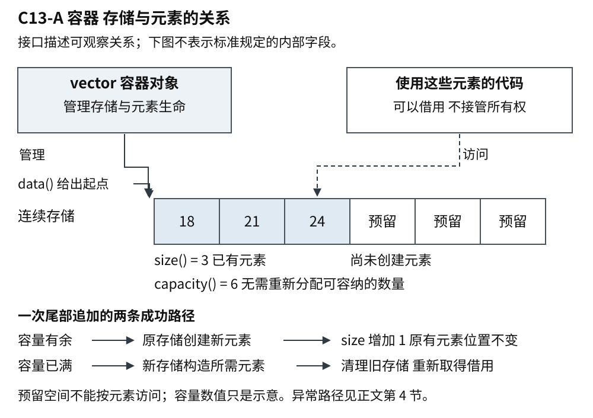
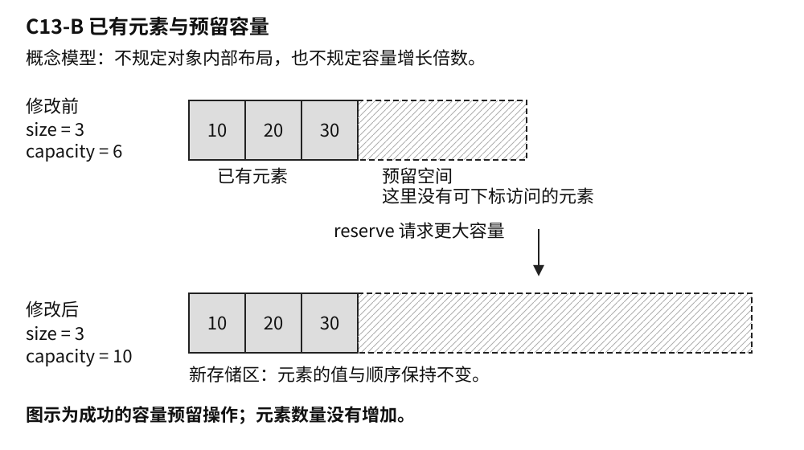
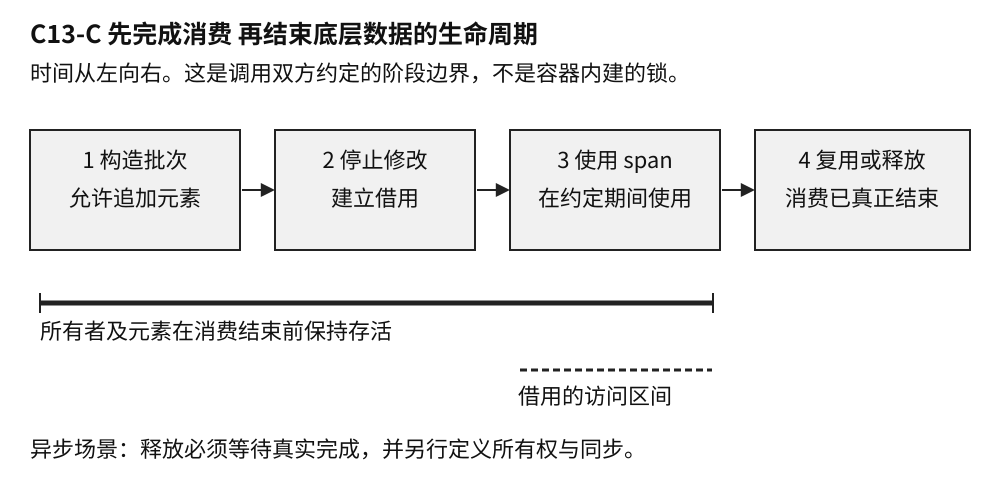

# C13 从一组数据认识 vector

样章 v0.4 · 卷一 共享基础 · 2026-10-03

程序经常需要保存一组同类数据：一次测量得到的温度、一份文件里的记录、屏幕上等待显示的消息。一个整数变量只能表达其中一项；为每条记录分别起名字，既无法应付未知数量，也不方便统一处理。我们需要一种数据结构来管理整组数据，让程序可以逐项读取、追加和删除。

在 C++ 标准库中，`std::vector` 就是完成这类工作的常用工具。它是一种**容器**，也就是负责保存和管理一组对象的类型。C++ 中的对象是有类型、占用存储的数据实体，一个整数也是对象，不必是一条复杂记录。vector 按顺序排列元素，数量可以在程序运行时改变，通常被称为动态数组。本章中的 vector 都指这个 C++ 容器；它不是数学里的向量，也不是机器学习中用一串数表示文本或图像的“嵌入向量”。后两者可以借助 `vector` 存储数值，但存储工具本身不规定这些数值的数学含义。

vector 适合怎样的工作，可以先从数据的形状判断。读取一个不知道有多少行的文件，读到一项就放到末尾；收集一批测量值，然后顺序计算；把若干订单摘要排好序，再按位置显示。这些任务都把“一段有顺序、长度可变的数据”作为整体。若主要需求是按订单编号查找，或者不停在队伍中间插入，就还要考虑别的结构。容器的选择，先来自要怎样使用数据。

下文以 C++20 的通常 `std::vector<T>` 为主线，不讨论采用特殊表示的 `vector<bool>`。这是一篇从基本使用走向存储和生命周期的专题样章，不要求读者已经熟悉容器实现。

## 1 结构总览

### 1.1 容器 管理的存储与已有元素

理解 vector，可以先把它分成三个相连的层次。**容器对象**是程序操作的入口，负责管理存储和元素；**存储**是容纳元素的连续空间；**已有元素**是在这片空间里已经创建、可以按从 0 开始的位置编号（也就是下标）访问的对象。申请了空间，不表示其中每个位置都有元素。对象从开始存在到生命结束的时间叫作**生命周期**，因此存储还在，也不保证原来的元素仍然存在。

三个接口把这层关系显露出来：`data()` 提供已有元素连续区的起始位置，`size()` 给出已有元素数，`capacity()` 给出当前存储不必换到别处就能容纳的元素数。有效下标始终小于 size；size 可以小于 capacity。空 vector 没有可访问元素，无论 data() 返回什么，都不能用它读取第一个元素。[S1]



图 C13-A vector 的概念结构。图中三个接口描述可观察的关系，不表示标准规定容器内部必须保存三个字段，也不是某家标准库的内存布局。

图中的“拥有”，是指负责保留对象并在适当时候销毁它；“借用”，是指访问这些对象，却不接管这份责任。vector 管理自己的元素，函数或界面可以临时访问它们。后面讨论指针、引用和视图时，始终沿着这条关系检查：元素由谁保留，使用者何时用完，中间有没有使访问失效的修改。

### 1.2 操作沿时间改变结构

静态图只交代此刻有什么。一次操作还会改变数量、存储位置或元素的生命。例如在尾部追加一个元素，成功路径可以分成两条：

- 还有预留空间：在现有存储末尾创建新元素，size 增加 1，capacity 不变
- 空间已经用满：取得更大的存储，创建并初始化所需元素，成功后清理旧元素与旧存储；size 增加 1，存储位置改变，原来的访问入口需要重新取得。这种更换存储的过程称为重新分配

这两条路径说明了同一个追加接口为什么可能带来不同后果。`reserve` 用来请求容量，本身不增加元素数；`resize` 用来改变元素数，增加时会创建元素，减少时会结束尾部元素的生命。`clear` 结束所有元素的生命并使 size 归零，但保留容量；容器销毁时，仍存在的元素和它管理的存储才一并清理。[S1]

因此，本章后面的机制可以放回两个问题里理解：结构上，容器、存储和元素分别由谁管理；时间上，某次操作改变了哪些关系。第 2 节用三个整数展开基本操作与存储变化，第 3 节追踪借用的有效期，第 4、5 节再讨论失败与成本。上面的操作描述只涵盖成功路径，不假定构造元素一定成功。

## 2 基本操作与存储变化

### 2.1 保存和读取三个数

`std::vector<int>` 表示保存整数的 vector。尖括号里的 `int` 是元素类型；`std::` 表示这个类型来自 C++ 标准库。容器里的每一个整数叫一个**元素**，例如下面的 18、21 和后来加入的 24。这里先关注 `readings` 这份读数列表的用法，暂不展开内存申请细节。

```cpp
// C++20 说明示例，未编译、未执行。
#include <vector>

int main() {
    std::vector<int> readings{18, 21};
    readings.push_back(24);
    const auto count = readings.size(); // 元素数量为 3
    const int first = readings[0];     // 第一个元素为 18
    int total = 0;
    for (int value : readings) {
        total += value;
    }
    return (count == 3 && first == 18 && total == 63) ? 0 : 1;
}
```

第一行创建容器并放入两个初始值。`push_back` 把一个值加入末尾，所以原来的顺序不变，列表变成 18、21、24。`size()` 告诉程序现在有几项；方括号通过**下标**访问某一项，下标从 0 开始，因此三个元素的有效下标是 0、1、2。`auto` 让编译器从表达式推导变量类型。范围 `for` 则逐项取值，这里将三个数相加。末尾的返回值只表达程序期望检查的条件，不是本书已执行这段代码的证明。

长度可变并不等于任何下标都可用。此时 `readings[3]` 已越过元素范围，普通下标访问不会替你做边界检查。`readings.at(3)` 会检查范围并在越界时抛出异常，也就是通过语言的错误处理机制中断当前正常路径。接收外部输入作为下标时，仍应明确检查规则，而不能把没有立刻崩溃当成访问合法。

容器也能保存字符串和自定义记录，不过一个 `vector<T>` 的元素类型固定为同一个 `T`。更复杂的类型会带来更复杂的创建、复制和销毁行为。先把整数版本理解清楚，后面再看这些行为怎样影响性能和失败处理。

### 2.2 连续布局与容量预留

第 1 节把存储和元素分开看，这里再看连续布局怎样决定操作方式。运行中的程序需要内存来保存元素。通常的 `vector<T>` 将元素放在一段**连续存储**中：第一个元素之后紧接着第二个，再接着第三个。按下标查找不需要从头逐项走过去；顺序处理时，也能沿相邻位置前进。这样的布局让它适合批量计算、排序和与接受连续数据的接口交换内容。[S1]

连续不表示“所有有关的数据都挤在一起”。这里用 Record 代表自定义记录类型；`vector<Record>` 中的记录对象连续，如果每条记录还有自己单独保存的长字符串，那些字符仍可能分散在别处。现代处理器通常能从规律的访问中获益，但具体是否更快，还要看记录大小、间接访问和实际负载。C++ Core Guidelines 建议默认考虑 vector，是工程起点，不是对所有场景的速度保证。[S3]

现在回到追加操作。已有三个元素，又来了第四个，容器需要让新元素紧挨着原有元素。如果每次追加都只准备刚好够用的空间，就可能频繁更换整段存储。因此，vector 可以在现有元素之外预留一部分空间。这正是结构图中 size 和 capacity 的区别：

- `size()` 是现在已经存在的元素数，也是可访问范围的依据
- `capacity()` 是当前存储在不重新分配的情况下能够容纳的元素数，可能大于 `size()`

把列表想成一排连续的格子有助于理解，但要保留一个区别：预留格子不是已经存在的元素。一个空容器调用 `reserve(100)`，只是请求足以容纳至少 100 个元素的容量；它的 `size()` 仍为 0，不能立刻写 `v[0]`。要逐条追加，用 `push_back`；如果确实需要先有一百个整数元素，再逐项填写，可以使用 `resize(100)`，对这里的整数例子，新增加的元素初始化为 0。[S1]

文件头已经给出准确记录数时，一次预留通常比反复猜测更合理。若后续代码要逐个构造，也就是创建并初始化完整记录，则先预留再追加；若后续算法需要按下标填写现成元素，则先调整大小。两者表达了不同的工作方式。对复杂类型，提前创建一批随后又被覆盖的元素还可能产生额外成本。

当追加后的元素总数超过容量，原存储便不够用了。vector 会取得一块更大的存储，在那里构造所需元素，成功后释放原来的存储。这叫**重新分配**，日常讨论里也常称为扩容。容量究竟增长多少由实现决定；标准不要求每次都翻倍。



图 C13-B size 表示已有元素，capacity 还包括预留空间。下面展示重新分配前后的位置变化；容量数值只是示意，不代表增长公式。

到这里已经能看出 vector 的基本交换：它提供简单的连续布局和方便的尾部增长，但增长有时会搬迁已有元素，中间插入或删除则可能需要移动后面的元素。对整批数据进行处理时，这常是值得接受的代价；要求对象始终待在同一个地址时，就需要更仔细地设计。

## 3 借用与有效期

### 3.1 引用 指针与元素生命

读取一个整数，可以把它复制到另一个变量，也可以保留对原元素的访问。两者不是一回事。`int first = readings[0]` 保存自己的整数值；`int& first = readings[0]` 中的 `&` 声明了一个**引用**，可以把它理解为原元素的另一个名字。引用不会自动复制元素，也不负责延长元素的生命。**指针**则保存对象的地址，程序可通过它找到原对象。

函数只想临时读取一份大记录时，借用原元素能避免复制。沿用第 1 节的生命周期概念，这个便利带来时间条件：使用指针或引用时，原对象必须仍然存在，访问也必须仍然有效。这里的“借用”是对这种使用关系的描述，不表示 C++ 会自动替所有借用检查有效期。

例如，一个日志界面记住某条记录的地址，打算下一次刷新时读取。同一线程在这期间追加了一批日志，触发重新分配。vector 变量还在，记录内容也还在列表中，却已经处于新的存储位置；旧地址不能继续用。C++ 不会登记所有曾交出去的地址，再在搬迁后逐一更新。

下面刻意请求比当前容量更多的空间，用来明确这一边界，不依赖某家标准库的增长倍率：

```cpp
// C++20 说明示例，未编译、未执行。
#include <vector>

int main() {
    std::vector<int> values{10, 20};
    const int* saved = &values[0];
    const auto capacity = values.capacity();
    if (capacity == values.max_size()) return 0;

    values.reserve(capacity + 1); // 成功返回时必定重新分配
    // 此后不能再通过 saved 访问原元素。
    const int current = values[0];
    return current == 10 ? 0 : 1;
}
```

`const int*` 是用于读取整数的指针，`&values[0]` 取得第一个元素的地址。`max_size()` 给出这个容器能够支持的元素数量上限，检查它是为了不在上限处再加 1。预留请求成功后，旧指针失效；从当前容器重新取 `values[0]` 则仍能读到 10。这个例子没有解引用失效指针来制造崩溃，因为规则已经足以判定那样的访问不成立。[S1]

“成功返回”也有意义：申请内存和构造元素可能失败。后文会讨论复杂元素怎样影响失败后的保证。眼下先记住，vector 的生命、它所管理的存储以及其中某个元素的有效访问期，并不总是一起开始、一起结束。

把地址改成下标能解决一部分问题。若只是重新分配，稍后用下标访问当前容器，可以重新找到相同位置；若前面删掉一项，原来的下标 5 却可能指向另一条记录，排序也会改变对应关系。需要持续跟踪“同一张订单”时，通常应该保存不随排列改变的业务 ID，再通过查找找到当前对象。地址稳定、位置稳定和业务身份稳定，是三种不同的要求。

### 3.2 迭代器与序列修改

除了下标，C++ 算法还常使用**迭代器**来表示序列中的位置。它像一个可以向前移动的访问入口：`begin()` 指向起点，`end()` 表示最后一个元素之后的位置。`end()` 本身不指向元素，不能读取它；它主要用于判断遍历是否结束。

尾部追加若没有重新分配，原有元素的指针和引用可以继续使用，但原先的 `end()` 已失效，因为序列的终点变了。没有重新分配的中间插入，会使插入点及其后的指针、引用和迭代器失效，包括原来的 end；插入点之前的访问则保持有效。删除也会使删除位置及其后的迭代器和引用失效。若发生重新分配，原有元素的指针、引用和迭代器都失效。[S1]

最初例子中的范围 `for` 看起来没有写迭代器，但它在循环开始时会取得起点和终点。如果一边范围遍历同一个 vector，一边向末尾追加，即使提前预留了足够容量，也不能仅凭“元素地址没变”判定安全；追加后继续循环会再次使用原先的结束位置。

若任务只是处理最初的一批整数，并把副本附到末尾，可以直接表达这个范围：

```cpp
// C++20 函数体片段，需包含 <vector> 和 <cstddef>。
// 未编译、未执行。
std::vector<int> values{10, 20, 30};
const auto count = values.size();
for (std::size_t i = 0; i < count; ++i) {
    const int value = values[i];
    values.push_back(value);
}
```

`std::size_t` 是用于表达大小和下标的无符号整数类型。`count` 固定了本轮要处理的原始数量，每次从当前容器取值。局部变量 `value` 持有自己的整数，不依赖插入前的地址；新追加的元素不进入本轮范围。若把它改成引用，或让处理过程删除、排序原元素，就要重新分析，不能机械搬用这个循环。

做图像变换或批量清洗时，分别使用输入、输出两个容器往往更直接。删除遍历中的元素时，则可以使用 `erase` 返回的后续有效迭代器，继续正确的遍历。共同要点是让修改方式和遍历方式相配，而不是把所有安全性都寄托在预留容量上。

### 3.3 视图与消费完成时间

前面的借用只涉及一个元素。如果函数需要读取整段数据，C++20 的 `std::span` 可以把起始位置和元素数量组合成一个视图。**视图**提供访问已有数据的方式；它不保存一份独立副本，也不负责拥有和销毁这些元素。复制一个 span，复制的是访问入口与范围，而不是整段数据。[S1]

```cpp
// C++20 函数体片段，需包含 <vector> 和 <span>。
// 未编译、未执行。
std::vector<int> readings{18, 21, 24};
std::span<const int> view{readings};
const int first = view[0]; // 读取 readings 的第一个元素
```

这里的 view 覆盖三个已有元素，const 表示不能通过它修改整数。数据仍由 readings 管理；view 销毁不会销毁这些整数，复制 view 也不会为它们延长生命。如果 readings 重新分配，旧 view 不会自动跟到新存储中。

例如，音频处理模块生成一批采样值，再同步交给滤波函数，也就是等滤波函数处理完才继续向下执行。只要使用期间底层数据仍然存活，且没有发生使访问失效的修改，传递 `span` 就很自然。如果改成异步处理，提交后台任务后生产者便继续运行，消费结束时间不再是函数返回时间。后台任务复制了一个 `span`，生产者却可能已经开始复用保存采样值的缓冲区。若只是原地覆写，元素可能仍然存活，任务读到的却已经是下一批数据；若销毁容器或发生重新分配，视图会悬空。不同线程若在缺乏所需同步的情况下读写同一元素，还可能发生数据竞争，违反 C++ 的并发访问规则。这几种错误需要分别处理，复制视图都不能解决。



图 C13-C 批次数据的一种使用约定。“停止修改”表示应用暂停影响读取的修改，不是 vector 内建的锁；异步读取必须等到真实完成后才能结束这段约定。

`span<const Sample>` 中的 Sample 表示采样值类型，const 表示不能通过这个视图修改元素；这个限制不能阻止其他持有者修改原容器，也没有提供线程同步。把类型写成只读，不能代替生产者与消费者之间的时序安排。

接口的选择可以从接收方真正需要什么出发。界面只显示标题和时间，复制这两个字段形成快照，往往比共享整份日志更省心。一个完整批次要交给后台处理，可以转移拥有它的对象，让接收方负责保留到任务完成。多个消费者确实需要同一批不可变数据时，再考虑共享所有权与同步。这里的所有权指负责保留数据并在适当时候销毁它的责任；共享所有权让多个持有者共同维持这段生命，共享的数据能否被安全修改仍需单独设计。

有时要求恰好相反：记录的地址要稳定，记录集合却频繁增长。`std::unique_ptr<Record>` 是独占管理一份 Record 的智能指针，通常在自身销毁时销毁所指向的记录。把这样的指针放进 `vector`，可以将指针自身的迁移与记录的存储分开；仅仅因为这个 `vector` 重新分配，被指向记录的地址不会随之迁移。不过，删除或重置相应智能指针仍会结束记录的生命。这种安排还有间接访问和通常的逐对象分配成本，适不适合需要结合访问模式判断。

## 4 元素迁移与异常保证

重新分配不只是在另一处找够字节。元素是对象，构造和销毁决定它何时可供使用，并负责适当地取得和清理它管理的资源。容器取得原始存储和在其中构造元素，是相关但不同的事情。重新分配的简化过程因此是：取得新存储，在那里构造所需元素，成功后清理旧元素和旧存储。这个过程说明了地址为何改变，也带来一个更深的问题：构造到一半失败，容器该留下什么状态？具体实现可能使用专门优化，构造顺序还会受操作和别名关系影响，不能把简图当成实现源码。

对整数而言，搬迁似乎只是复制一些字节。一个记录类型却可能拥有字符串、缓冲区、文件句柄或其他资源。复制通常要建立可独立使用的新值；移动则允许新对象接管旧对象管理的资源，避免不必要的复制。类型的移动构造函数定义了新对象怎样完成这种接管，它也可能执行用户代码。连续存储没有抹去对象语义，不能对一般类型随意用逐字节复制函数 `memcpy` 代替正确的构造和销毁。

假如前几个元素的资源已转移到新位置，下一个元素的移动构造抛出了异常，想把全部东西原样放回去并不容易。恢复动作本身也可能失败。移动是否会抛出，因而会影响容器能够给出的异常保证。`noexcept` 表达函数不让异常逃出的承诺；它经常出现在相关讨论里，原因就在这里。WG21 的早期设计论文也专门分析过这个冲突。[S4]

为容器提供和回收存储的对象称为分配器，元素的创建也通过相关机制完成。就 C++20 的尾部单元素插入而言，满足复制插入要求，或者元素具有不抛出的移动构造时，相关条款提供异常后的无效果保证，也就是操作失败时容器保持本次操作前的状态；对于不满足复制插入要求的类型，如果移动构造抛出，效果可能未指定，不能依赖原内容仍然保持。[S1] “复制插入”是包含分配器语义的库要求，不能只凭看到一个拷贝构造函数就判定满足。其他修改操作还要查看各自的条款。

实践中，可以先查看自己的类型是否真的需要手写复制、移动和析构。用合适的资源管理成员表达所有权，常常能减少特殊成员函数里的错误。如果必须自定义，就要把可能抛出的步骤和资源转移顺序说清楚。只有确实不会让异常逃出时，才应承诺 `noexcept`；异常若逃出不抛出函数，会调用 `std::terminate` 终止程序，给声明加一个关键字并不能修好资源设计。

默认分配器通常足够，但自定义分配器还可能影响两个容器之间转移存储的条件。这里谈的是把一个 vector 的内容移交给已经存在的另一个 vector，也就是容器的移动赋值，不是同一个 vector 扩容时搬迁元素。例如，不能不看分配器传播规则和实例是否相等，就断言任何 `vector` 移动赋值都只会交换几个指针。即使可以接管源容器的存储，目标容器原有元素的销毁成本也不能忽略。类型和分配器都是容器成本与失败行为的一部分，具体规则将在分配器章节展开。

## 5 容量规划与性能取舍

现在可以更准确地谈 vector 的快与慢。复杂度描述成本随数据规模怎样增长，不是某台机器上的毫秒数。尾部追加具有摊还常数复杂度：把一长串追加的总成本分摊到每一次上，平均的数量级不随已有元素数线性增长。它允许其中某次追加因重新分配而较慢。因此，离线文件转换关注的总体吞吐，与交互程序关心的一次卡顿，可能对同一实现给出不同评价。

用固定翻倍作简化模型，容量增长时迁移的元素数像 1、2、4、8 这样累加，增长到 N 个元素前的总迁移量仍与 N 同阶。这个推导解释了留出增长余量为什么有用，不表示标准要求两倍增长，也没有计算元素构造、分配器、内存页面或线程调度的真实代价。

可信的规模信息很有价值。文件头给出了记录数，或一帧处理中已经算出结果上限，一次合理的 `reserve` 可以减少后续重新分配。反过来，每追加一个元素就先调用 `reserve(size() + 1)`，可能把原本的增长余量逐步消掉。在按请求量提供容量的实现模型下，反复迁移会产生 1+2+… 的平方级成本。“主动管理容量”本身并不保证优化。

预留也占用内存。为应付极少出现的大批次，给每个连接都保留很大的容量，可能把单次延迟问题换成整体内存压力。调用 `clear()` 会销毁元素而保留容量；`shrink_to_fit()` 只是减少多余容量的请求，不能假定一定生效，若发生重新分配还会使旧借用失效。保留与释放都应服从实际使用周期。[S1]

要比较自然增长与一次预留，先确认两者产生的内容一致，再观察相同负载下的批次耗时、容量变化和峰值内存。关注偶发卡顿时，还要看慢批次分布，不能只报告平均数。记录工具链、标准库、优化选项、硬件、输入规模和重复次数，才能让结果有解释空间。给元素加计数器或日志会改变成本，这类仪表化结果最好与生产类型的计时分开。

对实时控制循环，预先分配更只是论证的一部分。元素内部还可能分配，其他调用可能阻塞，超限时也需要处理策略。一次 `reserve` 不能替整条调用链承诺最坏延迟。

## 6 沿修改和使用顺序排查

出现乱码或崩溃，先找出故障位置使用的是哪一次取得的地址，再向前查期间发生过的容器修改。若只在大输入下失败，可以记录容量变化来寻找关联，但仍需定位具体的失效访问。相关性足以指路，不能独立证明原因。

没有崩溃、只是内容错位时，检查业务身份尤其重要。缓存的下标可能在删除或排序后合法地读到另一条记录，这类错误未必会触发内存工具。对象 ID、当前排序方式和更新时序，比多加一次边界判断更能解释现象。

若预留容量后问题依旧，要继续查结束迭代器、中间插入与删除；若引入异步任务后才出现，沿着任务实际完成时间追踪底层所有者。`span` 和裸指针都需要这条时间线。只有性能退化时，则把重新分配、元素构造和业务处理分开观察，避免把解码或绘制的成本都算到容器头上。

AddressSanitizer 是随编译器使用的内存错误检测工具，能帮助发现已执行路径中的多类越界、释放后使用等问题；标准库的调试迭代器模式也能诊断部分无效迭代器操作。[S5]、[S6] 工具没报错仍不能证明全部访问有效。例如容量以内但元素范围以外的写入，检测能力就取决于实现及配置。调试模式还可能改变容器表示和性能，排错构建的时间数据不宜直接当作发布版本结论。

## 7 面试中的一条追问链

**“已经 reserve 了，为什么仍然出错？”** 这个问题需要先补足上下文。预留的是多少、之后是否超出容量、错误发生在元素地址还是结束迭代器、期间是否有删除或中间插入？把这些条件补齐后，才能区分重新分配、位置失效和对象已经销毁。直接回答“不会扩容，所以安全”，遗漏的恰恰是重要边界。

追问可以顺着一个修复继续：**“那保存下标，不保存指针，可以吗？”** 如果只是跨过重新分配再找回同一位置，可以；若期间会删除或排序，就必须重新说明下标与业务对象的对应。由此能自然谈到稳定 ID、句柄表，或对修改范围施加约束。方案要解决的是实际身份需求，不能仅看代码有没有悬空指针。

再把消费改成异步：**“传 span 能否避免复制？”** 在底层存储存活、访问有效、并发规则满足的条件下，可以避免为传参而复制元素。但任务队列什么时候完成、谁保留批次、谁还能修改数据，都需要明确。接收方只要几个字段时，小快照可能更简单；需要整个批次时，可以考虑所有权转移。

于是会有更具体的性能问题：**“换成 unique_ptr 元素，或给移动构造加 noexcept，会更好吗？”** 前者把记录地址与容器存储分开，同时引入间接访问和分配成本；后者必须反映类型真实的异常行为，并可能影响容器在相关操作中的迁移选择和保证。两者解决的问题不同，不能只凭一个基准数字相互替代。

最后值得追问的是证据：**“你会怎样验证这个改动？”** 正确性上核对所有者、修改点和消费结束点，覆盖重分配、删除、异步完成等路径；性能上固定负载，校验输出一致，再比较延迟分布与内存。若只做了设计而没有执行，就把验证计划与已得结果分开说。

## 8 来源与阅读边界

资料核验日期为 2026-10-03。正文、示例和三幅图由本项目原创组织，未转载第三方配图。公开规范、工程建议与设计背景分别列出；本版没有代码执行、诊断输出或性能测量证据。

- **S1 C++20 规范参照。** WG21 [N4861 公开工作草案](https://www.open-std.org/jtc1/sc22/wg21/docs/papers/2020/n4861.pdf)，重点为 `[vector.overview]`、`[vector.capacity]`、`[vector.modifiers]`、`[container.alloc.reqmts]`、`[span.overview]` 和 `[except.spec]`。用固定条款核对保证，不以当前滚动草案的新规则回填 C++20；它也不替代正式出版文本或后续缺陷报告分析。
- **S2 版本身份。** WG21 [N4859 编辑报告](https://www.open-std.org/jtc1/sc22/wg21/docs/papers/2020/n4859.html)，说明 N4861 与 C++20 DIS N4860 的内容关系。本章未使用 C++23/26 专属接口，旧项目需另行选择视图接口。
- **S3 工程建议。** [C++ Core Guidelines](https://isocpp.github.io/CppCoreGuidelines/CppCoreGuidelines#Rsl-vector)，关注 SL.con.2、SL.con.4 及资源管理建议。它是工程指南，不能作为特定负载的性能证据。
- **S4 设计背景。** WG21 [N2855 Rvalue References and Exception Safety](https://www.open-std.org/jtc1/sc22/wg21/docs/papers/2009/n2855.html)。用来理解移动与异常恢复的冲突，旧提案不替代 C++20 的最终接口条款。
- **S5 诊断工具。** LLVM [AddressSanitizer 文档](https://clang.llvm.org/docs/AddressSanitizer.html)。实际能力应结合工具版本、编译配置与执行覆盖核对。
- **S6 调试迭代器。** GCC libstdc++ [Using the Debug Mode](https://gcc.gnu.org/onlinedocs/libstdc++/manual/debug_mode_using.html)。尤其注意调试与非调试构建的兼容边界。

[S1]: https://www.open-std.org/jtc1/sc22/wg21/docs/papers/2020/n4861.pdf
[S2]: https://www.open-std.org/jtc1/sc22/wg21/docs/papers/2020/n4859.html
[S3]: https://isocpp.github.io/CppCoreGuidelines/CppCoreGuidelines#Rsl-vector
[S4]: https://www.open-std.org/jtc1/sc22/wg21/docs/papers/2009/n2855.html
[S5]: https://clang.llvm.org/docs/AddressSanitizer.html
[S6]: https://gcc.gnu.org/onlinedocs/libstdc++/manual/debug_mode_using.html
