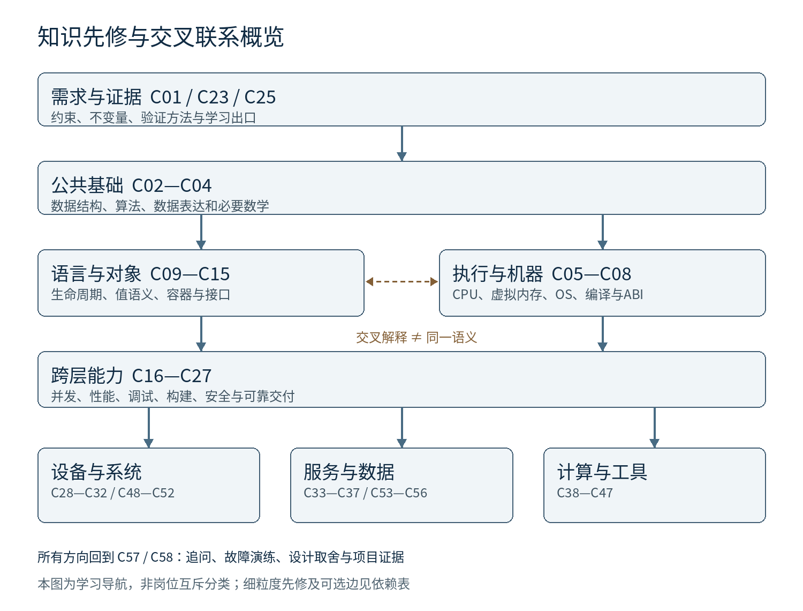

# 现代 C++ 与软件工程师面试指南

第一阶段研究与规划 V1

研究核验日：2026 年 10 月 3 日。交付性质：书籍立项、知识架构与可评审目录；尚未开始章节正文、配套站点开发或代码实验。目标读者与范围以本文件为 V1 编辑建议，待共同确认。

## 阅读这份方案的方法

先看第一至四部分，确认“要为谁解决什么问题”；第五部分给出全量三级目录；第六至九部分定义阅读路径、图片体系、在线配套与后续工作。附录保留来源、岗位样本、知识依赖和待决问题。目录中的章节是规划单位，并非已经写完或已经实测的内容。

核心建议是：用一套共享基础连接不同工程方向，采用“共享基础卷 + 系统与产品方向卷 + 智能计算与自主系统卷”的逻辑分卷。读者必学的是公共语言与自己所选方向，不是把所有分支全部读完。若最终只出版单册，应保留核心和方向导航，把专门领域的深挖迁往后续分卷与在线配套，而不是把几十个职业压缩成名词辞典。

## 一 对这本书定位的重新理解

### 1 书的承诺

这是一部以现代 C++ 和系统思维为主线、面向职业分化的工程能力地图。它把“知道概念”“能够解释机制”“能够在约束下做事”“能够拿出证据”接起来，再用面试追问检验理解。面试是检验接口，不是内容来源的唯一依据。

书应帮助读者完成四件具体事情：识别一类岗位的工作对象和约束；补齐进入该方向必需的公共知识；沿语言、运行时、操作系统与硬件定位问题；用项目、测量、故障复盘和设计取舍证明能力。它不承诺背完就能过面试，也不承诺一套工具在所有公司都适用。

建议副标题：“从语言与系统基础到岗位能力和工程实践”。“面试指南”保留可见性，但封面、导言和样章应让读者看到工程证据占据主导。

### 2 目标读者分层

- 主读者：已经会基本编程，理解函数、控制流和基本容器，希望进入或转换系统、C++、GPU、机器人等工程方向的人
- 次读者：具备项目经验但知识碎片化，需要补足底层、并发、性能和交付能力的工程师
- 进阶读者：需要对照相邻方向、设计面试问题或指导团队学习的人
- 不适合作为唯一教材的人：完全不会编程者；需要完整控制理论、计算机图形学或机器学习数学课程者；希望直接取得安全认证资格者

开篇提供基础自测和桥接资料，明确覆盖类、构造/析构、const、函数重载、lambda和模板入门，不把 Hello World、完整微积分、全部语言语法塞进公共主干。对机器人、HPC、图形的数学前提设置显式入口，不能因“不过度学术化”而删除必要数学。

### 3 必须改正的分类问题

原方案混合了五种层级：岗位（嵌入式工程师）、交付对象（数据库）、技术（CUDA）、框架（ROS 2）、架构模式（RAG/Multi-Agent）。它们不能作为同一层互斥分类。V1 用“岗位族 × 交付对象 × 横向能力”的矩阵：岗位族决定主要路径，技术标签标记用到什么，行业约束决定安全、实时、合规或成本的深度。

C++ 是连接运行时和硬件的一条强主线，不是所有岗位的唯一实现语言。LLM 应用、Web 后端、平台工程经常需要 Python、TypeScript、Go、Rust、SQL 等。本书解释互操作、语言选择和系统边界，不把它们全部强行改写为 C++。前端、原生移动端、企业业务应用、数据科学/模型研究在全景图中出现，但不在本书中建设同等深度的专门教材。

### 4 广度和深度怎样同时成立

每个核心概念形成一次规范解释，再被方向章引用。比如 C17 讲语言内存模型，C30 讲 Linux/设备访问约束，C44 讲 GPU 内存与同步，不复制三份“内存模型”，也不把三者混为一谈。方向章围绕交付任务展开，如“一个查询为何变慢”“机器人回放为何漂移”“一次工具恢复为何重复扣款”，只补充本方向独有的知识。

共享基础卷是知识的存放位置，不表示每章对所有方向都必修；最低入口见B，C++主线见K，高级主题按路径选择。

推荐逻辑分卷：卷一 C01—C27 为共享基础；卷二 C28—C44 为设备、服务、数据、媒体、工具链与计算；卷三 C45—C58 为 AI、自主系统和能力验证。C57 的追问方法从卷一就开始使用，不必等到最后才接触。初步篇幅预算仅用于编辑控制：核心约 400—550 页，两个方向卷各约 250—400 页，代码实验和版本细节在线维护；正式篇幅必须由样章校准，而非现在承诺出版页数。

### 5 证据和知识寿命

全书每条重要断言标记来源性质：F 官方规范事实；P 某项目或团队可观察实践；J 招聘样本信号；C 社区经验；D 存在争议；E 编辑建议。多个项目都使用某方法，也不足以自动写成“所有工业界都如此”。本轮技术结论优先来自官方规范、维护者文档和雇主 JD；没有把论坛热度当招聘需求统计，也没有宣称做过代码或硬件验证。

稳定并不等于不需要勘误。CPU 型号、内核行为、ABI、标准缺陷报告都会改变具体细节。分类应到节或知识点级：C13 的容器概念较稳定，具体 Range 新特性持续演进；C47 的排队和容量原理稳定，框架参数快速变化。

## 二 现代软件工程师岗位与技术方向全景图

### 1 以工作对象划分的岗位族

|岗位族|通常交付什么|共同基础|本方向独有或特别深入的知识|主要章节|
|---|---|---|---|---|
|固件 MCU IoT|设备固件、驱动接入、升级与诊断|资源、状态机、调试、测试|外设、中断、DMA、功耗、实时预算、量产|C28—C29|
|系统 内核 驱动 虚拟化|OS组件、设备驱动、隔离与运行平台|内存、并发、ABI、安全|内核上下文、设备语义、虚拟化、诊断|C30、C32|
|桌面 上位机 设备软件|GUI、可视化、设备控制和交付安装包|异步、生命周期、协议、UX|事件循环、线程亲和性、平台API、可访问性|C31|
|后端 网络服务 中间件|服务、RPC、消息和缓存系统|网络、并发、数据模型、可观测性|部分失败、协议兼容、背压、容量、一致性|C33—C34|
|数据库 存储内核|持久化引擎、事务与查询执行|算法、IO、正确性、性能|崩溃一致性、MVCC、索引、优化器|C35—C36|
|数据平台 搜索基础设施|数据管道、检索、治理与平台|分布式、存储、统计、接口|事件时间、血缘、搜索排序、权限过滤|C37、C54|
|SRE 平台 开发效能|可靠运行、交付平台和内部工具|构建、服务、测试、安全|SLO、容量、事故响应、平台产品化|C21—C27|
|产品安全 安全工程|安全设计、漏洞分析与供应链防护|语言、OS、协议、测试|威胁模型、身份权限、攻击面、验证|C23、C26、C56|
|音视频 实时通信|播放器、编解码管线、互动通信|缓冲、网络、异步、性能|采样、同步、时钟、质量与带宽预算|C38|
|图形 游戏 工业仿真|渲染器、引擎、CAD/CAE可视化|数学、数据结构、性能|几何、资源管线、物理、图形API|C39—C40|
|编译器 运行时 开发者工具|语言实现、优化器、分析器、IDE能力|语义、算法、ABI、验证|中间表示、代码生成、垃圾回收与即时编译、诊断与工具协议|C41—C42|
|HPC 科学计算 GPU|数值库、并行程序、异构加速|数学、性能、并发、验证|数值稳定性、MPI、拓扑、kernel优化|C43—C44|
|ML系统 AI Infra 推理优化|框架runtime、训练/推理平台和模型服务|张量、GPU、编译、分布式|图划分、量化、算子、KV、并行服务|C45—C47|
|机器人 感知 定位 规划 控制|机器人闭环软件与自主能力|数学、实时、消息、测试|标定、坐标、估计、物理模型、安全闭环|C48—C52|
|LLM应用 Agent平台|知识助手、工具执行系统和可靠任务平台|API、信息检索、权限、状态机、评测|检索质量、工具副作用、恢复、注入防护|C53—C56|
|Web 前端 移动 企业应用|用户产品、业务工作流与端侧应用|接口、数据、安全、测试、用户需求|浏览器/移动平台、交互、业务领域|交叉导航；不设完整专门课程|
|ML算法 模型研究 数据科学|模型、实验、统计解释和数据产品|统计、数据、实验、计算|学习理论、优化、领域数据与研究方法|AI工程前提导航；不替代算法教材|

安全关键不是单独语言方向，它可能横跨航空、汽车、医疗、工业控制和机器人。EDA、金融低延迟、科学仪器同样是行业叠加层；不为了“完整”另开几十条重复主干。

### 2 真实招聘样本如何改变目录

招聘材料表明，现代岗位往往同时要求代码能力、调试、跨层分析、测试与交付，不能仅按“懂哪些库”设计。可读的雇主样本涵盖网络数据平面、航空软件、人形机器人平台、媒体、EDA及Agent平台；具体日期、地区和可读性在岗位证据表中保留。

这些是目的性抽样，用于证明工作对象和能力组合确实存在，不是对2025—2026全球或中国招聘市场的统计。样本仍偏向公开英文企业招聘页；另已补入三条明确2025日期的国内科研机构招聘正文。国内企业JS招聘页部分只能获得索引记录，科研机构样本也不能代表整个国内企业市场。不能由此得出岗位数量增长、薪酬排名、入门容易或国内需求强弱。V2 若需要职业选择结论，须补充地区、资历和行业分层的专门研究。

### 3 AI 时代能力模型的变化

编辑判断：会调用模型只是工具熟练度；新的工程能力在于能把不确定模型输出接入可验证系统。传统的接口、测试、状态、一致性、权限和恢复仍然重要，新增的是数据/模型依赖、概率性结果、任务评测、成本配额和工具副作用。代码生成速度不能代替需求判断、维护责任、生产验收与事故处理。书中应把AI辅助开发也作为C23—C25的工作方式讨论，而不是只放在最后的Agent篇。

## 三 知识体系总架构

### 1 不是一根直线 而是有依赖的层次图

L0 任务与证据：需求、约束、不变量、实验和来源判断

L1 共同语言：算法数据结构、编码协议、必要数学

L2 两条互相连接的基础线：C++语义与所有权；机器、OS和二进制执行

L3 跨层能力：同步与异步、性能、调试、正确性和安全

L4 工程交付：构建依赖、测试、协作、发布、运行和系统演进

L5 方向模块：设备、服务、存储、媒体、工具链、HPC、AI、自主系统

L6 能力验证：追问链、故障演练、项目证据和设计评审

图中L0—L6是知识层次编号，与六层面试追问编号分别使用。L0及L4从第一项练习就出现，不是前面读几百页后才开始构建、测试与调试。各方向只需其必要的L1—L4部分，L5不是所有人的必修集合。

### 2 关键依赖及其原因

- C09 对象生命周期 → C13 非拥有视图：必须先知道对象何时有效，才判断 string_view/span 的安全边界
- C09 + C10 → C13 vector 扩容 → C14 异常保证 → C20 测量：连接移动行为、失败恢复和局部性，不把 move 当作性能保证
- C16 同步 + C09 生命周期 → C17 happens-before → C18 安全回收：无锁结构的正确性依赖同步与对象生存，不依赖先背完某个CPU的屏障表
- C05 硬件层次 ↔ C17 语言内存模型：这是实现解释的交叉联系，不是“Cache→Memory Model”单向因果；缓存一致性不提供全部跨位置顺序，也不能合法化C++数据竞争
- C08 ABI + C21 构建依赖 → C42 插件和FFI：语言模式一致不自动等于二进制兼容
- C04 状态机 + C07 资源 + C19 异步 → C33 服务 → C34 部分失败：先处理一次请求的生命周期，再处理网络中的恢复和重复
- C02 索引 + C07 持久化 + C16 并发 → C35 引擎 → C36 事务：磁盘上有字节不自动等于事务已提交
- C01 数值与统计 + C05 性能 → C43 HPC → C44 GPU → C46 算子：先有正确性和性能模型，再追求kernel速度
- C01 数学 + C04 时间 → C48 标定与估计 → C49 通信 → C50/C51闭环；C52安全论证贯穿，而非最后补丁
- C33 API + C26权限 + C37检索 → C53工具边界 → C54 RAG/C55 Agent → C56验收；RAG、MCP与Multi-Agent不存在人人必经的单线升级路线

图1：实线表示先修学习方向，双向虚线表示交叉解释；工程证据贯穿所有分支。细粒度条件以边表为准。

配套 planning/dependency-edges.csv 标记每条边为“必需先修”“建议先修”“交叉解释”或“可选扩展”；可选扩展不参与必需先修。箭头不代表因果定律，也不限制有经验读者从故障案例逆向阅读。

### 3 六条贯穿全书的案例线

1. 动态数组：算法复杂度 → 对象移动 → 分配 → 异常 → Cache → profiler → small_vector设计评审
2. 事件驱动服务：Socket → IO → Coroutine → 取消/背压 → p99 → 故障恢复
3. 持久化日志：内存缓冲 → 系统调用 → IO顺序 → WAL → crash recovery → 分布式复制
4. 设备闭环：采样 → 中断/DMA → 时间戳 → 控制 → 功耗/Deadline → HIL验收
5. 模型推理：张量 → 计算图 → kernel → 量化对齐 → serving队列 → 成本/SLO
6. 工具执行助手：用户意图 → 权限 → 工具调用 → 外部副作用 → checkpoint → 补偿/审计

案例是规划，不是已有可运行产品；同一个知识点在主章节定义，案例只引用并展示新的约束。

### 4 面试和工程共用的检验结构

六层追问定义为：识别概念；解释存在原因；推导机制与边界；定位失败；比较工程取舍；设计并验证系统。不是每节强凑六层，也不把更深等同更生僻。第六层追问的答案允许多个合理设计，评分看假设、证据、风险和反例。

例一 vector链：size/capacity和连续存储是什么 → 为什么需要可增长的连续结构 → 扩容失效及noexcept/move与异常保证 → 复现尾延迟尖峰 → reserve/PMR/不同容器取舍 → small_vector的布局与测试方案。

例二 Agent链：工具调用与直接回答的差别 → 为什么要幂等 → 恢复重放与副作用 → 找出重复执行的故障点 → 人工审批/补偿/自动重试取舍 → 设计可审计的长任务系统。

书中每道题同时保留“面试官要观察什么”“可接受答案边界”“危险误区”“可以验证的实验”。V1只规定这一机制，不提前编造数百道题或标准答案。

## 四 当前方案值得补入的领域

|补入项|为什么重要|放在哪里|证据性质与范围|
|---|---|---|---|
|安全开发与供应链|发布的软件不仅要正确，还要说明来源、依赖和攻击面|C23—C26、C56|NIST SSDF、SLSA等规范及安全岗位；不保证合规认证|
|SRE与平台工程|性能好不等于生产可用，需要SLO、容量、回滚与事故处理|C27、C34、C47|Google SRE公开团队实践；不是所有团队唯一流程|
|数值稳定性和测量统计|GPU、机器人、图形的“结果对”不能只看运行成功|C01、C20、C43、C46、C48|CUDA官方优化指南；数学先修为编辑选择|
|真实时间与时钟模型|实时是截止期，不是平均很快；分布式和传感器还涉及不同钟域|C04、C29、C34、C48|ROS时间设计、实时控制文档与相关JD|
|安全关键软件工程|航空/自动驾驶等要求证据链和变更影响，不能只有单元测试|C29、C52|航空JD、机器人能力边界；标准细则仍需专项审读|
|跨语言与内存安全迁移|现代系统常是多语言组合，C++主线要解释如何安全交界|C08、C26、C42|ABI文档、CISA指导；不宣称必须全量重写|
|数据工程与搜索系统|RAG（检索增强生成）建立在检索、权限和数据更新上，不能从向量库直接开始|C37、C54|官方RAG检索与评测架构；不把RAG等同数据库|
|虚拟化与数据平面|网络、云基础设施和驱动岗位有不同于普通Socket服务的约束|C30、C32|网络数据面JD及系统文档|
|EDA CAD CAE与工业软件|是真实C++产品方向，原目录容易被Web/AI视角遗漏|C40—C42交叉导航|Synopsys等JD；不是新增整套行业百科|
|产品可用性和可访问性|软件要让真实用户看懂状态、处理错误、保护数据|C25、C31、C42|产品工程需求与编辑判断；不等于前端专题教材|
|技术沟通与需求澄清|设计、事故和面试都要求解释假设及取舍|C25、C57|跨JD的交付能力信号；拒绝模板化行为面试话术|

本书不单开“量子软件”“区块链”“每一个Agent框架”之类章节凑全景。只有当岗位、稳定问题、先修知识和可验证案例同时成立，才升格为新方向章。行业名称不是新增章节的充分理由。

## 五 完整三级目录 V1

以下为出版内容规划，而非本研究报告的目录。稳定ID用于链接与版本比较，章节位置可调整而ID不变。节ID如C13.02表示当前规范主题；如果主题实质改变则新建ID，旧ID保留迁移说明。

章属性均为编辑评估，不是招聘频率统计。“共同基础/核心必问”指建议准备范围；“岗位常问/方向核心/专项深问”指路径内的重要性；“安全核心”等表示失败代价，不意味着其他章节可忽略。难度是先修深度，不与年龄或资历机械绑定。章内具体节可有不同生命周期。
